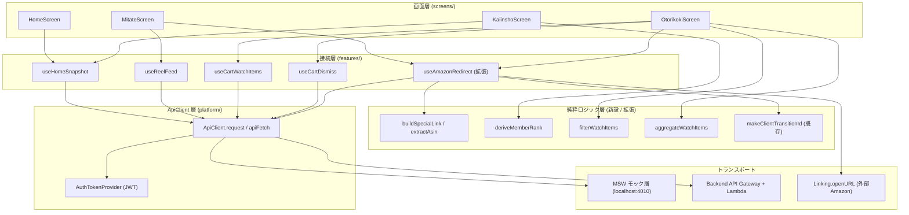
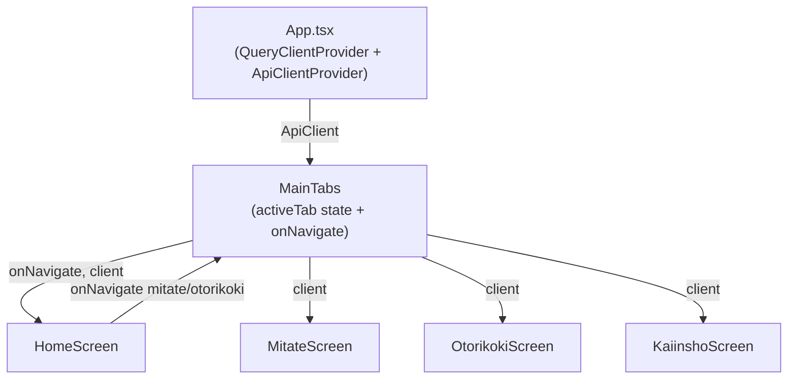
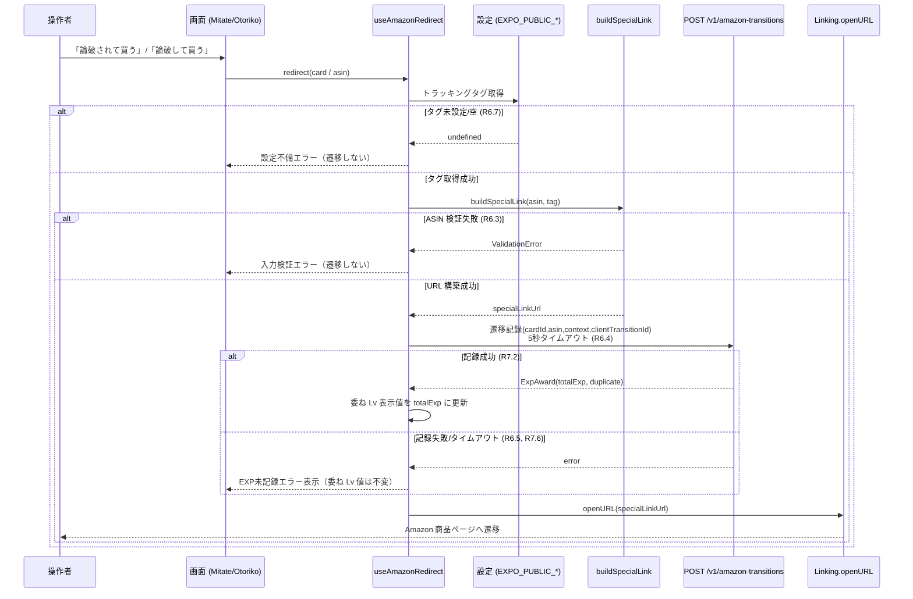
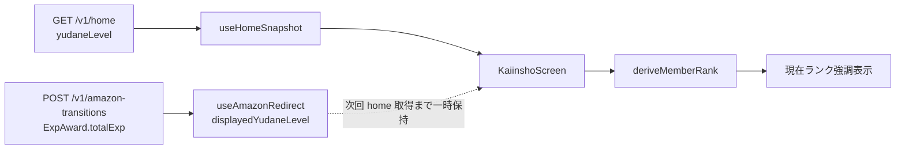

# 技術設計ドキュメント — デモ通し導線（demo-walkthrough-wiring）

## Overview

本設計は、要件書（[requirements.md](./requirements.md)）が定義する 12 要件（R1〜R12）を、YUDANE モバイルアプリ（React Native 0.76+ / Expo Dev Client / TypeScript 5.x）の既存資産に最小の非破壊変更で配線（wiring）して実現するための技術設計である。

### 解決する中心課題

現状、`mobile/src/screens/` 配下の 4 画面（ホーム / お見立て / お取り置き / 会員証）は固定モックを表示し、「Amazon で買う」系アクションは `Alert` のみで実遷移しない。一方 `mobile/src/features/` 配下には接続用ロジック（TanStack Query フック・`reel-api`・`ApiClient`）が既に実装済みだが、画面とは分断している。本設計はこの分断を解消する 3 本の柱で構成する。

1. **接続層への配線（R1〜R5, R9）**: 各画面を `features/` 配下の既存フック（`useHomeSnapshot` / `useReelFeed` / `useCartWatchItems` / `useCartDismiss`）に接続し、ローディング / エラー / 空状態を一貫したパターンで橋渡しする。
2. **Amazon 遷移サービス（R6, R7, R10, R11）**: ASIN とトラッキングタグから Special Link URL を構築する純関数 `buildSpecialLink` を新設し、`useAmazonRedirect` を拡張して「遷移記録（`POST /v1/amazon-transitions`）→ `Linking.openURL`」を配線する。EXP 加算（委ね Lv）と会員ランク導出を実データで成立させる。
3. **デモ堅牢化（R8, R12）**: バックエンド未デプロイ時も MSW モック層でデモを成立させ、セキュリティ規約（認証情報直書き禁止・JWT 認証・レスポンス検証）を遵守する。

### ダメ化メカニズムとの対応（product.md 整合）

| メカニズム | 本設計での実現 | 主担当要件 |
|---|---|---|
| M-1（判断力の弱体化） | お見立て・お取り置きに AI 提示商品を実データ供給 | R2, R3, R4 |
| M-2（購買快楽のストレス解消剤化） | Amazon 実遷移 → EXP 加算 → 委ね Lv / ランク前進の即時報酬ループ | R5, R6, R7 |
| M-3（判断の完全移譲） | 4 画面の通し導線連結（E2E-01〜03 再現） | R10 |

### 設計の基本方針

- **既存資産の最大活用**: `useHomeSnapshot` / `useReelFeed` / `useCartWatchItems` / `useCartDismiss` / `ApiClient` / `ASSOCIATES_DISCLOSURE_TEXT` は既に存在するため、新規作成は最小限（`buildSpecialLink` / `deriveMemberRank` / `useAmazonRedirect` の拡張 / フィルタ純関数 / 共通状態橋渡しフック）に留める。
- **純粋ロジックの分離（TDD / PBT 前提）**: URL 構築・ランク導出・フィルタ分類・EXP 反映は React / RN 非依存の純関数として切り出し、fast-check によるプロパティテストの対象とする（AGENTS.md §12 / tech.md §3）。
- **契約 SSOT 遵守**: OpenAPI 3.1（`shared/schema/openapi.yaml`）を正本とし、`/v1/home` パス未登録ギャップは契約 PR 先行で非破壊追記する（api-contracts.md §2, §6）。

### スコープ外（本設計では扱わない）

論破チャット（ご相談画面 / Unit-3 Debate）の実 AI 化、リール縦スワイプジェスチャーの新規実装、カレンダー / ポートフォリオ / セーフガード / オンボーディングの新規画面、ネイティブ Share Extension 連携、バックエンド Lambda（debate / calendar / safeguard / report）の新規実装。ご相談画面（`GosodanScreen`）の既存ハードコード応答辞書は据え置く（R10.5）。

---

## Architecture

### 全体アーキテクチャ（レイヤ構成）

本設計は既存の 4 レイヤ構成（画面 → 接続層フック → ApiClient → トランスポート）を踏襲し、画面と接続層の間の「未接続」を解消する。Amazon 遷移サービスのみ、新規の純関数（Special Link ビルダー）と外部遷移（`Linking`）を加える。



### 画面とデータ供給経路（MainTabs からの注入）

現状 `MainTabs.tsx` は `useState` で 5 タブを切り替え、`HomeScreen` にのみ `onNavigate` を渡している。本設計では `MainTabs` を「`ApiClient` 注入点」かつ「画面間ナビゲーションのハブ」として機能拡張する。`ApiClient` は `App.tsx`（Provider セットアップ）で生成し、`MainTabs` を経由して各画面に渡す（または React Context で供給する）。



**設計判断（ApiClient 供給方式）**: 既存フック `useHomeSnapshot(client)` / `useReelFeed(client)` は `ApiClient` を引数で受け取る。一方 `useCartWatchItems` / `useCartDismiss` はモジュールスコープの `apiFetch`（`setApiClient()` で初期化）を使う。この 2 方式の差異を吸収するため、`App.tsx` 起動時に **`setApiClient(client)` を必ず呼び**（`apiFetch` 系を有効化）、かつ **React Context（`ApiClientProvider`）で同一 `client` を供給**して引数注入系フックにも渡す。これにより両系統が同一の `ApiClient` インスタンス（同一 baseUrl・同一 JWT プロバイダ）を共有する。

### Amazon 遷移サービスのシーケンス（R6, R7）

「Amazon で買う」系操作（お見立て R2.9 / お取り置き R3.7）から起動される一連の処理。遷移記録の成否に関わらず外部遷移は継続する（R6.5）点が要点。



### MSW モック層フォールバック戦略（R8）

MSW（Mock Service Worker）はテスト用途（`mobile/src/test/msw-handlers.ts`）に既に存在する。本設計では、**バックエンド未デプロイ環境でもデモ実機/シミュレータ上で MSW を起動できる**よう、起動制御を `EXPO_PUBLIC_ENABLE_MSW` フラグで行う。

- フラグが有効（`'true'`）のとき、`App.tsx` 起動時に MSW のワーカー（React Native では `msw/native` の `setupServer` 相当のフェッチ介入）を起動し、`GET /v1/home` / `GET /v1/reel` / `POST /v1/amazon-transitions` / `GET /v1/cart-watch-items` / `DELETE /v1/cart-watch-items/{asin}` を OpenAPI examples 準拠でモックする。
- フラグが無効のとき、`ApiClient` は実バックエンド（`EXPO_PUBLIC_API_BASE_URL`）に接続する。
- MSW ハンドラは PII / 認証情報を含まない（R8.3）。既存ハンドラはこの制約を満たしているため、不足分（`GET /v1/cart-watch-items` の一覧 / `DELETE` の 204）を追記する。

**設計判断**: デモは「バックエンド未デプロイでも成立」が必須要件（R8）。接続層フックは MSW 有無に依存せず同一コードで動く（フックは `ApiClient` / `apiFetch` を呼ぶだけで、モックか実通信かはトランスポート層の関心事）ため、画面・フックには MSW 固有の分岐を入れない（R8.2）。

### `/v1/home` 契約ギャップの解消方針（R1, R5 / 既知依存 1）

`HomeSnapshot` スキーマは `shared/schema/components/schemas/auth.yaml` に定義済みで、`openapi.yaml` の `components.schemas` にも登録済みだが、**`paths` 節に `GET /v1/home` が未登録**である（調査で確認）。`useHomeSnapshot` と MSW は既に当該パスを参照している。

解消方針（api-contracts.md §2, §6 準拠の非破壊追記）:

1. `shared/schema/paths/auth.yaml`（または新規 `paths/home.yaml`）に `home` パスアイテムを追加し、`GET /v1/home` → 200 `HomeSnapshot` / 401 を定義する。
2. `shared/schema/openapi.yaml` の `paths` 節に `/v1/home: $ref: './paths/auth.yaml#/home'` を追記する（新規エンドポイント追加 = 非破壊的変更、api-contracts.md §6）。
3. 型生成（`npm run schema:gen:ts`）を同一 PR 内で再実行し `shared/schema/types/api.ts` を更新する。
4. **契約 PR を先行 merge** してから本スペックの実装 PR を出す（api-contracts.md §2）。

この契約追記は本スペックの**前提依存タスク**として tasks フェーズの先頭に置く。

---

## Components and Interfaces

本セクションは、新設・拡張するコンポーネントのインターフェースを定義する。既存コンポーネント（`ApiClient` / `useHomeSnapshot` / `useReelFeed` / `useCartWatchItems` / `useCartDismiss` / `makeClientTransitionId` / `ASSOCIATES_DISCLOSURE_TEXT`）は再利用し、必要な拡張点のみ明示する。

### 1. Special Link ビルダー（新設・純関数）— R6

`mobile/src/features/reel/special-link.ts`（新規）。ASIN とトラッキングタグから Amazon Associates Special Link URL を構築する純関数群。

```typescript
/** ASIN 検証失敗を表すエラー。 */
export class SpecialLinkValidationError extends Error {
  readonly kind: 'invalid-asin' | 'missing-tag';
}

/** ASIN が半角英数字 10 文字（^[A-Z0-9]{10}$）に合致するか検証する純関数。 */
export function isValidAsin(value: unknown): value is string;

/**
 * Special Link URL を構築する（R6.1, R6.3）。
 * @param asin - 半角英数字 10 文字の ASIN
 * @param trackingTag - 1 文字以上の非空トラッキングタグ
 * @returns Amazon 商品ページURL（ASIN と tag を両方含む）
 * @throws SpecialLinkValidationError - ASIN 不正（invalid-asin）/ タグ空（missing-tag）
 */
export function buildSpecialLink(asin: string, trackingTag: string): string;

/**
 * Special Link URL から ASIN を再抽出する純関数（R6.2 round-trip 検証用）。
 * @returns 抽出した ASIN。抽出不能なら null
 */
export function extractAsin(url: string): string | null;
```

**URL 形式（最小要件、既知依存 3）**: `https://www.amazon.co.jp/dp/{ASIN}?tag={trackingTag}`。`/dp/{ASIN}` パスに ASIN を、`tag` クエリにトラッキングタグを含める。`extractAsin` は `/dp/{ASIN}` パスセグメントから 10 文字英数字を抽出する。Approved Mobile Application 申請の承認状況により最終形式が変わりうるが（既知依存 3）、「ASIN + tag を含む遷移可能 URL」を不変条件として保つ。

### 2. トラッキングタグ / 設定プロバイダ（新設）— R6.6, R6.7, R12.1, R12.2

`mobile/src/app/config/runtime-config.ts`（新規）。環境変数（`EXPO_PUBLIC_*`）から接続設定を読み取り検証する純関数。認証情報・タグをソースに直書きしない（R12.2 / AGENTS.md §8）。

```typescript
export interface RuntimeConfig {
  apiBaseUrl: string;          // EXPO_PUBLIC_API_BASE_URL
  associatesTrackingTag: string; // EXPO_PUBLIC_ASSOCIATES_TRACKING_TAG
  enableMsw: boolean;          // EXPO_PUBLIC_ENABLE_MSW === 'true'
}

/** 環境変数から RuntimeConfig を読み取る。env はテスト注入可能。 */
export function readRuntimeConfig(env?: Record<string, string | undefined>): RuntimeConfig;

/**
 * トラッキングタグを取得する（R6.6）。
 * @returns 非空タグ。未設定/空なら null（R6.7 で遷移中止判定に使う）
 */
export function getTrackingTag(env?: Record<string, string | undefined>): string | null;
```

### 3. useAmazonRedirect（拡張）— R6, R7, R10

既存 `mobile/src/features/reel/use-amazon-redirect.ts` を拡張する。現状は `recordAmazonTransition` のみで `Linking` 遷移が未配線（本スペックの主要ギャップ）。

```typescript
export type AmazonRedirectContext = 'reel' | 'debate-agree' | 'cart-attack';

export interface AmazonRedirectInput {
  cardId: string;        // 冪等キー材料（R7.3）
  asin: string;
  context: AmazonRedirectContext;
}

export interface AmazonRedirectResult {
  status: 'redirected' | 'config-error' | 'validation-error';
  expRecorded: boolean;     // 遷移記録成功で true（R7.2）
  totalExp: number | null;  // 受信した totalExp（R7.2, R7.5）
}

/**
 * Amazon 遷移サービス。Linking 注入式（テスト容易性）。
 * - トラッキングタグ取得 → buildSpecialLink → 遷移記録(5s timeout) → Linking.openURL
 * - 記録失敗でも遷移は継続（R6.5）。タグ未設定/ASIN不正なら遷移しない（R6.7, R6.3）
 */
export function useAmazonRedirect(
  client: ReelApiClient,
  deps?: { openURL?: (url: string) => Promise<void>; getTag?: () => string | null },
): {
  redirect: (input: AmazonRedirectInput) => Promise<AmazonRedirectResult>;
  displayedYudaneLevel: number | null; // 次回 home 取得まで保持する委ね Lv（R7.2）
  isPending: boolean;
  error: Error | null;
};
```

**設計判断（遷移記録 → 遷移の順序）**: R6.4 は「記録の結果が確定した後に `Linking.openURL` で開く」と規定。よって `await` で 5 秒タイムアウト付き記録を確定させ、成功/失敗/タイムアウトいずれでも（タグ・ASIN が正当な限り）`openURL` を実行する。タイムアウトは `Promise.race` でラップする（`ApiClient` の REST デフォルトは 10 秒だが、本遷移は 5 秒上限の独自制御）。

**設計判断（EXP 冪等性 / 委ね Lv 反映）**: 委ね Lv 表示が参照する値は「次回ホーム概況取得が完了するまで」`displayedYudaneLevel` として保持する（R7.2）。`makeClientTransitionId(cardId)` が同一カードに対し決定的に同一 ID を返す（既存実装、R7.3）ため、サーバーは冪等に処理し `duplicate: true` / 同一 `totalExp` を返す。クライアントは受信した `totalExp` をそのまま採用する（`awarded` を加算再適用しない、R7.5）。これにより 2 回以上実行しても表示値は「ちょうど 1 回反映」と同一になる（R7.4）。記録失敗時は試行前の値から変更しない（R7.6）。

### 4. 会員ランク導出（新設・純関数）— R5.2〜R5.4

`mobile/src/features/auth/home/member-rank.ts`（新規）。委ね Lv（非負整数）から会員ランクを導出する全域関数。

```typescript
export type MemberRank = 'BLANC' | 'ARGENT' | 'NOIR' | 'ONYX' | 'ÉBÈNE';

/** 最下位→最上位の順序配列（単調性・全射の根拠）。 */
export const MEMBER_RANK_ORDER: readonly MemberRank[];

/** ランクのしきい値（昇順 yudaneLevel 下限）。 */
export const MEMBER_RANK_THRESHOLDS: { rank: MemberRank; minLevel: number }[];

/**
 * 委ね Lv → 会員ランクを導出する全域関数（R5.2 決定的・R5.3 全射・R5.4 単調非減少）。
 * @param yudaneLevel - 非負整数（負数や非整数は 0 にクランプ）
 * @returns ちょうど 1 つの会員ランク
 */
export function deriveMemberRank(yudaneLevel: number): MemberRank;

/** ランクの段階インデックス（0=BLANC 〜 4=ÉBÈNE、単調性検証用）。 */
export function rankStageIndex(rank: MemberRank): number;
```

**しきい値設計（R5.3 全射・R5.4 単調非減少を保証）**:

| 会員ランク | 段階 | 委ね Lv 下限 (minLevel) | 範囲 |
|---|---|---|---|
| BLANC（純白） | 0 | 0 | 0–4 |
| ARGENT（白銀） | 1 | 5 | 5–14 |
| NOIR（漆黒） | 2 | 15 | 15–29 |
| ONYX（縞瑪瑙） | 3 | 30 | 30–49 |
| ÉBÈNE（黒檀） | 4 | 50 | 50+ |

各ランクに少なくとも 1 つの整数 Lv が対応する（全射、R5.3）。Lv が増加するとランク段階は単調非減少（R5.4）。同一 Lv は常に同一ランク（決定的、R5.2）。`deriveMemberRank` は `MEMBER_RANK_THRESHOLDS` を降順走査し最初に `yudaneLevel >= minLevel` を満たすランクを返す全域関数。

### 5. お取り置きフィルタ・集計（新設・純関数）— R3.3, R4

`mobile/src/features/cart/watch-item-filter.ts`（新規）。タブ値 → status 判定条件のマッピングと、フィルタ適用後の件数・合計金額集計。

```typescript
export type FilterTab = 'すべて' | 'おすすめ' | 'まもなく' | '休眠';
export type CartStatus = CartWatchItemDto['status']; // 7状態

/**
 * タブ値ごとの status 判定条件（R4.1 一意対応付け）。
 * - すべて: 全件
 * - おすすめ: watching（新規監視中の推奨）
 * - まもなく: notified-30m | notified-6h | notified-24h（追撃通知進行中）
 * - 休眠: watching_orphaned | purchased | dismissed（停滞・終端）
 */
export function matchesFilter(tab: FilterTab, status: CartStatus): boolean;

/** 選択タブで一覧を絞り込む（R4.2, R4.3, R4.5）。各アイテムは合致/非合致のいずれか一方。 */
export function filterWatchItems(items: CartWatchItemDto[], tab: FilterTab): CartWatchItemDto[];

/** 表示対象の件数と価格合計を集計する（R3.3, R4.4）。 */
export function aggregateWatchItems(items: CartWatchItemDto[]): { count: number; totalYen: number };
```

**設計判断（タブ → status マッピング）**: 要件の 4 タブ（すべて / おすすめ / まもなく / 休眠）は、現状の画面モックが使う日本語ステータス（おすすめ / 新着 / 保留 / 休眠）と異なり、OpenAPI の 7 状態（`watching` / `notified-30m` / `notified-6h` / `notified-24h` / `purchased` / `dismissed` / `watching_orphaned`）にマッピングする必要がある。上記マッピングは 7 状態を漏れなく分類する（各 status はちょうど 1 タブ区分に属し、「すべて」は全件、R4.5 の二分性を満たす）。

### 6. 画面状態橋渡しフック（新設）— R9

`mobile/src/features/platform/app-shell/use-screen-query-state.ts`（新規）。TanStack Query の `isLoading` / `isError` / `data` / `refetch` を画面が一貫して扱える共通ビューステートに変換する純粋ヘルパー。

```typescript
export type ScreenViewState<T> =
  | { phase: 'loading' }
  | { phase: 'error'; message: string; retry: () => void }
  | { phase: 'empty' }
  | { phase: 'success'; data: T };

/**
 * TanStack Query 結果を画面ビューステートに射影する（R9.1, R9.2, R9.4）。
 * - キャッシュ済みデータがあればローディング中でも success（R1.3, R9.3）
 * - isEmpty 判定関数で空状態を区別（R2.8, R3.6）
 */
export function toScreenViewState<T>(
  query: { isLoading: boolean; isError: boolean; data: T | undefined; error: unknown; refetch: () => void },
  opts?: { isEmpty?: (data: T) => boolean },
): ScreenViewState<T>;

/** DomainError / Error からユーザー向け文言を導く（既存 DomainError.userMessage を優先）。 */
export function toUserMessage(error: unknown): string;
```

**設計判断（ローディング/エラー/空/成功の 4 相）**: 全画面が同じ 4 相モデルを使うことで R9 の一貫性を担保する。R1.3 / R9.3 の「キャッシュ済みがあればローディングと区別」は、`data !== undefined` を `success` 優先で扱うことで実現（TanStack Query はキャッシュ有効時 `data` を即時提供する）。R9.2 の「並行する他取得に関わらず当該失敗を直ちに提示」は、各クエリが独立した `ScreenViewState` を持つ（クエリ単位射影）ことで保証する。

### 7. Associates 開示コンポーネント（配置）— R11

既存 `ASSOCIATES_DISCLOSURE_TEXT`（`cart-intercept-screen-state.ts`、「YUDANE は Amazon Associates として、紹介リンク経由の購入で Amazon から紹介料を受け取っています」）を再利用する。この文言は「Amazon Associates」「紹介料」を含む（R11.2 を満たす）。

`mobile/src/features/platform/app-shell/AssociatesDisclosure.tsx`（新規・小コンポーネント）として共通化し、Amazon 遷移を伴う画面（お見立て R2 / お取り置き R3）に配置する（R11.1, R11.3）。会員証画面は遷移を伴わないため必須ではないが、ホームは「お見立てを見る」導線を持つのみで直接遷移はしないため対象外。

```typescript
/** Amazon 遷移を伴う画面に表示する Associates 開示（R11）。 */
export function AssociatesDisclosure(): React.JSX.Element; // testID="associates-disclosure"
```

### 8. 画面コンポーネントの配線（拡張）— R1, R2, R3, R4, R5, R10

各画面の固定モックを接続層フックに差し替える。props で `ApiClient`（または Context）と `onNavigate` を受け取る。

| 画面 | 接続フック | 主な配線 | 関連要件 |
|---|---|---|---|
| `HomeScreen` | `useHomeSnapshot` | 4 値表示（候補/監視/委ねLv/残額、0 も表示）、ローディング/エラー/再取得、ナビ 2 本 | R1 |
| `MitateScreen` | `useReelFeed` + `useAmazonRedirect` | 現在カード表示、UP NEXT、買う→遷移、見送る→次カード、空/ローディング/エラー | R2 |
| `OtorikokiScreen` | `useCartWatchItems` + `useCartDismiss` + filter | 一覧表示、集計、フィルタ、解除（楽観更新）、買う→遷移 | R3, R4 |
| `KaiinshoScreen` | `useHomeSnapshot` + `deriveMemberRank` | 委ね Lv→ランク導出、現ランク強調、ローディング/エラー | R5 |

---

## Data Models

本スペックは既存の OpenAPI 型を再利用し、新規の DTO は導入しない。クライアント内部のビューモデル（純関数の入出力）のみ新設する。

### 既存ドメイン型（再利用、変更なし）

| 型 | 定義場所 | 用途 |
|---|---|---|
| `HomeSnapshot` | `shared/schema/types/api.ts` | `candidateCount` / `cartWatchCount` / `yudaneLevel` / `remainingBudgetYen`（全て optional integer） |
| `ReelPage` | `mobile/src/features/reel/types.ts` | `cards: ReelCard[]` / `nextCursor: string \| null` / `generatedAt` |
| `ReelCard` | 同上 | `cardId` / `product` / `pitch` / `ownershipLabel` / `tags` / `origin` / `isHighPriceBoost` |
| `CartWatchItemDto` | `mobile/src/features/cart/use-cart-watch-item.ts` | `asin` / `status`(7状態) / `productMeta.title` / `productMeta.priceYen` 等 |
| `AmazonTransitionRequest` | `mobile/src/features/reel/types.ts` | `cardId` / `asin` / `context` / `clientTransitionId` |
| `ExpAward` | 同上 | `awarded` / `totalExp` / `duplicate` |

### 新設ビューモデル（クライアント内部）

```typescript
// 会員ランク（R5）
type MemberRank = 'BLANC' | 'ARGENT' | 'NOIR' | 'ONYX' | 'ÉBÈNE';

// フィルタタブ（R4）
type FilterTab = 'すべて' | 'おすすめ' | 'まもなく' | '休眠';

// 画面ビューステート（R9）
type ScreenViewState<T> =
  | { phase: 'loading' }
  | { phase: 'error'; message: string; retry: () => void }
  | { phase: 'empty' }
  | { phase: 'success'; data: T };

// Amazon 遷移結果（R6, R7）
interface AmazonRedirectResult {
  status: 'redirected' | 'config-error' | 'validation-error';
  expRecorded: boolean;
  totalExp: number | null;
}

// ランタイム設定（R12）
interface RuntimeConfig {
  apiBaseUrl: string;
  associatesTrackingTag: string;
  enableMsw: boolean;
}
```

### お見立て画面のカード進行状態（R2.2, R2.10, R2.11）

リールページ内の「現在表示中カード」をインデックスで管理する。`useReelFeed` は `useInfiniteQuery` で `pages[].cards` を返すため、全カードを `flatMap` で平坦化し、`currentIndex`（初期 0 = 先頭、R2.2）で現在カードを指す。「感想で見送る」は `currentIndex += 1`（後続があれば、R2.10）、後続がなければ空状態（R2.11）。

```typescript
interface ReelViewModel {
  cards: ReelCard[];          // pages.flatMap(p => p.cards)
  currentIndex: number;       // 0 始まり
  current: ReelCard | null;   // cards[currentIndex] ?? null
  upNext: ReelCard[];         // cards.slice(currentIndex + 1)
}
```

### データフロー図（委ね Lv の伝播、R5・R7）



---

## Correctness Properties

*プロパティ（correctness property）とは、システムのすべての正当な実行において成り立つべき特性・振る舞いであり、システムが「何をすべきか」に関する形式的な言明である。プロパティは、人間が読む仕様と、機械が検証可能な正しさの保証との架け橋となる。*

本スペックは純粋ロジック（URL 構築・ランク導出・フィルタ分類・EXP 反映・ビューステート射影）を `features/` 配下に切り出すため、これらは property-based testing（PBT）に適する（tech.md §3 / PBT-01〜10、fast-check）。一方、画面マウント時の配線・ナビゲーション・MSW インフラ・JWT 付与（既存 `ApiClient` で担保済み）は example / integration / smoke テストで扱う（[Testing Strategy](#testing-strategy) 参照）。

以下のプロパティは、各受け入れ基準のテスト可能性分析（Acceptance Criteria Testing Prework）の結果を、Property Reflection による冗長性排除を経て導出したものである。

### Property 1: Special Link round-trip と ASIN/tag 含有

*For any* 半角英数字 10 文字の ASIN と 1 文字以上の非空トラッキングタグについて、`buildSpecialLink(asin, tag)` が構築した URL は ASIN とトラッキングタグの両方を部分文字列として含み、かつ `extractAsin(buildSpecialLink(asin, tag))` が入力 ASIN と大文字小文字を含めて完全一致する。

**Validates: Requirements 6.1, 6.2**

### Property 2: Special Link は不正入力を拒否する

*For any* 正規表現 `^[A-Z0-9]{10}$` に合致しない値（長さ不一致・英数字以外を含む・空文字列・`undefined`）について、`buildSpecialLink` は URL を構築せず `SpecialLinkValidationError` を送出する。

**Validates: Requirements 6.3**

### Property 3: 会員ランク導出は全域かつ決定的

*For any* 非負整数の委ね Lv について、`deriveMemberRank` は集合 {BLANC, ARGENT, NOIR, ONYX, ÉBÈNE} のうちちょうど 1 つを例外なく返し、同一の委ね Lv に対しては常に同一の会員ランクを返す。

**Validates: Requirements 5.2**

### Property 4: 会員ランク導出は全射

*For any* 会員ランク `r ∈ {BLANC, ARGENT, NOIR, ONYX, ÉBÈNE}` について、`deriveMemberRank(lv) === r` となる非負整数の委ね Lv が少なくとも 1 つ存在する（`deriveMemberRank` の像は会員ランク集合全体を被覆する）。

**Validates: Requirements 5.3**

### Property 5: 会員ランク導出は単調非減少かつ強調はちょうど 1 つ

*For any* 非負整数の委ね Lv のペア `a <= b` について、`rankStageIndex(deriveMemberRank(a)) <= rankStageIndex(deriveMemberRank(b))` が成り立つ（より大きい Lv がより低い段階を導出しない）。さらに任意の委ね Lv についてランク段階の強調表示はちょうど 1 つだけ（導出されたランク）であり、それ以外の段階は強調されない。

**Validates: Requirements 5.4, 5.5**

### Property 6: EXP 加算の冪等性と成功時の値反映

*For any* リールカードと任意の `totalExp` 値について、冪等なサーバー（同一 `clientTransitionId` に対し同一 `totalExp` と `duplicate` を返す）を前提に、同一カードに対し Amazon 遷移記録を 1 回以上（N >= 1）実行したとき、委ね Lv 表示が参照する値（`displayedYudaneLevel`）は受信した `totalExp` と一致し、N >= 2 回実行しても加算がちょうど 1 回だけ反映された場合と同一の値に保たれる（`duplicate: true` のとき `awarded` を加算再適用しない）。

**Validates: Requirements 7.2, 7.4, 7.5**

### Property 7: 記録失敗時の不変性と冪等キーの決定性

*For any* 試行前の委ね Lv 表示値とリールカードについて、Amazon 遷移記録が失敗（ネットワークエラー・非成功応答・タイムアウト）したとき、委ね Lv 表示値は試行前の値から変更されない。また *for any* `cardId` について、`makeClientTransitionId(cardId)` を複数回呼び出しても同一のクライアント遷移 ID を返す（決定的）。

**Validates: Requirements 7.6, 7.3**

### Property 8: 監視アイテムフィルタの分割性・健全性・恒等性

*For any* 監視アイテム一覧とフィルタタブについて、`filterWatchItems` の結果に含まれる全アイテムは `matchesFilter(tab, status)` を満たし（健全性）、結果と補集合は元の一覧を漏れなく重複なく分割する（各アイテムは合致・非合致のいずれか一方、二分性）。さらに「すべて」タブに対しては結果が元の一覧と一致する（恒等性）。

**Validates: Requirements 4.1, 4.2, 4.3, 4.5**

### Property 9: 監視アイテム集計とフィルタ後の整合

*For any* 監視アイテム一覧について、`aggregateWatchItems` の `count` は一覧の要素数と一致し、`totalYen` は各アイテムの `productMeta.priceYen` の総和と一致する。さらに任意のフィルタタブと解除対象 ASIN について、フィルタ適用後または解除（`applyOptimisticDismiss`）後の一覧に対する集計は、それぞれ加工後の一覧を基準として再計算された値と一致する（解除後は当該 ASIN が一覧に存在しない）。

**Validates: Requirements 3.3, 3.9, 4.4**

### Property 10: 画面ビューステート射影の決定性・相互排他・キャッシュ優先

*For any* クエリ状態 `(isLoading, isError, data)` について、`toScreenViewState` はちょうど 1 つの相（loading / error / empty / success）を決定的に返す。`data` が存在すれば（キャッシュ有効）`isLoading` 中でも `success` を優先し、`isError` のときは他の並行クエリの状態に関わらず `error` 相（再取得手段つき）を返す。レスポンス構造検証に失敗した場合も `error` 相に射影される。

**Validates: Requirements 9.1, 9.2, 9.3, 9.4, 12.4**

### Property 11: 表示要素は対象データのすべての必須情報を含む

*For any* `HomeSnapshot`（候補件数・監視件数・委ね Lv・残額の 4 値、値 0 を含む）について、ホーム画面のレンダリング結果は 4 値それぞれを（0 の場合も省略せず）表示要素に含む。同様に *for any* リールカードについて、お見立て画面のレンダリングは商品名・価格・論破ピッチ・所有感ラベルを含み、*for any* 監視アイテムについて、お取り置き画面のレンダリングは商品名・価格・ステータスを含む。

**Validates: Requirements 1.2, 2.3, 3.2**

### Property 12: リールビューモデルの不変条件

*For any* 非空のリールカード列について、初期リールビューモデルの現在カードは先頭カード（`cards[0]`）と一致する。任意のカード列と現在インデックス `i` について、「UP NEXT」一覧は `cards.slice(i + 1)`（後続カード集合）と一致し、「感想で見送る」操作は後続が存在すれば現在カードを `cards[i + 1]` へ進め、後続が存在しなければ空状態へ遷移する。

**Validates: Requirements 2.2, 2.4, 2.5, 2.10, 2.11**

---

## Error Handling

### エラー分類と画面への射影

すべてのデータ取得・変更操作のエラーは、既存の `DomainError`（`mobile/src/features/platform/api-client/domain-error.ts`）に正規化され、`toScreenViewState` / `toUserMessage` を通じて画面のエラー相に射影される。`DomainError.userMessage`（サーバー由来の Problem Details `title`）を優先し、なければカテゴリ別の既定文言を用いる。

| 発生源 | エラー種別 | 画面の挙動 | 関連要件 |
|---|---|---|---|
| `GET /v1/home` | ネットワーク / 10s タイムアウト / 構造検証失敗 | エラーメッセージ＋各表示要素をエラー状態（空ではない）＋再取得 | R1.4, R1.5 |
| `GET /v1/reel` | 取得失敗 | エラー表示＋再取得操作 | R2.7 |
| `GET /v1/cart-watch-items` | 取得失敗 | エラー表示＋ `GET` 再実行の再取得操作 | R3.5 |
| `DELETE /v1/cart-watch-items/{asin}` | 非成功応答 / 通信失敗 | 当該アイテムを一覧に保持（楽観更新ロールバック）＋エラー＋再試行 | R3.10 |
| `POST /v1/amazon-transitions` | ネットワーク / 非成功 / 5s タイムアウト | EXP 未記録エラー表示。**ただし `Linking.openURL` による遷移は継続**。委ね Lv 表示値は不変 | R6.5, R7.6 |
| Special Link 構築 | ASIN 不正（`invalid-asin`） | 入力検証失敗を通知。遷移しない | R6.3 |
| トラッキングタグ取得 | 未設定 / 空（`missing-tag`） | 設定不備エラー表示。URL 構築せず遷移しない | R6.7 |
| レスポンス構造検証 | 期待構造に不一致 | 当該画面にエラー状態を提供 | R12.3, R12.4 |

### 設計上の要点

- **遷移記録の失敗は遷移を妨げない（R6.5）**: 収益導線（Amazon 遷移）を最優先し、EXP 記録の失敗は遷移を止めない。ユーザーには「EXP が記録されなかった」旨だけを伝え、Amazon ページは開く。これは「決済は Amazon 側で完結」という product.md の原則と整合する。
- **タイムアウトの二層構造**: `ApiClient` の REST 既定タイムアウトは 10 秒（`DEFAULT_REST_TIMEOUT`）。ホーム概況は R1.4 で 10 秒、Amazon 遷移記録は R6.4 で 5 秒と要件が異なるため、遷移記録は `useAmazonRedirect` 内で `Promise.race` による 5 秒上限を独自に課す。
- **楽観更新のロールバック（R3.10）**: `useCartDismiss` は既に `onMutate`（即時除去）/ `onError`（ロールバック）/ `onSettled`（invalidate）を実装済み。解除失敗時はロールバックにより一覧が復帰し、エラー表示＋再試行を提示する。
- **構造検証（R12.3, R12.4）**: 画面表示前に Zod スキーマでレスポンス構造を検証する。検証失敗は `DomainError`（`category: 'validation'`）として扱い、`toScreenViewState` がエラー相に射影する。SECURITY 規約（無検証の `JSON.parse` 禁止、AGENTS.md §8）を遵守する。

---

## Testing Strategy

本スペックは TDD（Mobile = Outside-In、AGENTS.md §12）で実装する。テストファイル → 実装 → PBT 補強の順序を守る。Unit / Property / Integration の各レイヤを補完的に用いる。

### PBT 適用判断

純粋ロジック層（`buildSpecialLink` / `extractAsin` / `deriveMemberRank` / `filterWatchItems` / `aggregateWatchItems` / `applyOptimisticDismiss` / EXP 反映ロジック / `toScreenViewState`）は入力が広く普遍的性質が成り立つため **PBT を適用**する（[Correctness Properties](#correctness-properties) の P1〜P12）。

一方、以下は PBT 非対象とし代替手段を用いる:

- **画面マウント時の配線・ナビゲーション**（R1.1, R1.6, R1.7, R2.1, R3.1, R5.1, R10.1）: React Native Testing Library による example テスト
- **MSW モック層**（R8.1, R8.2, R8.4）: MSW を起動した integration テスト（1〜3 例）
- **モックデータの PII 非含有・タグ直書き禁止**（R8.3, R12.2）: smoke テスト / 静的検査（grep）
- **JWT 認証ヘッダ付与**（R12.5）: 既存 `ApiClient` の auth interceptor で担保済み（`api-client.test.ts` でカバー）
- **E2E 通し導線**（R10.2〜R10.4）: MSW 下の integration テスト
- **ご相談画面の据え置き**（R10.5）: smoke テスト（`GosodanScreen` が既存応答辞書のまま）

### Property Test 構成（fast-check）

- ライブラリ: **fast-check**（`mobile/package.json` に導入済み `^3.23.0`）。スクラッチ実装は禁止。
- 各プロパティテストは **最低 100 イテレーション**（fast-check の既定 `numRuns: 100` 以上）で実行する。
- 各テストは設計のプロパティ番号をコメントで参照する。タグ形式: `// Feature: demo-walkthrough-wiring, Property {番号}: {プロパティ本文の要約}`
- 各 Correctness Property は **単一のプロパティテスト**で実装する。

代表的な generator（arbitrary）:

| 対象 | generator | 用途 |
|---|---|---|
| 有効 ASIN | `fc.stringMatching(/^[A-Z0-9]{10}$/)` 相当（`fc.array(fc.constantFrom(...A-Z0-9), {minLength:10,maxLength:10})` で構成） | P1 round-trip |
| 不正 ASIN | 長さ不一致・小文字・記号・空・undefined を含む `fc.oneof` | P2 |
| 非負整数 Lv | `fc.nat()` | P3, P4, P5 |
| Lv ペア（a<=b） | `fc.tuple(fc.nat(), fc.nat()).map(([x,y]) => [Math.min,Math.max])` | P5 単調性 |
| `CartWatchItemDto` 列 | status 7 状態を含む `fc.array` | P8, P9 |
| クエリ状態 | `(isLoading, isError, data?)` の `fc.record` | P10 |
| `HomeSnapshot`（0 含む） | `fc.record({candidateCount: fc.nat(), ...})` | P11 |
| `ReelCard` 列 | `fc.array(reelCardArbitrary, {minLength:1})` | P12 |

### Unit Test（example / edge）

property テストが入力空間を広くカバーするため、unit テストは具体例・配線・エッジケースに集中する（過剰な unit テストは避ける）:

- マウント時のフック発火（R1.1, R2.1, R3.1, R5.1）
- ナビゲーション配線（R1.6, R1.7, R10.1）
- Amazon 遷移サービスの順序とタイムアウト（R6.4 = 記録解決後に `openURL`）、記録失敗でも遷移継続（R6.5）、タグ未設定で遷移中止（R6.7）
- リクエスト body 構築（R7.1）、設定読み取り（R6.6, R12.1）
- Associates 開示の文言・表示（R11.1, R11.2, R11.3）
- 空状態の境界（R2.8, R3.6）

### Integration Test（MSW）

`mobile/src/test/msw-handlers.ts` を拡張し、IT として以下を検証（api-contracts.md §11 の IT-03 = 論破成功 → Special Link → Amazon 起動と整合）:

- MSW 有効下で 4 エンドポイントが OpenAPI examples 準拠レスポンスを返す（R8.1, R8.2）
- `DELETE /v1/cart-watch-items/{asin}` が 204 を返す（R8.4）
- E2E-01: お見立てで「論破されて買う」→ 遷移記録 → `openURL` 呼び出し（R10.2）
- E2E-03: お取り置きで「論破して買う」→ 遷移記録 → `openURL` 呼び出し（R10.3）
- 遷移後の会員証で加算後委ね Lv に基づくランク表示（R10.4）

### 品質ゲート（AGENTS.md §9 / tech.md §6 準拠）

- ESLint エラー 0 / `tsc --noEmit` エラー 0
- Unit / Property / Integration 全件 pass
- Coverage: Line 80%+ / Branch 70%+（Unit + PBT 合算）
- `shared/schema/` 変更（`/v1/home` 追記）時は型生成ファイル最新（CI 差分なし）+ Schemathesis pass
- SAST Critical / High 0（認証情報・タグの直書きなし）

### テスト一覧マッピング（要件トレーサビリティ）

| テスト種別 | 対象要件 |
|---|---|
| Property（P1〜P12） | R1.2, R2.2/2.3/2.4/2.5/2.10/2.11, R3.2/3.3/3.9, R4.1/4.2/4.3/4.4/4.5, R5.2/5.3/5.4/5.5, R6.1/6.2/6.3, R7.2/7.3/7.4/7.5/7.6, R9.1/9.2/9.3/9.4, R12.3/12.4 |
| Unit（example/edge） | R1.1/1.3/1.4/1.5/1.6/1.7, R2.1/2.6/2.7/2.8/2.9, R3.1/3.4/3.5/3.6/3.7/3.8/3.10, R5.1/5.6/5.7, R6.4/6.5/6.6/6.7, R7.1, R11.1/11.2/11.3, R12.1/12.5 |
| Integration（MSW） | R8.1/8.2/8.4, R10.2/10.3/10.4 |
| Smoke / 静的検査 | R8.3, R10.5, R12.2 |
