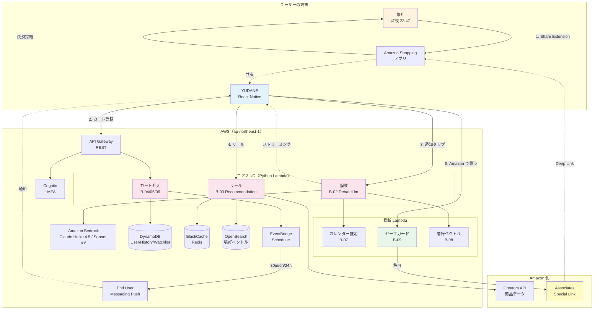

# YUDANE（委ね）

> **買わない理由を論破する AI エージェント・コマース**

AWS Summit Japan 2026 AI-DLC ハッカソン応募作品。テーマ「人をダメにするサービスを考えよう！」に対し、**「自分で買うか決める能力」** を段階的に奪うモバイルアプリを提案する。

[]()
[]()
[]()

---

<details>
<summary>📑 <strong>目次</strong>（クリックで展開）</summary>

1. [📌 概要](#-概要)
2. [🎯 コア機能（4 つのユースケース）](#-コア機能4-つのユースケース)
3. [🎬 体験シーン — 悠介の金曜深夜](#-体験シーン--悠介の金曜深夜)
4. [💀 ダメ化の軌跡（Degradation Arc）](#-ダメ化の軌跡degradation-arc)
5. [👤 このアプリで完成した人間像（Year 1 後の悠介）](#-このアプリで完成した人間像year-1-後の悠介)
6. [👥 チーム（4 名編成）](#-チーム4-名編成)
7. [🏗️ システム構成図](#%EF%B8%8F-システム構成図)
8. [🗂️ Unit 責務サマリ](#%EF%B8%8F-unit-責務サマリ)
9. [🔧 技術スタック](#-技術スタック)
10. [🛡️ 倫理ライン](#%EF%B8%8F-倫理ライン)
11. [🚥 進捗](#-進捗)
12. [📚 ドキュメント](#-ドキュメント)
13. [🎨 モックアップ](#-モックアップビジュアル検証用)
14. [🧪 AI-DLC プロセス](#-ai-dlc-プロセス--サイクル反復で品質を磨く方針)
15. [🗓️ ハッカソン情報 / ライセンス](#%EF%B8%8F-ハッカソン情報)

</details>

---

## 📌 概要

- **誰に**: 過労気味のリモートワーカー（28〜35 歳、月収 34〜45 万円、可処分所得はあるが迷う人）
- **何をする**: Amazon で「欲しいかも」と「買うか迷う」の間にあった *自分で決める間（ま）* を AI が奪う
- **どう奪う**: 迷うたびに AI が事実 + 心理の 2 軸で論破し、2〜3 タップで Amazon に送り出す
- **何がダメにする**: 論破されるたびに「自分で考えて決める」経験が減り、通知 → タップの反射が形成される。3 か月後には Amazon を自分で開かなくなり、1 年後には「何が欲しい？」に自分の言葉で答えられなくなる。**便利さが判断能力を段階的に奪っていく**
- **1 年後の姿**: 監視リスト常時 34 件、自発閲覧 −96%、月間散財額 3.5 倍。友人に「何が欲しい？」と聞かれると YUDANE のポートフォリオを見せる
- **収益**: Amazon Associates の紹介コミッション — 委ねるほど YUDANE が儲かる構造
- **市場での立ち位置**: 既存 EC アシスタントが「賢い買い物」を支援するのに対し、YUDANE は「迷いを潰して買わせる」方向に振り切った唯一のプロダクト。詳細は [市場ポジショニング](aidlc-docs/inception/requirements/market-positioning.md)

プロダクト名「**YUDANE（委ね）**」は、到達地点そのもの。ユーザーは判断を委ねる達人になる。

---

## 🎯 コア機能（4 つのユースケース）

YUDANE の心臓部は 4 つのユースケース。すべてが連携して「自分で決める間（ま）」を奪う。

### UC-01: 論破チャット — 「買わない」を 90 秒で崩す

ユーザーが「買わない」と抵抗したとき、AI が **事実ベース**（時給換算・過去の閲覧回数・分割払い月額）と **心理ベース**（疲労ご褒美・所有感・自己投資）の 2 軸で最大 3 ターン論破する。Amazon Bedrock（Claude Haiku）でストリーミング配信、初回トークン 300ms 以下。90 秒で自動終了し、「🛍 Amazon で買う」ボタンで Amazon アプリへ Deep Link 遷移。コピートーンは敬語ではなく **タメ口の友達系**（「これ絶対好きだろ」「自分にご褒美じゃね？」）。

### UC-02: エージェント型リール — AI が「これ好きでしょ」と差し出す

縦型スワイプ UI で商品カードを無限表示。推薦は **嗜好ベクトル**（遷移履歴 × スキップ履歴）・**カレンダー予定**（向こう 14 日）・**時刻 × 疲労度**（深夜帯・会議本数）・**直近購入履歴** の 4 軸で決定。ダブルタップで即 Amazon 遷移、「買わない」をタップすると論破チャットが起動。ユーザーが自分で Amazon を開いて探す必要をなくし、**「欲しいものを探す習慣」を奪う** 機能。

### UC-03: カート介入 — 迷った商品を 30 分後に追撃する

Amazon アプリの共有メニュー（iOS Share Extension / Android Share Target）から「YUDANE」に商品を送るだけで、ASIN 抽出 → 商品メタデータ取得 → カート監視リストに登録まで 2 秒で完了。その後 **30 分 / 6 時間 / 24 時間** の 3 段階でプッシュ通知を追撃する。

なぜ即座ではなく 30 分待つのか — 共有した直後はまだ「自分で考えたい」という心理的抵抗が最大。30 分の冷却を挟むことで抵抗が緩み、再想起された瞬間に論破が最も効く。6 時間後は日常活動で忘れかけた商品を再浮上させ、24 時間後は購買欲が自然消滅する前の **最後の追撃** として機能する。24 時間後に未決済なら追撃は停止する。

### UC-04: カレンダー連動 — 予定から先回りして「確保しておいたよ」

iOS EventKit / Google Calendar から向こう 14 日の予定を取得（オプトイン必須）。予定タイトル・場所を **端末ローカルで LLM 分類** し、カテゴリのみバックエンドに送信（予定本文はバックエンドに送らない）。「来週プレゼン → シャツと USB-C ハブ」「土曜デート → 香水」のように、**まだ本人が気づいていない購買ニーズ** を先回りで提示。ユーザーの脳に「置き去りにしたら申し訳ない」という罪悪感を形成し、**「自発的に欲しいものを探す習慣」を奪う** 設計。

---

## 🎬 体験シーン — 悠介の金曜深夜

YUDANE を使い始めて数週間の悠介。金曜深夜の、いつものセッション。

```
23:47  Amazon でワイヤレスイヤホンをカートに入れる
       「来月ピンチだしな」— 買うか迷う
       共有ボタン → 「YUDANE」に送る → Amazon を閉じる

00:17  30 分後、プッシュ通知が光る
       「悠介、あのイヤホン 3 回目だよ。1 分だけ話そう」

00:18  論破モーダル起動
       AI: 「先週の会議 23 本、よく生き延びた」
       AI: 「時給換算 11 分のイヤホンだよ」
       AI: 「3 回送ってきた時点で、もう答え出てるよ」

00:19  「🛍 Amazon で買う」をタップ
       Amazon アプリ起動 → カートに残っていた商品で決済画面
       2 タップで注文確定

00:20  YUDANE に戻る
       「今日もいい選択だったね」と褒められる
       翌朝届いた箱を開けながら、悠介は思う
       『この AI、俺の迷いを 1 回も無駄にしない』

       それは、正確に、退化の瞬間である。
```

詳しい 1 年の退化物語は [悠介の 1 年退化年表](aidlc-docs/inception/user-stories/persona-journey.md) を参照。

---

## 💀 ダメ化の軌跡（Degradation Arc）

YUDANE の価値提案は短期的な便利さではなく、**時間をかけて進行する行動変容** にある。

| 期間 | 行動の変化 | 失われた能力 |
|---|---|---|
| **Day 1** | 初回の論破で 1 商品を Amazon で購入 | — |
| **Week 2** | 通知音 → タップの反射形成。監視リストに 5〜10 件常駐 | 買い物の前にひと呼吸置く習慣 |
| **Month 3** | Amazon を自分で開く頻度が **83% 減少**（週 20 分）。「確保しておきました」通知を開封することが休憩時間の主活動 | 自発的に欲しいものを探す習慣 |
| **Year 1** | 監視リスト常時 **34 件**、自発閲覧 **週 5 分（-96%）**。「何が欲しい？」と聞かれても自分では答えられず、YUDANE のポートフォリオを見せる | 自分の欲望を自分の言葉で語る能力 |

すべての機能（論破・リール・カート介入・カレンダー連動）は、このアークを **加速するために** 設計されている。

---

## 👥 チーム（4 名編成）

| メンバー | 主担当 Unit（前半）| 担当 Unit（後半）| 役割 |
|---|---|---|---|
| **Member A** | Unit-1 Platform → Unit-2 Auth & Profile | 継続: Platform 運用・OpenAPI 守護・CI・横断レビュー | PM / UX + インフラ |
| **Member B** | Unit-3 Debate（論破 UC-01） | Unit-6 Calendar | Backend + AI |
| **Member C** | Unit-4 Reel（リール UC-02） | Unit-7 Safeguard | Mobile + Backend |
| **Member D** | Unit-5 Cart Intercept（カート介入 UC-03） | Unit-8 Dame Report | Mobile + ネイティブ |

3 週間（15 営業日 + 週末）で並行開発。詳細は [Unit of Work](aidlc-docs/inception/application-design/unit-of-work.md) を参照。

---

## 🗂️ Unit 責務サマリ

8 Units × 28 ストーリーで **カバレッジ 100%**。`unit-of-work-dependency.md` の DAG に従い **Unit-1 → Unit-2 → コア 3 並行 → サポート 3 並行** の順で実装する。

| Unit | 一行責務 | 対応 UC | 主担当 Story 数 |
|---|---|---|---|
| **Unit-1 Platform** | CDK 基盤・Cognito・共通モジュール・OpenAPI 守護 | 横断 | 副担当のみ |
| **Unit-2 Auth & Profile** | サインアップ / MFA / 予算感アンケート / 負債自己申告 | UC-05〜08 初期化 | 3 |
| **Unit-3 Debate** | 論破モーダル（Bedrock Haiku ストリーミング 3 ターン）| UC-01 | 5 |
| **Unit-4 Reel** | エージェント型縦型リール（嗜好 × 時間 × 疲労 × 予定）| UC-02 | 5 |
| **Unit-5 Cart Intercept** | Share Extension 受領 + 30m/6h/24h 追撃（EventBridge Scheduler）| UC-03 | 5 |
| **Unit-6 Calendar** | 予定カテゴリ端末ローカル分類 + 論破弾薬化 | UC-04 | 3 |
| **Unit-7 Safeguard** | 月間上限・冷却モード・NG カテゴリ・年齢確認 | UC-08 | 4 |
| **Unit-8 Dame Report** | 週次集計 + 委ね Lv / 称号 / Before-After 指標 | UC-06/07 | 3 |

各 Unit は **「デモで見せられる独立した価値」** を持つ縦割り設計。コア 3 Unit（Debate / Reel / Cart Intercept）は 3 名並行、サポート 3 Unit（Calendar / Safeguard / Report）も 3 名並行。詳細は [unit-of-work.md](aidlc-docs/inception/application-design/unit-of-work.md) と [unit-of-work-story-map.md](aidlc-docs/inception/application-design/unit-of-work-story-map.md) を参照。

---

## 🏗️ システム構成図

コア 3 ユースケース（論破・リール・カート介入）の導線を中心に図示する。



**設計原則**:

- **Amplify は Auth のみ薄く採用** — AWS 公式推奨に従い `amazon-cognito-identity-js` を避け、Auth モジュールのみ採用。Data/Functions/CLI は不採用で説明容易性を優先
- **EventBridge Scheduler 単独で時間差制御** — Step Functions は持ち込まない
- **Mobile と Backend で同じ `SafeguardPolicy` を共有** — UX 整合性
- **カレンダー予定の本文はバックエンドに送らない** — プライバシー、端末ローカル分類
- **Amazon 決済は自分で持たない** — Associates Special Link で送り出すだけ

**図の配色**:

| 色 | 意味 |
|---|---|
| オレンジ | ユーザー側のコンテキスト（悠介・端末）|
| 青 | YUDANE アプリ（React Native）|
| ピンク | コア 3 UC の Lambda（論破 / リール / カート介入）|
| 緑 | セーフガード（遷移制御） |
| 黄 | Amazon Associates（Special Link 出口）|

詳細は [Application Design](aidlc-docs/inception/application-design/application-design.md) を参照。

---

## 🔧 技術スタック

<details>
<summary>採用技術と選定理由（クリックで展開）</summary>

| レイヤ | 採用技術 | 選定理由 |
|---|---|---|
| モバイル | React Native 0.76+ (New Architecture) + TypeScript 5.x + AWS SDK v3 | Fabric + TurboModules が default。AWS SDK を直接利用。Share Extension / Share Target はネイティブモジュール |
| 状態管理 | TanStack Query（サーバー）+ Zustand（クライアント） | 認証・論破ストリーミング・嗜好キャッシュを分離管理 |
| 認証 | Amazon Cognito + Amplify JavaScript v6 の Auth モジュールのみ + TOTP MFA | AWS 公式推奨（`amazon-cognito-identity-js` は非推奨）。Data/Functions/CLI は不採用、Cognito User Pool は CDK で直接管理 |
| API | API Gateway (REST) + Lambda (Python 3.13) | 論破 LLM・カート監視・Amazon 連携などの複雑ロジックを Lambda で自由実装 |
| データ | DynamoDB + S3 + ElastiCache Redis + OpenSearch Serverless | 生 AWS サービスを CDK で直接定義、暗号化標準 |
| AI | Amazon Bedrock（Claude Haiku 4.5 / Sonnet 4.6）+ Titan Embeddings V2 | 論破ストリーミング（Haiku）+ 予定駆動プロンプト合成（Sonnet）+ 嗜好ベクトル埋め込み |
| EC 連携 | Amazon Creators API + Associates Program | PA-API の後継（PA-API 5.0 は 2026-04-30 deprecation / 2026-05-15 endpoint shutdown）。Approved Mobile Application 申請を決勝前に完了 |
| プッシュ | AWS End User Messaging Push + EventBridge Scheduler | Pinpoint EoL 2026-10-30 への対応。30m/6h/24h 追撃 |
| IaC | AWS CDK (TypeScript, v2 系最新) + Node.js 22 LTS | Unit ごとに独立スタック分割 |
| CI/CD | GitHub Actions + SBOM（Snyk/Dependabot）| SECURITY-10 整合 |
| PBT | fast-check (TS 5.x/RN 0.76+) + Hypothesis (Python 3.13) | Security + PBT Extension 全面適用 |

</details>

---

## 🛡️ 倫理ライン

YUDANE は「ダメにする」を名乗るが、**2 層構造で実害を抑える** 設計を取る:

- **YUDANE 側**: 決済機能を持たない。金銭移動は YUDANE 内部で一切発生しない
- **Amazon 側**: ユーザーが自分で設定する月間上限・冷却モード・負債自動冷却で金銭影響を制御

その上で、以下 8 つを NG として明文化している。

- **NG-1** 違法性（薬物・武器・未成年ギャンブル等は対象外）
- **NG-2** 健康被害（極端ダイエット食品・未認可サプリ除外）
- **NG-3** 差別・ハラスメント（身体・家族・人種・ジェンダー・病歴・宗教を攻撃しない）
- **NG-4** 金融実害（上記 2 層構造で制御）
- **NG-5** 未成年（18 歳未満は利用不可）
- **NG-6** 精神衛生（脅迫・罪悪感強要型コピー禁止、AI 出力の 2 段モデレーション）
- **NG-7** データ悪用（購入履歴・位置・ヘルスケア・カレンダー予定を広告主に販売しない）
- **NG-8** Amazon Associates Operating Agreement 遵守（Approved Mobile Application 承認前の本番 Special Link 配信禁止、開示義務常時表示）

発動条件と撤退可逆性は [NG 発動シナリオ集](aidlc-docs/inception/requirements/ng-scenarios.md) で「発動条件 / YUDANE が採る行動 / 発動しない逃げ道 / 倫理的な線引き」の 4 フィールドで実体化している。

---

## 🚥 進捗

| フェーズ | 締切 | 状態 |
|---|---|---|
| **書類審査（Inception 成果物）** | 2026-05-10 | ✅ 完了 |
| 予選会（動作する MVP デモ） | 2026-05-30 | ⏳ Construction Phase で実装予定 |
| 決勝（AWS デプロイ済み + ソース） | 2026-06-26 | ⏳ — |

**Inception Phase 完了内訳**:

- Workspace Detection ✅
- Requirements Analysis（v0.7）✅
- User Stories（**28 本** + ペルソナ 2 名 + 非ターゲット 3 名 + 1 年退化年表）✅
- Workflow Planning（EXECUTE / SKIP 判定済み）✅
- Application Design（31 コンポーネント + 7 サービス）✅
- Units Generation（8 Units + 依存 DAG + ストーリーマップ 100%）✅
- Mockup Validation（6 画面 × 28 仮説、25 件成立）✅（AI-DLC 公式外の補助ステージ）

<details>
<summary><strong>Construction Phase 規約整備</strong>（書類審査対象外、参考情報）</summary>

並行開発のためのステアリング規約を既存 3 ファイルに統合済（実装・CI・デプロイは Construction 着手後に進める）。

- [`.kiro/steering/AGENTS.md`](.kiro/steering/AGENTS.md): Git 運用 / 品質ゲート / 衝突解決
- [`.kiro/steering/structure.md`](.kiro/steering/structure.md): 命名規則 / コード編集ルール
- [`.kiro/steering/tech.md`](.kiro/steering/tech.md): Lint・型 / API 契約ガバナンス / テストレイヤー

</details>

---

## 📚 ドキュメント

[aidlc-docs/](aidlc-docs/) 配下に全成果物を集約。

### 📁 Inception Phase 全成果物

| 領域 | ファイル |
|---|---|
| 要件 | [requirements.md](aidlc-docs/inception/requirements/requirements.md) / [質問票と回答](aidlc-docs/inception/requirements/requirement-verification-questions.md) / [NG 発動シナリオ集](aidlc-docs/inception/requirements/ng-scenarios.md) / [市場ポジショニング](aidlc-docs/inception/requirements/market-positioning.md) |
| ユーザーストーリー | [stories.md](aidlc-docs/inception/user-stories/stories.md) / [personas.md](aidlc-docs/inception/user-stories/personas.md) / [persona-journey.md](aidlc-docs/inception/user-stories/persona-journey.md) |
| モックアップ検証 | [mockup-plan.md](aidlc-docs/inception/mockup-validation/mockup-plan.md) / [screen-hypothesis-map.md](aidlc-docs/inception/mockup-validation/screen-hypothesis-map.md) / [mockup-to-uc-traceability.md](aidlc-docs/inception/mockup-validation/mockup-to-uc-traceability.md) / [dark-copy-inventory.md](aidlc-docs/inception/mockup-validation/dark-copy-inventory.md) / [3-tap-timeline.md](aidlc-docs/inception/mockup-validation/3-tap-timeline.md) / [color-rationale.md](aidlc-docs/inception/mockup-validation/color-rationale.md) |
| アプリケーション設計 | [application-design.md](aidlc-docs/inception/application-design/application-design.md) / [components.md](aidlc-docs/inception/application-design/components.md) / [component-methods.md](aidlc-docs/inception/application-design/component-methods.md) / [services.md](aidlc-docs/inception/application-design/services.md) / [component-dependency.md](aidlc-docs/inception/application-design/component-dependency.md) |
| Unit of Work | [unit-of-work.md](aidlc-docs/inception/application-design/unit-of-work.md) / [unit-of-work-dependency.md](aidlc-docs/inception/application-design/unit-of-work-dependency.md) / [unit-of-work-story-map.md](aidlc-docs/inception/application-design/unit-of-work-story-map.md) |
| 計画 | [execution-plan.md](aidlc-docs/inception/plans/execution-plan.md) / [application-design-plan.md](aidlc-docs/inception/plans/application-design-plan.md) / [unit-of-work-plan.md](aidlc-docs/inception/plans/unit-of-work-plan.md) / [story-generation-plan.md](aidlc-docs/inception/plans/story-generation-plan.md) / [user-stories-assessment.md](aidlc-docs/inception/plans/user-stories-assessment.md) |
| Construction 並行開発規約 | [AGENTS.md](.kiro/steering/AGENTS.md)（Git 運用 / 品質ゲート / マイルストーン判定 / 同期プロトコル）/ [structure.md](.kiro/steering/structure.md)（命名規則 / コード編集ルール）/ [tech.md](.kiro/steering/tech.md)（Lint・型・フォーマッタ / API 契約ガバナンス / テストレイヤー） |
| プロセス管理 | [aidlc-state.md](aidlc-docs/aidlc-state.md) / [audit.md](aidlc-docs/audit.md) |

---

## 🎨 モックアップ（ビジュアル検証用）

6 画面のモックアップを [`mockup/`](mockup/) 配下に配置。

ビルド不要、ブラウザで直接開ける:

```bash
open mockup/index.html     # macOS
xdg-open mockup/index.html # Linux
start mockup/index.html    # Windows
```

あるいは静的サーバ経由:

```bash
python3 -m http.server -d mockup 8080
# http://localhost:8080 でアクセス
```

**画面構成**: ホーム / カート介入 / リール / 論破チャット / ダメ化レポート / セーフガード。Indigo + cold rose (#E8B4D0) + cyan (#4DE1FF) の静かな誘惑パレット、友達系コピーで統一。詳細は [mockup/README.md](mockup/README.md)。

**検証済みの事実**（[mockup-validation/](aidlc-docs/inception/mockup-validation/) に集約）:

- **6 画面 × 28 仮説のうち 25 件が静的 HTML 上で成立確認済**（3 件は実機検証を要する UX、FR で捕捉済）
- **論破コピー 39 件を心理学メカニズムで分類**（🟢 安全 20 / 🟡 注意 18 / 🔴 危険 1）、それぞれ NG-3 / NG-6 との距離判定を付与
- **「3 タップ 3 分」タイムライン検証**: 悠介の金曜深夜シナリオ（23:47 → 00:20）をモックアップ上で実時間 60 秒 / 3 タップで再現可能と立証

> ⚠️ これはビジュアル仮説の検証用。実装は Construction Phase で React Native + AWS SDK v3 で行う。

---

## 🧪 AI-DLC プロセス — サイクル反復で品質を磨く方針

本プロジェクトは、[AWS AI-DLC Workflows](https://github.com/awslabs/aidlc-workflows) に準拠した **AI 駆動開発ライフサイクル** で進めている。

### 1 回で完成は目指さない

Inception の成果物を一度で完成とみなさず、**Inception → Construction → Ops のサイクルを複数回リワインドして更新する** ことを前提とする。実装中の発見、MVP でのユーザー反応、AWS 本番環境での挙動が、必ず要件書と設計に跳ね返ってくる。

```
┌─────────────┐   ┌─────────────┐   ┌──────────┐
│  Inception  │ → │ Construction│ → │    Ops   │
│  要件/設計  │   │   実装/検証 │   │ デプロイ │
└─────┬───────┘   └──────┬──────┘   └────┬─────┘
      │                  │               │
      │                  │ フィードバック │
      └──────────────────┴───────────────┘
             （何度でも巻き戻す）
```

### Inception 提出時点での反復履歴

| バージョン | 主な変化 | 得た学び |
|---|---|---|
| **要件書 v0.1** | 「使い切るアプリ TSUKAIKIRE」逆・家計簿中心 | 「使い切る」が目的化するとコア体験がぼやけ、ダメ化が弱い |
| **要件書 v0.3** | 「論破する AI」中心にピボット、Amazon 連携明示、決済はアプリ外 | Amazon 決済完結の前提が UX 全体を縛る（認証・セーフガード） |
| **要件書 v0.4** | React Native + Amplify Gen 2 採用、Pinpoint → End User Messaging | Amplify 全採用はスタック説明コストが大きい |
| **要件書 v0.5** | **Amplify 全面削除**、生 DynamoDB + REST + Lambda + CDK | 認証方式（`amazon-cognito-identity-js`）の選定ミスが発覚 |
| **要件書 v0.6** | 認証を **Amplify Auth のみ** に戻す、Python 3.13 / Claude 4.5〜4.6 / Node.js 22 に最新化、サポート Unit にストーリー 13 本追加（15 → 28） | Unit カバレッジが揃い、技術選定の曖昧さが解消 |
| **要件書 v0.7** | Inception 仕上げラウンド。§2.6 ダメ化効果マトリクス（FR × 5 退化軸）を新設、非ターゲットペルソナ「美咲」を追加、ng-scenarios.md（NG-1〜8 発動シナリオ）と market-positioning.md（3 軸市場比較）を新設、Mockup Validation を補助ステージとして正式化 | 倫理境界を「書いておしまい」にせず発動条件付きで実体化できた。ダメ化の加速作用が FR 単位で可視化 |

リポジトリ内の「完成度」は、完璧な初版ではなく、**反復によって磨かれた跡** で測れる。`aidlc-docs/audit.md` には全対話履歴が ISO 8601 タイムスタンプ付きで残っており、[aidlc-state.md](aidlc-docs/aidlc-state.md) で各ステージの EXECUTE / SKIP 判定と承認履歴を追跡している。

### 予選・決勝に向けた次イテレーション候補

- **予選**（MVP デモ）: 実装知見を元に FR / NFR を改訂、Unit 境界を実際の並行開発の摩擦で微調整
- **決勝**（AWS デプロイ）: Approved Mobile Application 承認後の本番 Creators API 組込、CloudWatch ダッシュボードと CDK スタックの完成形、実ユーザー計測に基づく中毒性指標（§6.1）の再キャリブレーション

### Extension

Security Baseline + Property-Based Testing を両方とも全面強制（要件書 §6.4 / §6.5）。各 Unit の Functional Design / NFR Design でさらに具体化する。

---

## 👤 このアプリで完成した人間像（Year 1 後の悠介）

Year 1 の悠介の姿は [persona-journey.md](aidlc-docs/inception/user-stories/persona-journey.md) に物語形式で記録されている。**このアプリが最終的に生産する人間像** をここに要約する。

### プロファイル（Day 365、28 歳男性、リモートワーカー）

| 項目 | 観測値 |
|---|---|
| カート監視リスト | 常時 **34 件**（導入前: 0） |
| 論破成約率 | **81%** |
| Amazon 自発閲覧時間 | 週 **5 分**（導入前の **−96%**） |
| 深夜帯（22〜2 時）利用比率 | **58%** |
| 決済までの平均タップ数 | **1.8 タップ** |
| 月間 Amazon 経由散財額 | **¥148,000**（導入前の **3.5 倍**） |
| 委ね Lv. | **47** |
| 獲得した称号 | 「本日の湯水使い」→「静かな信徒」→ **「伝道師」**（要件書 FR-GAME-01 の例示 + Year 1 物語での発展形、[persona-journey.md](aidlc-docs/inception/user-stories/persona-journey.md) 参照）|
| ダメ化ポートフォリオのタグ数 | **27 個**（初期の 5 倍以上） |

### 失われた能力

- ✗ **買い物の前にひと呼吸置く習慣** — 通知音 → タップの反射に置き換わった
- ✗ **自発的に欲しいものを探す習慣** — Amazon を自分で開くことをやめた
- ✗ **自分の欲望を自分の言葉で語る能力** — 「何が欲しい？」と聞かれても自分では答えられず、YUDANE のダメ化ポートフォリオを開いて見せる
- ✗ **判断の躊躇** — 平均論破ターン数 3 → 1 以下、翻意に迷いがない
- ✗ **ケチだけど計画的、という自己像** — 「頑張ってる自分は褒められるべき」に置換

### 起きた行動変容の典型シーン

深夜 23:12、**悠介の高校時代の友人・美咲**（33 歳、地方自治体職員、`personas.md` で「YUDANE に堕ちないタイプ」の逆相性ペルソナとして定義）から LINE で「最近どんなもの買ってる？ 何が欲しい？」と聞かれる。悠介は数秒タイプを始めて、止まる。そしてダメ化ポートフォリオを開き、スクリーンショットを返信する。

> ちょっと、YUDANE のポートフォリオ送るね。俺が欲しいもの、大体これに書いてある。

美咲からは、返事が来ない。1 時間後、YUDANE が通知を送る。「さっきのやり取り見てたよ。美咲さんに贈れそうなもの、確保しておいた」。悠介は、考えずに、タップする。

### 獲得したもの（悠介本人の体感）

- ✓ 選ばずに済む安心感 — AI が全部決めてくれる
- ✓ 時間の節約 — Amazon で 1 時間悩む時間が消えた
- ✓ 所有感 — 毎月 10 個以上の新しいものが届く
- ✓ 自己肯定感（の代用品） — 「頑張った自分」を AI が毎晩褒めてくれる
- ✓ Associates の共犯者ポジション — 悠介が買うたびに YUDANE が儲かる構造を、悠介も知っていて、むしろそれを面白がっている

### これは事故か、設計か

この退化は **事故ではない**。YUDANE の設計意図そのものである。プロダクト名「YUDANE（委ね）」が、最終到達地点を示している。悠介は **判断を委ねる達人** になった。すべての機能（論破・リール・カート介入・カレンダー連動・ゲーミフィケーション）は、この Year 1 の姿に到達するよう協調設計されている。

> 💭 便利さの先にある退化まで踏み込んだとき、「人をダメにする」はエンタメではなく、**プロダクト設計の明確なゴール** になる。

---

## 🗓️ ハッカソン情報

- **イベント**: [AWS Summit Japan 2026 AI-DLC ハッカソン](https://pages.awscloud.com/summit-japan-2026-hackathon-reg.html)
- **テーマ**: 🛋️ 人をダメにするサービスを考えよう！
- **主催**: AWS Japan
- **評価軸**（書類審査）: ビジネス意図の明確さ / Unit 分解の適切さ / 創造性とテーマ適合性 / ドキュメント品質

---

## Third-Party Skills

本リポジトリには、第三者が公開している [Agent Skills](https://agentskills.io/) 形式のスキルをスナップショット取り込みしています。
それぞれのスキルは元の著作権者のライセンスに従います。

| Skill | 配置場所 | 元リポジトリ | ライセンス | 詳細 |
|---|---|---|---|---|
| `vercel-react-native-skills` | [`.kiro/skills/react-native-skills/`](./.kiro/skills/react-native-skills/) | [vercel-labs/agent-skills](https://github.com/vercel-labs/agent-skills) | MIT (© Vercel, Inc.) | [ATTRIBUTION.md](./.kiro/skills/react-native-skills/ATTRIBUTION.md) |
| `skill-creator` | [`.kiro/skills/skill-creator/`](./.kiro/skills/skill-creator/) | [anthropics/skills](https://github.com/anthropics/skills) | Apache-2.0 (© Anthropic, PBC) | [ATTRIBUTION.md](./.kiro/skills/skill-creator/ATTRIBUTION.md) |

---

## 📄 ライセンス

[LICENSE](LICENSE) を参照。

---

> 💭 *「迷うたびに YUDANE に聞く」— その瞬間、あなたは少しダメになっている。*
