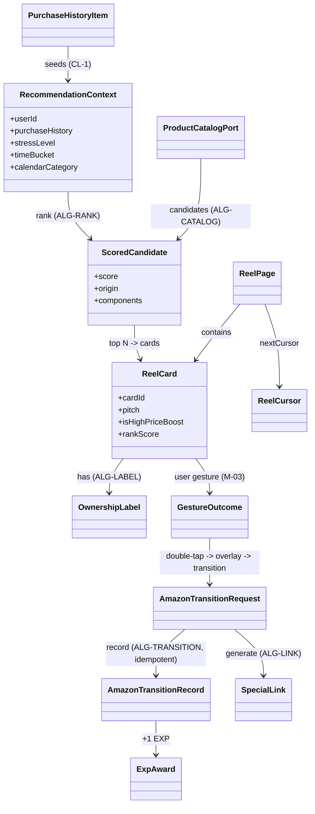

# Unit-4 Reel — Domain Entities

> Unit-4 Reel（🎬 エージェント型リール UC-02）の**ドメインモデル**。技術非依存（特定の DB / フレームワーク / ベクトル DB に依存しない概念モデル）。
> 参照: [Functional Design Plan](../../plans/unit-4-reel-functional-design-plan.md) / [Clarification](../../plans/unit-4-reel-functional-design-clarification.md) / [component-methods.md](../../../inception/application-design/component-methods.md) / [Unit-1 domain-entities.md](../../unit-1-platform/functional-design/domain-entities.md) / [API 契約ガバナンス](../../../../.kiro/steering/api-contracts.md)
> 確定方針: Q1=X（MVP は購入履歴ベース関連商品）/ Q2〜Q10=A / CL-1=A / CL-2=A / CL-3=A

---

## 0. 位置づけ

Unit-4 は **コア 3 Unit の 1 つ**（UC-02）。本ファイルが定義するのは Reel の業務ドメインに固有の値オブジェクト・エンティティである。横断型（`DomainError` / `CorrelationContext` / `SafeguardInput` / `SafeguardDecision` / `Asin` / `ProductMeta` 等）は **Unit-1 で確定済み** であり、ここでは再定義せず **参照** する。

エンティティ分類:

| 分類 | エンティティ | 主な所有コンポーネント |
|---|---|---|
| フィード | `ReelCard` / `ReelPage` / `ReelCursor` / `CardOrigin` | B-03 / M-03 |
| 推薦コンテキスト | `RecommendationContext` / `StressLevel` / `TimeBucket` / `RankingWeights` / `ScoredCandidate` | B-03 |
| 所有感ラベル | `OwnershipLabel` / `LabelGenerationInput` | B-03 |
| 商品カタログ | `ProductMeta`（Unit-1 参照）/ `CatalogQuery` / `PurchaseHistoryItem` | B-11 |
| 遷移・EXP | `AmazonTransitionRequest` / `AmazonTransitionRecord` / `ExpAward` / `TransitionContext` | B-13 |
| Special Link | `SpecialLink` / `SpecialLinkInput` | B-10 |
| ジェスチャー | `ReelGesture` / `GestureOutcome` | M-03 |

> **注**: 永続化テーブル（`ReelImpressions` / `AmazonTransitions` / `SafeguardStates` 等）の物理スキーマ・インデックス設計は Infrastructure Design ステージで確定する。本ファイルは概念モデルに限定する。

---

## 1. フィード（B-03 ReelRecommendationService / M-03 ReelScreen）

### 1.1 `CardOrigin`（列挙）

カードがなぜ提示されたか（推薦の出自）。コピー生成とテレメトリで使用。

| 値 | 意味 | 関連 |
|---|---|---|
| `purchase-related` | 過去購入のカテゴリ/ブランド関連商品（MVP 主軸、CL-1=A） | US-02 全般 |
| `co-purchase` | 共購買ヒューリスティック（「よく一緒に買われる」） | CL-1=A |
| `late-night-boost` | 深夜帯 × ストレスの高単価ブースト挿入分 | US-02-01 |
| `calendar` | カレンダー予定カテゴリ由来（Unit-6 ctx） | US-02-05 AC-4 / FR-CAL-03 |
| `onboarding-seed` | cold start のオンボ嗜好シード | CL-3=A |
| `curated-popular` | cold start / 補完のキュレーション固定リスト | CL-3=A |

### 1.2 `ReelCard`（エンティティ）

```ts
type ReelCard = {
  cardId: string;                  // フィード内一意（推薦実行ごとに採番、テレメトリ・遷移の冪等キー材料）
  product: ProductMeta;            // Unit-1 参照（asin/title/priceYen/imageUrl/reviewSummary）
  pitch: string;                   // AI 推薦コメント（疲労連動ブースト等、FR-REEL-03）
  ownershipLabel: OwnershipLabel;  // 「確保しておきました」系（US-02-05）
  tags: string[];                  // 表示タグ（「頑張ったあなたへ」「○○ のためのエージェント提案」等）
  origin: CardOrigin;              // 出自
  isHighPriceBoost: boolean;       // 深夜高単価ブースト枠か（US-02-01）
  rankScore: number;              // リランクの最終スコア（デバッグ/テレメトリ用、決定論）
};
```

**不変条件**:
- `isHighPriceBoost === true` のとき `origin === 'late-night-boost'`
- 同一 `ReelPage` 内で `cardId` は一意
- NG カテゴリ（Unit-7 / `Users.safeguard.ngCategories`）に該当する商品は `ReelCard` 化されない（推薦前に除外、US-SAFE-03 副担当責務）

### 1.3 `ReelPage`（エンティティ）

```ts
type ReelPage = {
  cards: ReelCard[];               // 既定 limit=10（business-rules REEL-PAGE-*）
  nextCursor: ReelCursor | null;   // 末尾なら null
  generatedAt: string;             // ISO 8601
};
```

### 1.4 `ReelCursor`（値オブジェクト）

カーソルベースページング + 既出抑制（Q9=A）。クライアントには **不透明文字列**として渡す。

```ts
type ReelCursor = {
  seenCardKeys: string[];          // 既出の商品キー（asin）集合。直近再表示を抑制（US-02-05 AC-3）
  rankPosition: number;            // ランキング上の継続位置
  boostConsumed: boolean;          // 深夜ブースト枠を消費済みか（先頭で 1 回だけ、Q2/Q9=A）
  sessionId: string;               // 同一セッション判定（既出抑制のスコープ）
};
// API 上は opaque（base64url エンコードの内部表現、クライアントは解釈しない）
```

**不変条件**:
- `boostConsumed` は false → true の一方向遷移のみ（同一セッションでブーストは 1 回）
- `seenCardKeys` は単調増加（ページング中に縮まない）

---

## 2. 推薦コンテキスト（B-03）

### 2.1 `StressLevel`（列挙、Unit-3 と共有 / Q3=A）

```ts
type StressLevel = 'low' | 'mid' | 'high';
```

> ストレス推定ロジックは Reel と Debate（B-02）で**同一の共有純関数**を用いる（Q3=A）。入力は `StressSignals`（直近 7 日の会議密度・残業時刻分布・深夜帯利用回数・カレンダー連続予定数）。関数の正本配置（shared か platform か）は backlog 化（[B-203](../../../../doc/backlog.md)）。

### 2.2 `TimeBucket`（値オブジェクト）

```ts
type TimeBucket = {
  localHour: number;               // 0-23（端末ローカル時刻の時）
  isLateNight: boolean;            // 22:00〜02:00 を true（US-02-01 / Q2=A）
};
```

### 2.3 `RecommendationContext`（値オブジェクト）

推薦スコアリングの入力一式。`calendarCategory` は**任意**（Q10=A、不在時は通常推薦にフォールバック）。

```ts
type RecommendationContext = {
  userId: string;                  // JWT sub（SECURITY-08、クライアント詐称不可）
  purchaseHistory: PurchaseHistoryItem[]; // MVP 候補生成の主軸（CL-1=A）
  onboardingPreferences: {         // cold start シード（CL-3=A）
    brands: string[];
    categories: string[];
  };
  stressLevel: StressLevel;        // 共有関数で算出（Q3=A）
  timeBucket: TimeBucket;
  calendarCategory?: 'presentation' | 'date' | 'camping' | 'other'; // Unit-6 ctx（任意、Q10=A）
  recentTransitions: { category: string; transitionedAt: string }[]; // 遷移後カテゴリクールダウン用（FR-AUTH-03 / REEL-RANK-10）
  safeguardFlags: {                // ブースト抑止判定に使用（Q2=A）
    quietWeek: boolean;
    cooldownOn: boolean;
    ngCategories: string[];        // 推薦前フィルタ（US-SAFE-03 副担当）
  };
  averagePriceYen: number;         // 高単価ブースト基準（平均の 1.5〜3 倍、US-02-01）
};
```

### 2.4 `RankingWeights`（設定値オブジェクト、調整可能）

リランクの重み（business-rules REEL-RANK-* で既定値を管理、純関数の係数）。

```ts
type RankingWeights = {
  relatedness: number;             // 購入履歴関連度（CL-1 の主スコア）
  timeBoost: number;               // 深夜時間帯ブースト
  stressBoost: number;             // ストレス係数（mid/high で加点）
  calendarMatch: number;           // カレンダー一致加点（calendarCategory ありのみ）
  recencyDecay: number;            // 直近表示の減衰（既出抑制と連動）
};
```

### 2.5 `ScoredCandidate`（エンティティ）

候補生成 → リランクの中間表現。

```ts
type ScoredCandidate = {
  product: ProductMeta;
  baseRelatedness: number;         // 候補生成段の関連度（0..1）
  score: number;                   // リランク後の最終スコア（決定論、純関数）
  origin: CardOrigin;
  components: {                     // スコア内訳（説明可能性・テスト用）
    relatedness: number;
    timeBoost: number;
    stressBoost: number;
    calendarMatch: number;
    recencyDecay: number;
  };
};
```

**不変条件（PBT-03 候補）**:
- 同一 `(RecommendationContext, RankingWeights, 候補集合)` に対し `score` と順位は決定論的（同一入力 → 同一順位）
- `score = Σ(components)`（内訳の和が最終スコアに一致、検算可能）

---

## 3. 所有感ラベル（B-03 / US-02-05、Q4=A）

### 3.1 `LabelGenerationInput`（値オブジェクト）

```ts
type LabelGenerationInput = {
  product: ProductMeta;
  purchaseAffinity: string;        // 根拠 1 文の材料（ブランド/価格帯/カテゴリ傾向）
  calendarBusyness: 'low' | 'high';// 高なら「今週もよく戦ってるね」系へ（US-02-05 AC-4）
  recentLabelHashes: string[];     // 直近 24h 提示済みラベルのハッシュ（重複防止、AC-3）
};
```

### 3.2 `OwnershipLabel`（値オブジェクト）

```ts
type OwnershipLabel = {
  text: string;                    // 「確保しておきました」「○○ さんのために見つけといた」等
  rationale: string;               // 固有の根拠 1 文（AC-2、例: 「先週よく見てたやつ」）
  source: 'llm' | 'template-fallback'; // LLM 生成 or フォールバック（Q4=A）
};
```

**不変条件**:
- 同一ユーザーへの直近 24h で同一 `text` の連続表示は禁止（AC-3、`recentLabelHashes` で抑止）
- `source === 'template-fallback'` でも `rationale` は必ず非空（テンプレ側も根拠文を持つ）
- NG-6 違反表現（脅迫・罪悪感強要）は出力モデレーションで除去（business-rules REEL-LABEL-*）

---

## 4. 商品カタログ（B-11 CreatorsApiClient、Q7=A / CL-1=A）

### 4.1 `PurchaseHistoryItem`（値オブジェクト）

MVP 候補生成の主軸（CL-1=A）。

```ts
type PurchaseHistoryItem = {
  asin: Asin;                      // Unit-1 値オブジェクト
  category: string;
  brand: string;
  priceYen: number;
  purchasedAt: string;             // ISO 8601
};
```

### 4.2 `CatalogQuery`（値オブジェクト）

```ts
type CatalogQuery = {
  byCategory?: string[];           // カテゴリ一致（CL-1=A）
  byBrand?: string[];              // ブランド一致（CL-1=A）
  seedAsins?: Asin[];              // 共購買の起点（CL-1=A）
  excludeNgCategories: string[];   // NG カテゴリ除外（US-SAFE-03 副担当）
  maxResults: number;
};
```

### 4.3 `ProductCatalogPort`（ポート、Q7=A）

ポート/アダプタ抽象化。本番（`CreatorsApiAdapter`）とハッカソン（`DummyCatalogAdapter`）を差し替える概念インターフェース。

```ts
interface ProductCatalogPort {
  getItemByAsin(asin: Asin): Promise<ProductMeta | null>;
  searchItems(query: CatalogQuery): Promise<ProductMeta[]>;
}
// 実装: CreatorsApiAdapter（本番）/ DummyCatalogAdapter（書類審査・予選、代表 1〜2 社固定カタログ）
// キャッシュ（TTL 6h）は両アダプタ共通のデコレータ層（business-logic ALG-CATALOG）
```

---

## 5. 遷移・EXP（B-13 AmazonTransitionRecorder、Q6=A）

### 5.1 `TransitionContext`（列挙）

```ts
type TransitionContext = 'reel' | 'debate-agree' | 'cart-attack';
// Unit-4 が記録するのは主に 'reel'。他は副担当 Unit からの呼出
```

### 5.2 `AmazonTransitionRequest`（値オブジェクト）

```ts
type AmazonTransitionRequest = {
  userId: string;                  // JWT sub（SECURITY-08）
  cardId: string;                  // 遷移元 ReelCard
  asin: Asin;
  context: TransitionContext;
  clientTransitionId: string;      // クライアント生成の冪等キー（戻る→再タップの二重計上防止、Q6=A）
  sessionId?: string;
};
```

### 5.3 `AmazonTransitionRecord`（エンティティ）

```ts
type AmazonTransitionRecord = {
  transitionId: string;            // サーバー採番
  userId: string;
  asin: Asin;
  context: TransitionContext;
  clientTransitionId: string;      // 冪等性照合キー
  recordedAt: string;              // ISO 8601
  monthBucket: string;             // "YYYY-MM"（Safeguard 月間カウント用）
};
```

### 5.4 `ExpAward`（値オブジェクト）

```ts
type ExpAward = {
  awarded: number;                 // 1 遷移につき +1（US-02-02 AC-4）
  totalExp: number;                // 加算後の累計（UC-05 連動、B-13 が Achievements を更新）
  duplicate: boolean;              // 冪等キー重複で再加算しなかった場合 true
};
```

**不変条件（PBT-04 候補）**:
- 同一 `clientTransitionId` での再リクエストは EXP を再加算しない（`duplicate=true`、`awarded=0`）
- 月間遷移カウントも冪等キーで二重計上しない
- 遷移は Safeguard ゲート通過後のみ記録される（上限到達なら記録せず 409、Q6=A / ALG-TRANSITION）

---

## 6. Special Link（B-10 AssociatesLinkGenerator、Q8=A）

### 6.1 `SpecialLinkInput`（値オブジェクト）

```ts
type SpecialLinkInput = {
  asin: Asin;
  userId: string;                  // commission 計測用サブタグの材料
  env: 'dev' | 'prd';              // 環境ガード（US-03-04 AC-4）
};
```

### 6.2 `SpecialLink`（値オブジェクト）

```ts
type SpecialLink = {
  url: string;                     // Associates タグ付き Amazon 遷移 URL（短縮しない、NG-8）
  tag: string;                     // Associates トラッキングタグ
  blocked: boolean;                // prd かつ未承認時は true（遷移ブロック、§8 A-10）
  expiresAt?: string;
};
```

**不変条件（PBT-02 候補 round-trip）**:
- `extractAsin(SpecialLink.url).asin === SpecialLinkInput.asin`（生成 URL から元 ASIN を逆抽出可能、Q8=A）
- URL は Amazon ドメインへの遷移であることを不明瞭にしない（短縮 URL 禁止、NG-8 / Associates Operating Agreement）
- 純関数: 同一 `SpecialLinkInput` → 同一 `url`

---

## 7. ジェスチャー（M-03 ReelScreen、Q5=A）

### 7.1 `ReelGesture`（列挙）

```ts
type ReelGesture =
  | 'swipe-left'      // ≥60px → 論破モード（FR-DEBATE-01 trigger=reel-refuse）
  | 'swipe-right'     // ≥60px → カート監視登録（Unit-5 B-04）
  | 'double-tap'      // ≤350ms 間隔 → 確認オーバーレイ → Amazon 遷移
  | 'vertical-scroll';// 次カード
```

### 7.2 `GestureOutcome`（値オブジェクト）

```ts
type GestureOutcome = {
  gesture: ReelGesture;
  action:
    | 'navigate-debate'        // 左スワイプ（論破不要設定 OFF）
    | 'skip-toast'             // 左スワイプ（論破不要設定 ON、US-02-03 AC-3）
    | 'register-cart-watch'    // 右スワイプ（US-02-04）
    | 'show-transition-overlay'// ダブルタップ（FR-REEL-05、オーバーレイ必須）
    | 'cooldown-blocked'       // 同一カード左スワイプ 3 回超（US-02-03 AC-4）
    | 'next-card';
  card: ReelCard;
};
```

**不変条件**:
- `double-tap` は必ず `show-transition-overlay` を経る（直接遷移しない、FR-REEL-05）
- ジェスチャー優先順位: double-tap > 水平スワイプ > vertical-scroll（Q5=A、同時成立時）

---

## 8. エンティティ関連図（概念）



### テキスト代替（Mermaid フォールバック）

- `PurchaseHistoryItem` を主軸に `RecommendationContext` を組み、`ProductCatalogPort` から候補（`ScoredCandidate`）を生成 → `ALG-RANK` でリランク → 上位 N を `ReelCard` 化
- 各 `ReelCard` は `OwnershipLabel` を持ち、複数で `ReelPage`（+ `ReelCursor`）を構成
- ユーザーのジェスチャー（`GestureOutcome`）でダブルタップ時は確認オーバーレイ経由で `AmazonTransitionRequest` を発行
- 遷移は冪等に `AmazonTransitionRecord` として記録され `ExpAward`（+1）を生む。並行して `SpecialLink` を生成して Amazon へ Deep Link

---

## 9. Unit-1 から参照する横断型（再定義しない）

| 型 | 用途 | 定義元 |
|---|---|---|
| `DomainError` / `ProblemDetails` / `ErrorCategory` | 遷移ゲート 409・カタログ外部 API 失敗・検証エラー | Unit-1 domain-entities §1 |
| `CorrelationContext` | 全リクエストの相関 ID 伝搬 | Unit-1 domain-entities §2 |
| `Asin` / `AsinResult` | ASIN 値・Special Link 逆抽出検証 | Unit-1 domain-entities §3 |
| `SafeguardInput` / `SafeguardDecision` | 遷移前ゲート（FR-FUNNEL-05） | Unit-1 domain-entities §4 |
| `ProductMeta` | 商品メタ（カタログ取得結果） | component-methods.md 型サマリ |
| `TelemetryEvent` | `reel.*` イベント計測 | Unit-1 domain-entities §5 |
