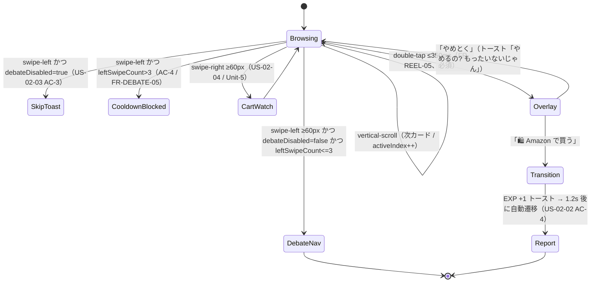

# Unit-4 Reel — Frontend Components

> Unit-4 Reel の Mobile コンポーネント（M-03 ReelScreen）のフロントエンド機能設計。Unit-1 が提供する土台（AppShell / ApiClient / Telemetry / TanStack Query / Zustand）に乗る。
> 参照: [domain-entities.md](./domain-entities.md) / [business-logic-model.md](./business-logic-model.md) / [business-rules.md](./business-rules.md) / [Unit-1 frontend-components.md](../../unit-1-platform/functional-design/frontend-components.md) / [components.md](../../../inception/application-design/components.md) / [mockup/index.html](../../../../mockup/index.html)
> 確定方針: Q1=X（MVP は購入履歴ベース関連商品）/ Q2〜Q10=A / CL-1=A / CL-2=A / CL-3=A

---

## 0. スコープ

Unit-4 の Mobile 責務は **M-03 ReelScreen**（UC-02 縦型スワイプリール）。Unit-1 の `AppShell` / `ApiClient`（M-12）/ `Telemetry`（M-13）/ TanStack Query / Zustand 土台の上に構築する。Outside-In TDD（[AGENTS.md §12](../../../../.kiro/steering/AGENTS.md)）で、API Mock（Prism / MSW）駆動で外側から実装する。

| 提供物 | 役割 |
|---|---|
| `ReelScreen` | 縦型スワイプ UI / 無限スクロール / 3 ジェスチャー / 確認オーバーレイ |
| `useReelFeed` | `GET /v1/reel` のカーソルページング（TanStack Query useInfiniteQuery） |
| `useAmazonRedirect` | 確認オーバーレイ → `POST /v1/amazon-transitions` → Special Link Deep Link |
| `useReelGestures` | ジェスチャー判定・優先順位・遷移ガード（Q5=A） |

---

## 1. コンポーネント階層

```
<ReelScreen>                         # M-03（TabNavigator 配下、Unit-1 AppShell に乗る）
├── <ReelFeedList>                   # 縦型ページャ（1 画面 1 カード、垂直ページング）
│   └── <ReelCardView>  (× N)        # 1 カード
│       ├── <ProductMedia>           # 画像 / 価格
│       ├── <PitchText>              # AI 推薦コメント（FR-REEL-03）
│       ├── <OwnershipLabelBadge>    # 「確保しておきました」系（US-02-05）
│       ├── <OriginTagRow>           # 「頑張ったあなたへ」「○○ のためのエージェント提案」
│       └── <GestureLayer>           # 左/右スワイプ・ダブルタップ・縦スクロール検知
├── <AmazonTransitionOverlay>        # ダブルタップ時の確認（FR-REEL-05、削除不可）
├── <ReelToast>                      # 「あとで見るに入れたよ」「委ね EXP +1」等（Unit-1 GlobalToast 利用）
└── <ReelFeedSkeleton>               # ローディング / cold start プレースホルダ
```

> **深夜ブースト枠の注意誘導アニメ（US-02-01 AC-2）**: `isHighPriceBoost` のカード（`origin='late-night-boost'`、「頑張ったあなたへ」タグ付き）が表示中、最初の **3 秒間スクロールやジェスチャーが発生しない**場合、`<OriginTagRow>` / カードに微細アニメーション（pulse / shimmer）を発火して注意を誘導する。スクロール・ジェスチャー発生で即停止。`react-native-reanimated` で実装。`boostIdleTimer` で管理。

---

## 2. M-03 ReelScreen

### 2.1 State

```ts
type ReelScreenState = {
  feedStatus: 'loading' | 'ready' | 'error' | 'empty';
  cards: ReelCardDto[];              // domain-entities ReelCard 由来
  activeIndex: number;               // 現在表示中のカード位置
  overlay: { open: boolean; card?: ReelCardDto }; // 確認オーバーレイ
  leftSwipeCountByCard: Record<string, number>;   // 同一カード左スワイプ回数（クールダウン用、REEL-GES-06）
  settings: { debateDisabled: boolean };          // 「論破不要」設定（US-02-03 AC-3）
  boostNudge: { active: boolean; cardId?: string }; // 深夜ブースト枠の 3 秒無操作で誘導アニメ（US-02-01 AC-2）
};
```

### 2.2 公開フック（component-methods.md 準拠）

```ts
function useReelFeed(cursor?: string): UseInfiniteQueryResult<ReelPageDto>;
//  GET /v1/reel?cursor=&limit= をカーソルページング（Q9=A）。nextCursor で getNextPageParam

function useAmazonRedirect(): (card: ReelCardDto) => Promise<void>;
//  確認オーバーレイ確定 → POST /v1/amazon-transitions（ALG-TRANSITION）→ Special Link で Amazon 起動

function onSwipeLeft(card: ReelCardDto): void;    // UC-01 論破へ遷移（or スキップ/クールダウン）
function onSwipeRight(card: ReelCardDto): void;   // カート監視登録（Unit-5）
function onDoubleTap(card: ReelCardDto): void;    // 確認オーバーレイを開く（FR-REEL-05）
```

---

## 3. ジェスチャー状態遷移（ALG-GESTURE、Q5=A）



### テキスト代替（Mermaid フォールバック）

- 通常は Browsing（縦スクロールで次カード）
- 左スワイプ ≥60px: 論破不要 OFF かつ同一カード 3 回以内 → 論破画面へ / 論破不要 ON → スキップトースト / 3 回超 → クールダウンでブロック
- 右スワイプ ≥60px: カート監視登録（Unit-5）
- ダブルタップ ≤350ms: **必ず確認オーバーレイ** → 「Amazon で買う」で遷移、「やめとく」で同画面に留まる
- 遷移後: EXP +1 トースト → 1.2 秒でダメ化レポートへ自動遷移
- 優先順位: double-tap > 水平スワイプ > vertical-scroll（Q5=A）

---

## 4. 確認オーバーレイ（AmazonTransitionOverlay、FR-REEL-05）

| 項目 | 仕様 |
|---|---|
| 表示契機 | ダブルタップ確定時のみ（REEL-GES-03、削除不可） |
| コピー | 「Amazon に飛ばすよ」（§2.2 友達系トーン） |
| 主アクション | 「🛍 Amazon で買う」→ `useAmazonRedirect`（ALG-TRANSITION + ALG-LINK） |
| 副アクション | 「やめとく」→ 閉じてトースト「やめるの? もったいないじゃん」（REEL-GES-07） |
| 認証 | Face ID 等の認証は挟まない（FR-REEL-05、確認のみ） |
| Safeguard | 遷移リクエストが 409（block）を返したら遷移せず Safeguard 画面へ誘導（REEL-TR-03） |

---

## 5. API 連携点

| フック / 操作 | エンドポイント | 備考 |
|---|---|---|
| `useReelFeed` | `GET /v1/reel?cursor=&limit=` | カーソルページング（Q9=A）。`X-Correlation-Id` は ApiClient が付与 |
| `useAmazonRedirect` | `POST /v1/amazon-transitions` | `clientTransitionId` を冪等キーに送信（Q6=A）。409 は Safeguard ブロック |
| カート監視登録（右スワイプ）| `POST /v1/cart-watch-items`（Unit-5）| 楽観 UI 更新 + トースト（US-02-04）。Unit-5 未完成中は Prism Mock |
| 論破遷移（左スワイプ）| 画面遷移（Unit-3 DebateScreen）| API ではなくナビゲーション。trigger=`reel-refuse` を渡す |
| テレメトリ | `track('reel.swiped' / 'reel.amazon_tap' / 'reel.viewed')` | M-13 経由、PII 含めない（REEL-TR-08）|

---

## 6. 状態管理方針

| 状態 | 管理 | 備考 |
|---|---|---|
| リールフィード（サーバー状態）| TanStack Query `useInfiniteQuery` | カーソルページング、キャッシュ、再取得 |
| 遷移確認オーバーレイ / トースト（UI 状態）| Zustand | `overlay` / トーストキュー |
| 「論破不要」設定・左スワイプ回数 | Zustand（persist）| クールダウン判定はセッション内、設定は永続 |
| EXP 表示 | 遷移レスポンス（ExpAward）を楽観反映 | 正本は Unit-2 / B-13 |

---

## 7. UI 検証観点（mockup 整合 / TDD）

| 観点 | 確認内容 |
|---|---|
| Mockup 整合 | `mockup/index.html` のリール画面（縦型カード・スワイプ・遷移確認）と要素整合（TDD 例外 §12.3 = 機械的移植部分） |
| Outside-In TDD | `useReelFeed` / `useAmazonRedirect` / `useReelGestures` を MSW モック駆動でテスト先行 |
| ジェスチャー | 60px / 350ms 閾値、優先順位、クールダウン、論破不要 ON の分岐（REEL-GES-*） |
| オーバーレイ | ダブルタップで必ず開く / 「やめとく」で留まる / 409 で Safeguard 誘導（FR-REEL-05 / REEL-TR-03） |
| 深夜ブースト誘導 | ブースト枠で 3 秒無操作 → 誘導アニメ発火、スクロール/ジェスチャーで停止（US-02-01 AC-2 / `boostNudge`） |
| アクセシビリティ | カードに代替テキスト、ジェスチャー操作にボタン代替（A11y）|

> コンポーネントの props 詳細・スタイル（NativeWind トークン）・アニメーション仕様は Code Generation ステージで TDD により確定する。本ファイルは機能設計（構造・状態遷移・API 連携点）に限定する。
