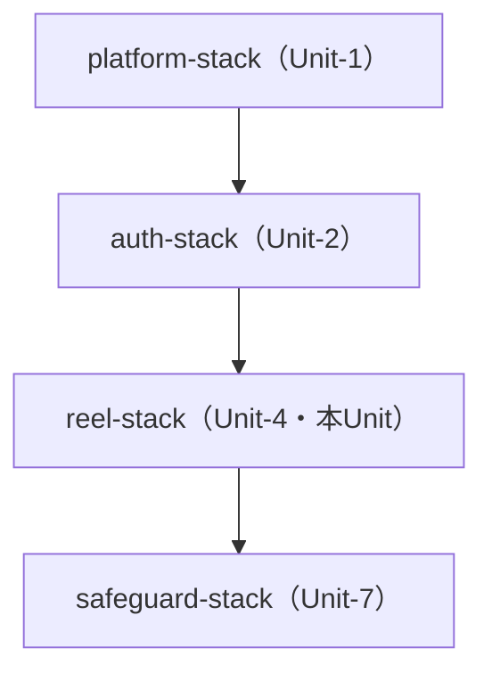
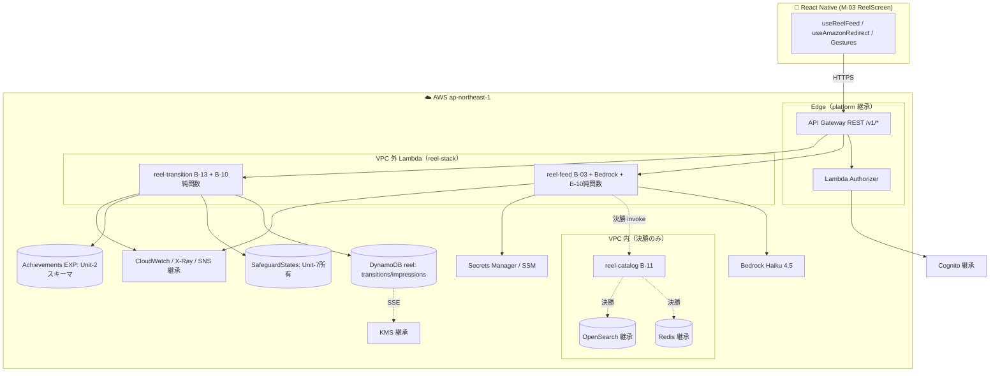

# Unit-4 Reel — Deployment Architecture

> `reel-stack` のデプロイアーキテクチャ、環境戦略、スタック依存、デプロイ順序。Unit-1 platform-stack の後段にデプロイし SSM 参照で連携。
> 参照: [infrastructure-design.md](./infrastructure-design.md) / [shared-infrastructure.md](../../shared-infrastructure.md) / [Unit-1 deployment-architecture.md](../../unit-1-platform/infrastructure-design/deployment-architecture.md) / [tech-cdk.md](../../../../.kiro/steering/tech-cdk.md)
> 確定方針: Infra Q7=A（単一 reel-stack / dev・prd / feature フラグで MVP↔決勝出し分け）

---

## 1. 環境戦略（Q7=A）

| 環境 | 用途 | removalPolicy | カタログ | VPC（reel） |
|---|---|---|---|---|
| `dev` | 開発・予選 MVP（ダミーカタログ） | DESTROY | DummyCatalogAdapter（feed 同梱） | なし |
| `prd` | 決勝 AWS 本番デモ | RETAIN | Creators API（VPC 内 B-11） | 決勝で B-11 のみ VPC 内 |

- 環境切替は CDK context（`-c env=dev|prd`）
- **MVP↔決勝の出し分けは feature フラグ**（`creators-approved` SSM / context）。MVP は VPC 内 B-11 / Redis / OpenSearch 連携を生成しない
- 書類審査・予選はダミーカタログ（要件書 §8 A-10）、決勝で Approved Mobile Application + Creators 本番接続

---

## 2. スタック依存とデプロイ順序

### reel-stack の位置（unit-of-work-dependency.md）


### テキスト代替
- platform-stack（Unit-1）→ auth-stack（Unit-2）→ **reel-stack（Unit-4）** の順
- reel-stack は platform の SSM パラメータ（VPC / API GW / Cognito / Redis / KMS / SNS / Layer）が存在することを前提
- safeguard-stack（Unit-7）は reel に Authorizer middleware として後段で関与（SafeguardStates の所有 Unit）

### スタック間連携（SSM 参照、Export/Import 不使用）
- reel-stack は `StringParameter.valueForStringParameter()` で platform の共有資源を参照
- reel-stack が公開する SSM（他 Unit 参照用、必要に応じて）:
  - `/yudane/<env>/reel/feed-lambda-arn`（report/calendar が参照する可能性）
  - `/yudane/<env>/reel/transitions-table-name`（report 集計が参照）

---

## 3. reel-stack 構成（`infra/lib/reel-stack.ts`）

```
reel-<env>-stack
├─ DynamoDB
│   ├─ yudane-reel-<env>-amazon-transitions（GSI: gsi-month）
│   └─ yudane-reel-<env>-impressions
├─ Lambda（VPC 外、SnapStart + Alias、AuditLogger Layer）
│   ├─ yudane-reel-<env>-feed（B-03、Bedrock invoke、B-10 純関数同梱）
│   └─ yudane-reel-<env>-transition（B-13、DDB + SafeguardStates + Achievements EXP、B-10 純関数同梱）
├─ Lambda（決勝のみ、VPC 内 Isolated Subnet + Lambda SG）
│   └─ yudane-reel-<env>-catalog（B-11、Redis / Creators / OpenSearch）
├─ 共有モジュール（Lambda ではない）
│   └─ B-10 Special Link Generator（純関数、feed/transition が import）
├─ API Gateway（platform の API に統合）
│   ├─ GET  /v1/reel              → feed
│   └─ POST /v1/amazon-transitions → transition（usage plan 429）
├─ SSM Parameters（reel 固有設定）
│   ├─ /yudane/<env>/reel/bedrock-model-id
│   ├─ /yudane/<env>/reel/ranking-weights
│   └─ /yudane/<env>/reel/creators-approved（feature フラグ）
└─ CloudWatch Alarms → platform SNS（alerts-topic-arn）
```

- 決勝の VPC 内 catalog Lambda / OpenSearch 連携は **同一 reel-stack 内で feature フラグ出し分け**（MVP は生成しない）
- 命名規約は shared-infrastructure.md §2 準拠

---

## 4. デプロイフロー（CI/CD、Unit-1 と共通）

```
GitHub Actions
  ├─ npm ci（ロックファイル厳守）
  ├─ Lint（ESLint / cdk-nag）+ 型チェック（tsc --noEmit / mypy --strict）
  ├─ Unit/PBT テスト + CDK snapshot test（infra/test/reel-stack.test.ts）
  ├─ Schemathesis（reel.yaml 契約テスト）
  ├─ npx cdk synth（cdk-nag AwsSolutionsChecks 自動検査）
  ├─ npx cdk diff reel-<env>-stack
  └─ npx cdk deploy reel-<env>-stack   ← デプロイはユーザー承認必須（tech-cdk §9）
```

- `cdk destroy`（prd）/ DynamoDB・IAM 削除は事前承認必須（tech-cdk §10）
- デプロイ前に platform-stack の SSM パラメータ存在を確認（前提依存）

---

## 5. cdk-nag 方針

- `AwsSolutionsChecks` rule pack 全適用
- IAM（`aws-solutions-iam4/5`）: B-13 の SafeguardStates クロス書き込み等の Suppression は理由コメント必須
- Lambda（`aws-solutions-l1`）: SnapStart / ランタイムバージョン検査
- 無言サプレッション禁止（`NagSuppressions` + 理由コメント）

---

## 6. デプロイアーキテクチャ図（論理）



### テキスト代替
- M-03 → API Gateway（platform 継承）→ Authorizer（Cognito JWT）→ reel Lambda（VPC 外: feed/transition）
- feed（B-03）は Bedrock でラベル生成、B-10 Special Link 純関数を同梱。**MVP はダミーカタログ同梱**、**決勝のみ** VPC 内 catalog（B-11）を invoke して Redis/OpenSearch へ
- transition（B-13）は reel DynamoDB（transitions/impressions）、Unit-7 所有 SafeguardStates（月間カウント）、Unit-2 スキーマ Achievements（EXP +1 同期）へ書き込み
- Associates タグは SSM、Creators OAuth 認証情報のみ Secrets Manager
- 観測（CloudWatch/X-Ray/SNS）/ KMS / Cognito は platform から継承

---

## 7. コスト最適化メモ（dev / MVP）

- **VPC / Redis / OpenSearch を MVP では使わない**（ダミーカタログ・VPC 外 Lambda）→ ENI・ElastiCache・OpenSearch コストゼロ
- DynamoDB On-Demand（アイドル課金なし）
- Lambda 従量課金 + SnapStart（追加料金なし、コールドスタート短縮）
- Bedrock Haiku 4.5（低コスト、ラベル生成のみ。フォールバックで呼び出し回数を抑制）
- 決勝で Redis / OpenSearch / VPC（NAT）コストが発生 → 決勝前に Member A と容量・コストを確認

---

## 8. 未確定（Code Generation で確定）

| 項目 | 確定タイミング |
|---|---|
| Lambda メモリ / タイムアウト / 同時実行数の具体値 | Code Generation |
| DynamoDB GSI 射影属性 / TTL 保持期間 | Code Generation |
| SnapStart Alias 運用（バージョン発行フロー） | Code Generation |
| FlashList vs FlatList（クライアント、60fps ベンチ） | Code Generation |
| OpenSearch コレクション設定（決勝、B-204） | 決勝着手時（Unit-1 へ依頼） |
| 決勝 VPC Endpoint（Creators API / Bedrock） | 決勝着手時 |
