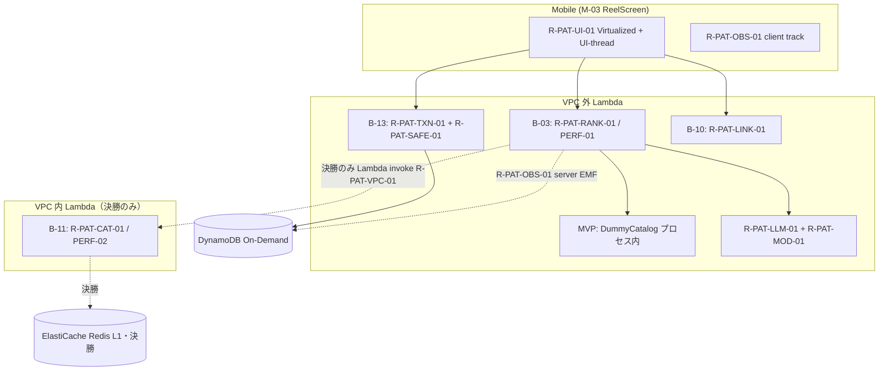

# Unit-4 Reel — NFR Design Patterns

> NFR Requirements を **設計パターン** に落とし込んだ成果物。Unit-1 が確立した横断パターンを継承し、Unit-4 固有パターン（推薦・カタログ・遷移・ラベル生成・ブースト）を上乗せ。
> 参照: [NFR Requirements](../nfr-requirements/) / [Functional Design](../functional-design/) / [logical-components.md](./logical-components.md) / [Unit-1 NFR Design](../../unit-1-platform/nfr-design/) / [services.md SVC-02](../../../inception/application-design/services.md)
> 確定方針: NFR-Req Q1〜Q10=A / NFR-Design Q1〜Q10=A ＋ 矛盾解消 3 件（VPC=a / レイテンシ分離 / ラベル同期統一）

---

## 0. パターン一覧

| ID | パターン | 対応 NFR | 適用コンポーネント | 出自 |
|---|---|---|---|---|
| PAT-RESIL-01 | Retry with Backoff + Jitter | NFR-PERF | M-12 ApiClient | Unit-1 継承 |
| PAT-SEC-01 | Authorizer + sub-claim 照合 | SECURITY-08 | API GW + 全 Lambda | Unit-1 継承 |
| PAT-SEC-04 | Rate Limit at Edge | SECURITY-11 | API Gateway（POST 全般） | Unit-1 継承 |
| PAT-OBS-01 | Metric Facade (EMF) + 命名規約 | NFR-OBS | B-12 metric() | Unit-1 継承 |
| **R-PAT-CAT-01** | Cache-aside + Stale-on-error（**決勝のみ**） | NFR-AVAIL-01 / PERF-06 | B-11 CreatorsApiClient | Unit-4（Q1） |
| **R-PAT-CAT-02** | Port/Adapter Catalog（dummy↔本番） | FR-REEL-04 | B-11 + B-03 | Unit-4（FD Q7） |
| **R-PAT-LLM-01** | Bounded LLM + Template Fallback | NFR-AVAIL-03 | B-03 ALG-PITCH/LABEL | Unit-4（Q2） |
| **R-PAT-PERF-01** | Latency Budget（soft 期限 / hard timeout 分離） | NFR-PERF-01 | B-03 buildReel | Unit-4（Q3 + 矛盾解消2） |
| **R-PAT-PERF-02** | 2-Tier Cache（meta=Redis / 候補=短 TTL、**決勝のみ**） | NFR-PERF-06 / SCALE-04 | B-11 / B-03 | Unit-4（Q4） |
| **R-PAT-TXN-01** | Idempotent Transactional Write + 先行 Gate | NFR-PERF-04 / PBT-04 | B-13 ALG-TRANSITION | Unit-4（Q5） |
| **R-PAT-SAFE-01** | Fail-closed Safeguard Gate | NFR-AVAIL-05 / SECURITY-11 | B-13 + S-03 | Unit-4（Q5 / Q8） |
| **R-PAT-RANK-01** | Pluggable Candidate Source + 決定論 Rerank | NFR-PERF / B-204 | B-03 ALG-RANK | Unit-4（Q7） |
| **R-PAT-VPC-01** | VPC 境界分離（**決勝のみ**: B-11 in-VPC / B-03·B-13 out-VPC + invoke） | NFR-SCALE-02 | B-03/B-11/B-13 | Unit-4（矛盾解消1） |
| **R-PAT-MOD-01** | Output Moderation Pipeline | NG-6 / NG-3 | B-03 | Unit-4（Q8） |
| **R-PAT-LINK-01** | Pure Link Generator + 環境ガード + 短縮禁止 | NG-8 / §8 A-10 | B-10 | Unit-4（Q8） |
| **R-PAT-SCALE-01** | On-Demand + SnapStart（深夜スパイク） | NFR-SCALE-01 | B-03/B-13 | Unit-4（Q6） |
| **R-PAT-OBS-01** | Dual-path Metrics（client M-13 / server EMF） | NFR-OBS | M-03/B-03/B-13 | Unit-4（Q9） |
| **R-PAT-UI-01** | Virtualized List + UI-thread Gesture | NFR-PERF-03 | M-03 ReelScreen | Unit-4（Q10） |

> **⚠️ MVP と決勝の構成差（過剰設計の回避）**: MVP（予選 5/30）のカタログは `DummyCatalogAdapter`（インメモリ / 同梱 JSON）であり、**Redis・VPC・B-11 別 Lambda は不要**。MVP では B-03 のプロセス内でダミーカタログを完結させる（最小構成）。Redis L1 キャッシュ（R-PAT-PERF-02）・VPC 境界分離（R-PAT-VPC-01）・stale-on-error（R-PAT-CAT-01）は **Creators API 本番接続（決勝）でのみ有効化**する。これにより MVP の Lambda invoke ホップ・VPC 構築コストを排除し、p95 800ms 予算に余裕を持たせる。

---

## 0.1 MVP / 決勝の構成マトリクス

| 項目 | MVP（予選 5/30） | 決勝（6/26、Creators API ライブ） |
|---|---|---|
| カタログ | `DummyCatalogAdapter`（プロセス内、インメモリ/同梱 JSON） | `CreatorsApiAdapter`（VPC 内 B-11 経由） |
| Redis L1 キャッシュ | **なし**（ダミーをキャッシュする意味がない） | あり（TTL 6h、R-PAT-PERF-02） |
| VPC 境界分離 | **なし**（B-03 が全処理を VPC 外で完結） | あり（B-11 in-VPC、R-PAT-VPC-01） |
| B-11 別 Lambda invoke | **なし**（B-03 内でカタログ解決） | あり |
| stale-on-error | **N/A**（ダミーは失敗しない） | あり（R-PAT-CAT-01） |
| ベクトル検索 | なし（購入履歴ヒューリスティック） | OpenSearch（B-204） |

---

## 1. レジリエンスパターン

### R-PAT-CAT-01 Cache-aside + Stale-on-error（Q1、NFR-AVAIL-01、**決勝のみ**）
- **適用条件**: Creators API 本番接続時（決勝）。MVP のダミーカタログには適用しない（ダミーは失敗せず、キャッシュも不要）
- **通常**: キャッシュ参照 → ミスでアダプタ呼出 → put（cache-aside）
- **Creators API 失敗時**: ① 期限切れでもキャッシュがあれば **stale を返す**（stale-while-error）② 無ければ `DummyCatalogAdapter` にフォールバック
- **ハードタイムアウト**: アダプタ呼出に 2s（外部 API のみ）。超過は失敗扱いで stale/ダミーへ
- **不変条件**: カタログ起因でフィードが空にならない（必ず stale or ダミー or DomainError の縮退で埋める）

### R-PAT-LLM-01 Bounded LLM + Template Fallback（Q2、NFR-AVAIL-03）
- LLM 呼出（Bedrock Haiku 4.5）に **ハードタイムアウト 1.5s**
- タイムアウト / 失敗 / モデレーション拒否 → 決定論テンプレートにフォールバック（必ず非空、REEL-LABEL-08）
- カードごと **並列**実行（直列の遅延累積を回避）
- **MVP は同期生成に統一**（矛盾解消3）: ソフト期限 350ms 内に未完了ならテンプレートで確定。後追い差し替えは採用しない（FD: ownershipLabel/pitch は必須・同期）

### R-PAT-TXN-01 Idempotent Transactional Write + 先行 Gate（Q5、PBT-04）
- 遷移記録は DynamoDB `TransactWriteItems` で原子的（**Reel 所有の 2 項目に限定**）:
  1. `AmazonTransitions` put（条件: `attribute_not_exists(clientTransitionId)`）
  2. `SafeguardStates.transitionCountMonth` += 1（遷移ゲートの整合性に必要）
- **EXP は B-13 が同期付与**（component-methods.md / services.md 準拠）: トランザクション成功時（= 非重複）に Achievements（Unit-2 スキーマ）へ EXP +1 を冪等 UpdateItem し、`ExpAwardDto` を同期で返す（US-02-02 AC-4 の「委ね EXP +1」トースト用）。3 テーブル横断の単一原子トランザクションにはせず、遷移の冪等条件で EXP 二重加算を防ぐ
- **非同期なのは嗜好ベクトル学習のみ**: B-08 PreferenceVectorUpdater（日次バッチ）が AmazonTransitions ログを読み嗜好ベクトルを更新（EXP 加算ではない、UC-05/FR-FUNNEL-04 連動）
- 冪等キー重複は条件式違反で検知 → `duplicate=true`（遷移記録・月間カウント・EXP 付与すべて二重発火しない）
- **不変条件**: 同一 clientTransitionId で遷移記録・月間カウント・EXP 付与は高々 1 回 / 月間カウントは上限超過しない / 記録とカウントは部分適用なし

### R-PAT-SAFE-01 Fail-closed Safeguard Gate（Q5/Q8、NFR-AVAIL-05）
- 遷移 Lambda 冒頭で S-03 SafeguardPolicy を **同期評価**（Unit-1 ALG-SG、Authorizer の判定とも一致）
- `block` → 記録せず 409（reasonCode）。`warn` → 200 + warning ヘッダ（止めない）
- **Safeguard 状態取得失敗 → fail-closed（遷移ブロック）**。曖昧時は拒否（SECURITY-09/11）

---

## 2. 性能・スケールパターン

### R-PAT-PERF-01 Latency Budget（soft 期限 / hard timeout 分離、Q3 + 矛盾解消2、NFR-PERF-01 = p95 800ms）

| 段階 | ソフト期限（予算） | ハードタイムアウト | 超過時の挙動 |
|---|---|---|---|
| 候補取得（ALG-CATALOG） | ≤ 300ms | 外部 API 2s（**決勝の Creators ミス時のみ**） | MVP=ダミー（プロセス内、~数 ms）/ 決勝=stale 返却 or ダミー（R-PAT-CAT-01） |
| リランク（ALG-RANK ステップ3-4） | ≤ 50ms（インメモリ純関数） | — | 最適化不要（決定論） |
| ラベル/コピー生成（並列） | ≤ 350ms | LLM 1.5s | ソフト期限でテンプレートフォールバック（同期確定） |

- **ソフト期限とハードタイムアウトを分離**: 予算（soft）は「ここで打ち切ってフォールバック」、ハードタイムアウトは「外部呼び出しの強制中断」。両者を混同しない
- リランク・ブーストは純関数のため律速にならない。律速は外部 I/O（カタログ・LLM）であり、両者ともフォールバックで予算内に収束

### R-PAT-PERF-02 2-Tier Cache（Q4、NFR-PERF-06 / SCALE-04、**決勝のみ**）
- **適用条件**: Creators API 本番接続時（決勝）。MVP はダミーカタログをプロセス内保持するためキャッシュ不要
- **L1 商品メタ（ASIN→ProductMeta）**: ElastiCache Redis、TTL 6h、全 Unit 共有（B-11）
- **L2 ユーザー別候補リスト**: 短 TTL（60〜120s、任意・決勝で調整）でフィード連打スパイクを吸収
- MVP のダミーカタログ: インメモリ / 同梱 JSON（外部に出ない、Redis 不使用）

### R-PAT-SCALE-01 On-Demand + SnapStart（Q6、NFR-SCALE-01）
- DynamoDB On-Demand（PAY_PER_REQUEST）で深夜帯スパイク吸収
- B-03/B-13 は SnapStart でコールドスタート短縮
- Provisioned Concurrency は決勝判断（コスト発生のため backlog、Unit-1 B-202 と同枠）

### R-PAT-VPC-01 VPC 境界分離（矛盾解消1、NFR-SCALE-02、**決勝のみ**）

**MVP では不要**（カタログがプロセス内ダミーのため、B-03 は全処理を VPC 外で完結し Lambda invoke も Redis も使わない）。本パターンは **Creators API 本番接続（決勝）** で有効化する。VPC 外 Lambda は VPC 内の ElastiCache Redis に直接到達できないため、責務で VPC 境界を分離する。

```
[B-03 ReelRecommendationService]  ← VPC 外（SnapStart、ENI 新規作成回避）
[B-13 AmazonTransitionRecorder]   ← VPC 外（SnapStart）
        │ Lambda invoke（決勝: カタログ取得が必要なとき）
        ▼
[B-11 CreatorsApiClient]          ← VPC 内（ElastiCache Redis / 将来 OpenSearch に到達）
        │
        ▼
   ElastiCache Redis（L1 キャッシュ）/ Creators API（VPC Endpoint or NAT）
```

- **決勝**: B-11（Redis アクセス）を VPC 内、B-03/B-13 を VPC 外に置き、B-03 は B-11 を Lambda invoke で呼ぶ
- **MVP**: B-03 が `DummyCatalogAdapter` をプロセス内で直接利用（invoke なし、VPC なし、Redis なし）
- B-13 の DynamoDB アクセスは MVP/決勝とも VPC 外から（DynamoDB は VPC 不要）。Safeguard 状態も DynamoDB のため VPC 外で完結
- 決勝の VectorSearchSource（OpenSearch、B-204）も VPC 内側（B-11 と同じ境界 or 専用 in-VPC Lambda）に置く
- **根拠**: Unit-1 が B-02 を VPC 外化したのと一貫。ストリーミング/低レイテンシ系を VPC 外で完結させ、VPC 必須リソース（Redis/OpenSearch）へのアクセスのみ in-VPC Lambda に隔離

---

## 3. セキュリティパターン

### R-PAT-MOD-01 Output Moderation Pipeline（Q8、NG-6 / NG-3）
- LLM 出力（pitch / label）は生成後に必ず `moderate()` を通す:
  - 禁止表現の正規表現/分類（脅迫・罪悪感強要 = NG-6、身体/家族/人種/病歴/宗教 = NG-3）
  - 必要に応じて Bedrock Guardrails を併用
- 拒否ならテンプレートフォールバック（R-PAT-LLM-01 と連動）
- **プロンプト内指示だけに頼らない**（出力後チェックを必須化、すり抜け防止）

### R-PAT-LINK-01 Pure Link Generator + 環境ガード + 短縮禁止（Q8、NG-8 / §8 A-10）
- Special Link は純関数生成（同一入力→同一 URL、PBT-02 round-trip）。**専用 Lambda にせず呼び出し元 Lambda に同梱**（純関数、invoke ホップ回避）
- 環境ガード: dev = 仮リンク / prd 未承認 = 遷移ブロック（`blocked=true`）
- **短縮 URL 禁止**（遷移先が Amazon であることを不明瞭にしない、Associates Operating Agreement）
- **Associates タグは SSM**（URL に公開される非機密値）。**Creators API の OAuth 認証情報のみ Secrets Manager**（実行時取得、ハードコード禁止）

### PAT-SEC-01 / PAT-SEC-04（Unit-1 継承）
- Authorizer + `@require_owner` で JWT sub 照合（フィード/遷移の IDOR 対策）
- API Gateway usage plan で `POST /v1/amazon-transitions` に rate limit（429 + `X-RateLimit-*`、REEL-API-07）

---

## 4. 観測パターン

### R-PAT-OBS-01 Dual-path Metrics（Q9、Unit-1 PAT-OBS-01 継承）
- **クライアント経路（M-13 track）**: `reel.viewed` / `reel.swiped` / `reel.double_tap` / `reel.amazon_tap` / `reel.boost_shown` / `reel.label_fallback`
- **サーバー経路（B-12 metric / EMF）**: フィード生成レイテンシ / カタログキャッシュヒット率 / 遷移 409（Safeguard block）率
- `reel.<verb>` 命名（api-contracts §12.2）、PII 非含、低カーディナリティ次元。S-04 TelemetryContracts に追記

---

## 5. UI 性能パターン

### R-PAT-UI-01 Virtualized List + UI-thread Gesture（Q10、NFR-PERF-03 = 60fps）
- 縦型ページングは仮想化リスト（FlashList 優先 / FlatList フォールバック）でオフスクリーン破棄
- ジェスチャーは gesture-handler + reanimated で **UI スレッド実行**（JS ブリッジ往復回避）
- 画像はサムネ解像度 + 次カードプリフェッチ
- 誘導アニメ（boostNudge、US-02-01 AC-2）も reanimated worklet で UI スレッド実行

---

## 6. パターン適用の依存関係



### テキスト代替（Mermaid フォールバック）
- M-03（仮想化リスト + UI スレッドジェスチャー）が VPC 外の B-03（推薦）/ B-13（遷移）/ B-10（リンク）を呼ぶ
- **MVP**: B-03 は `DummyCatalogAdapter` をプロセス内で直接利用（VPC・Redis・invoke なし）
- **決勝**: B-03 はカタログが必要なとき VPC 内の B-11 を Lambda invoke（R-PAT-VPC-01）。B-11 は Redis L1 キャッシュ（cache-aside + stale-on-error）
- B-03 はラベル/コピーを Bounded LLM + モデレーション + テンプレートフォールバックで同期生成
- B-13 は先行 Safeguard ゲート（fail-closed）+ TransactWriteItems（遷移記録 + 月間カウントの 2 項目）で DynamoDB へ。EXP +1 は同期付与、嗜好ベクトル学習のみ B-08 日次バッチで非同期
- 観測はクライアント（M-13）/ サーバー（EMF）の二経路

---

## 7. Extension コンプライアンスサマリ（NFR Design 段階）

| Extension | 状態 | 反映パターン |
|---|---|---|
| SECURITY-08（IDOR） | ✅ | PAT-SEC-01（継承）|
| SECURITY-09/11（fail-closed / rate limit） | ✅ | R-PAT-SAFE-01 / R-PAT-LINK-01 / PAT-SEC-04 |
| NG-6 / NG-3 | ✅ | R-PAT-MOD-01 |
| NG-8 / §8 A-10 | ✅ | R-PAT-LINK-01 |
| PBT-02（round-trip） | ✅ | R-PAT-LINK-01（Special Link）|
| PBT-03（invariant） | ✅ | R-PAT-RANK-01（決定論）|
| PBT-04（idempotency） | ✅ | R-PAT-TXN-01 |
| SECURITY-07（VPC）/ IAM / Lambda 物理構成 | ⏭ Infrastructure Design | R-PAT-VPC-01 の論理境界のみ確定、物理化は次ステージ |
