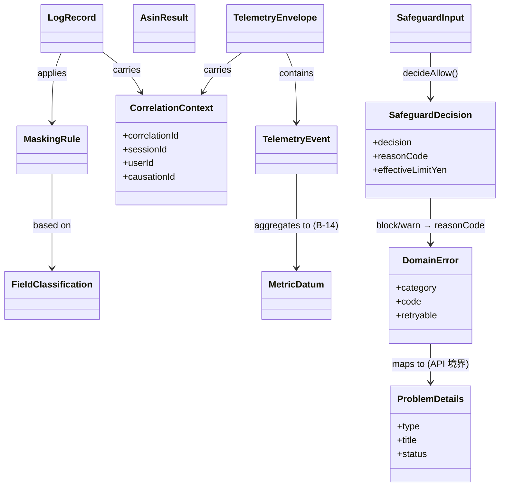

# Unit-1 Platform — Domain Entities

> Unit-1 Platform が定義する**横断ドメインモデル**。技術非依存（特定の DB / フレームワークに依存しない概念モデル）。
> 参照: [Functional Design Plan](../../plans/unit-1-platform-functional-design-plan.md) / [component-methods.md](../../../inception/application-design/component-methods.md) / [API 契約ガバナンス](../../../../.kiro/steering/api-contracts.md)
> 確定方針: Q1=refinedA / Q2=A / Q3=A / Q4=refinedA / Q5=A / Q6=A / Q7=A

---

## 0. 位置づけ

Unit-1 は基盤 Unit のため、ここで定義するエンティティは**特定 UC のビジネスデータ**（ユーザー / 論破セッション / カート監視等）ではなく、**全 Unit が共通利用する横断的な値オブジェクト・契約型**である。永続化を伴うドメインエンティティ（Users 等）は Unit-2 以降の Functional Design で定義する。

エンティティの分類:

| 分類 | エンティティ | 主な所有コンポーネント |
|---|---|---|
| エラー表現 | `DomainError` / `ErrorCategory` / `ProblemDetails` | 全層（B-12 / M-12 が変換） |
| 相関・トレース | `CorrelationContext` | M-12 ApiClient / B-12 AuditLogger |
| ASIN | `AsinResult` / `Asin`（値オブジェクト） | S-01 AsinExtractor |
| セーフガード判定 | `SafeguardDecision` / `SafeguardInput` / `SafeguardPolicyConstants` | S-03 SafeguardPolicy |
| テレメトリ | `TelemetryEvent` / `TelemetryEnvelope` / `MetricDatum` | M-13 Telemetry / B-14 / S-04 |
| ログ | `LogRecord` / `MaskingRule` / `FieldClassification` | B-12 AuditLogger / S-04 |
| 契約メタ | `ApiContractMeta`（OpenAPI ガバナンスの概念表現） | S-02 SchemaRegistry |

---

## 1. エラー表現

### 1.1 `ErrorCategory`（列挙）

Q7=A の「カテゴリ + コード」2 階層の第1階層。

| 値 | 意味 | 代表 HTTP ステータス |
|---|---|---|
| `validation` | 入力検証エラー | 400 |
| `auth` | 認証・認可エラー（IDOR 含む、SECURITY-08） | 401 / 403 |
| `not-found` | リソースなし | 404 |
| `conflict` | 競合（冷却モード中の遷移等） | 409 |
| `safeguard` | セーフガード発動（業務的なブロック） | 409 / 422 |
| `external-api` | 外部 API 失敗（Amazon Creators API / Bedrock 等） | 502 / 503 |
| `rate-limit` | レート制限 | 429 |
| `internal` | 内部エラー（詳細は body に出さない、SECURITY-09） | 500 |

### 1.2 `DomainError`（エンティティ）

```ts
type DomainError = {
  category: ErrorCategory;        // 第1階層
  code: string;                   // 第2階層。"<category>.<slug>" 形式（例: "safeguard.cooldown"）
  message: string;                // 開発者向け内部メッセージ（ユーザー表示はしない）
  userMessage?: string;           // ユーザー表示用（友達系トーン、任意）
  retryable: boolean;             // M-12 のリトライ判定に使用（Q5=A）
  details?: Record<string, unknown>; // 構造化付帯情報（PII を含めない）
  cause?: unknown;                // 元例外（ログ専用、API レスポンスには出さない）
};
```

**コード体系（第2階層の代表例、business-rules.md で全量管理）**:

| category | code 例 |
|---|---|
| validation | `validation.required-field` / `validation.invalid-format` / `validation.out-of-range` |
| auth | `auth.unauthenticated` / `auth.forbidden` / `auth.idor`（sub とパス不一致） / `auth.token-expired` |
| safeguard | `safeguard.cooldown` / `safeguard.monthly-limit-exceeded` / `safeguard.quiet-week` / `safeguard.debt-restricted` |
| external-api | `external-api.creators-unavailable` / `external-api.bedrock-throttled` |
| rate-limit | `rate-limit.exceeded` |
| not-found | `not-found.resource` |
| conflict | `conflict.state` |
| internal | `internal.unexpected` |

### 1.3 `ProblemDetails`（API 表現、RFC 7807）

`DomainError` を API レスポンスへ変換した形（api-contracts.md §4.4 準拠）。

```ts
type ProblemDetails = {
  type: string;     // "https://api.yudane.app/errors/{code}" （code を URL 化）
  title: string;    // 人間可読の要約（userMessage 由来）
  status: number;   // HTTP ステータス
  detail?: string;  // 具体説明（PII / 内部情報を含めない、SECURITY-09）
  instance?: string;// 対象リソースのパス
};
```

**変換規則**（business-logic-model.md で詳細化）:
- `type` = `https://api.yudane.app/errors/` + `DomainError.code`
- `internal` カテゴリは `detail` に内部情報を出さない（固定の汎用文言）
- `cause` / `details` の内部要素は API には出さず、ログ（B-12）にのみ残す

---

## 2. 相関・トレース

### 2.1 `CorrelationContext`（値オブジェクト）

全リクエストを貫通する相関情報。M-12 が生成し、Backend は受け取って B-12 のログ・X-Ray に伝搬する。

```ts
type CorrelationContext = {
  correlationId: string;   // UUID v4。クライアント起点。HTTP ヘッダ X-Correlation-Id で伝搬
  sessionId?: string;      // アプリ起動セッション（端末側）
  userId?: string;         // 認証済みなら JWT sub。未認証は未設定
  causationId?: string;    // 直前イベントの id（イベント連鎖の親、将来の非同期用）
};
```

**不変条件**:
- `correlationId` は 1 リクエストにつき不変。リトライ（Q5=A）時も同一 ID を再利用する
- `userId` はクライアントが詐称できない。Backend は JWT claim の `sub` を正とし、ヘッダ値は無視（SECURITY-08）

---

## 3. ASIN（S-01 AsinExtractor）

### 3.1 `Asin`（値オブジェクト）

```ts
type Asin = string; // 10 桁の英数字（正規化済み、大文字）。不変条件は business-rules.md ASIN-* を参照
```

### 3.2 `AsinResult`

抽出結果。失敗を例外でなく結果型で表す（Q3=A、`Result` 指向）。

```ts
type AsinResult =
  | { ok: true; asin: Asin; source: AsinSource; normalizedFrom: string }
  | { ok: false; reason: 'no-match' | 'invalid-checksum-format' | 'unsupported-host'; input: string };

type AsinSource =
  | 'path-dp'          // /dp/ASIN
  | 'path-gp-product'  // /gp/product/ASIN
  | 'path-gp-aw'       // /gp/aw/d/ASIN
  | 'query-asin'       // ?asin=ASIN
  | 'short-url';       // amzn.to / amzn.asia 展開後
```

**round-trip 性質（PBT-02）**: 任意の有効 `Asin` を含む正規 URL を生成 → `extractAsin` で抽出 → 元の `Asin` に一致する（business-logic-model.md ALG-ASIN 参照）。

---

## 4. セーフガード判定（S-03 SafeguardPolicy）

### 4.1 `SafeguardPolicyConstants`（不変定数）

component-methods.md の定数を正とする。

```ts
const DEFAULT_MONTHLY_LIMIT_RATIO = 0.7;            // 予算感の 70%
const DEBT_MONTHLY_LIMIT_RATIO = 0.35;              // 負債保有者
const DEBATE_COOLDOWN_SECONDS = 86_400;             // 24h（3 連続拒否後）
const CART_ATTACK_STEPS_SECONDS = [1_800, 21_600, 86_400]; // 30m / 6h / 24h
const WARN_THRESHOLD_RATIO = 0.8;                   // 上限の 80% で warn（Q2=A）
```

### 4.2 `SafeguardInput`（値オブジェクト）

```ts
type SafeguardInput = {
  transitionCountMonth: number;     // 今月の Amazon 遷移回数
  monthlyLimitYen: number;          // 適用中の月間上限（円）
  currentBudgetUsedYen: number;     // 今月の遷移額合計（円）
  flags: {
    cooldownOn: boolean;            // 冷却モード（手動 or 3 連続拒否で自動）
    quietWeek: boolean;             // 静観ウィーク
    hasDebt: boolean;               // 負債保有フラグ（オンボーディング由来）
  };
};
```

### 4.3 `SafeguardDecision`

```ts
type SafeguardDecision = {
  decision: 'allow' | 'block' | 'warn';
  reasonCode:                        // block/warn の根拠（DomainError.code と対応）
    | 'safeguard.cooldown'
    | 'safeguard.quiet-week'
    | 'safeguard.monthly-limit-exceeded'
    | 'safeguard.debt-restricted'
    | 'safeguard.near-limit'         // warn 用
    | 'allowed';
  effectiveLimitYen: number;         // hasDebt で 0.35 比率に切替後の実効上限
  remainingYen: number;              // effectiveLimitYen - currentBudgetUsedYen（下限 0）
};
```

**判定の優先順位（Q2=A、段階評価）**: cooldown/quietWeek → debt による実効上限切替 → 上限超過 block → 80% 超 warn → allow。詳細は business-logic-model.md ALG-SG。

---

## 5. テレメトリ（M-13 Telemetry / B-14 / S-04）

### 5.1 `TelemetryEvent`

クライアントが計測する 1 イベント。

```ts
type TelemetryEvent = {
  name: string;                      // S-04 で許可された名前のみ（ホワイトリスト、Q4=refinedA）
  occurredAt: string;                // ISO 8601（端末時刻）
  props: Record<string, TelemetryValue>; // 許可キーのみ。未許可キーは送信前にドロップ
};

type TelemetryValue = string | number | boolean; // ネスト・オブジェクト不可（PII 混入防止）
```

### 5.2 `TelemetryEnvelope`

バッチ送信の封筒（Q6=A）。

```ts
type TelemetryEnvelope = {
  correlation: CorrelationContext;
  events: TelemetryEvent[];          // 最大 BATCH_MAX_EVENTS 件
  clientSentAt: string;              // 送信時刻（遅延計測用）
  schemaVersion: string;             // S-04 TelemetryContracts のバージョン
};
```

### 5.3 `MetricDatum`（B-14 → CloudWatch EMF）

```ts
type MetricDatum = {
  name: string;                      // S-04 のメトリクス名カタログに存在するもの
  value: number;
  unit: 'Count' | 'Milliseconds' | 'None' | 'Percent';
  dimensions: Record<string, string>; // 低カーディナリティのみ（userId は次元に入れない）
};
```

**不変条件**: `dimensions` に高カーディナリティ値（userId / correlationId / asin）を入れない（CloudWatch コスト爆発防止）。これらは S3 Data Lake 側の属性として保持。

---

## 6. ログと PII 保護（B-12 AuditLogger / S-04）

### 6.1 `FieldClassification`（Q4=refinedA の中核）

各フィールドの**出力可否分類**。default-deny の基盤。

```ts
type FieldClassification =
  | 'allowed'       // ログ・テレメトリにそのまま出力可（ホワイトリスト登録済み）
  | 'pii'           // PII。出力時は必ずマスク（x-pii: true 由来）
  | 'unclassified'; // 未分類。default-deny によりマスク + CI で検出対象
```

### 6.2 `MaskingRule`

```ts
type MaskingRule = {
  classification: FieldClassification;
  strategy: 'passthrough' | 'full-mask' | 'partial-email' | 'hash';
  // allowed → passthrough / pii(email) → partial-email / pii(その他) → full-mask
  // unclassified → full-mask（fail-safe）
};
```

### 6.3 `LogRecord`

```ts
type LogRecord = {
  level: 'info' | 'warn' | 'error';
  message: string;
  correlation: CorrelationContext;
  context: Record<string, unknown>;  // 出力前に FieldClassification + MaskingRule を適用
  timestamp: string;                 // ISO 8601（サーバー時刻）
  emittedBy: string;                 // Lambda 名 / モジュール名
};
```

**不変条件（fail-safe）**:
- `context` の各キーは S-04 の許可リスト（`allowed`）に無ければ `unclassified` 扱いとなり `full-mask` される
- `pii` 分類のキーは許可リストに入っていてもマスク戦略が優先される
- マスキングは出力直前に 1 回だけ適用（二重マスク・マスク漏れを防ぐ）

---

## 7. 契約メタ（S-02 SchemaRegistry、概念表現）

OpenAPI ガバナンス（Q1=refinedA）を概念モデルとして表現したもの。実体は `shared/schema/` の YAML。

```ts
type ApiContractMeta = {
  version: 'v1';                     // パス prefix（api-contracts.md §4.1）
  frozenScope: {                     // 第1版で Member A が凍結する範囲
    pathsSkeleton: string[];         // 全 UC のパス + メソッド骨格
    sharedComponents: string[];      // ProblemDetails / 認証 / ページネーション / 共通パラメータ
    requiredFieldsMinimal: boolean;  // 主要リソースの必須フィールド最小セット
  };
  extensibleByImplementers: {        // 実装者が後から非破壊で追記してよい範囲
    optionalFields: true;            // 省略可能フィールドの追加（v1 内、非破壊）
    newPaths: true;                  // 新規パス追加（非破壊）
    newStatusCodes: true;
  };
  piiPolicy: {
    extensionKey: 'x-pii';           // PII フィールドのスキーマ宣言キー
    forbiddenFields: string[];       // CalendarEvent の title/body/attendees 等（NG-7、追加 PR は CI reject）
  };
};
```

**不変条件**:
- 破壊的変更（フィールド削除 / 必須追加 / 型変更）は v1 内で禁止。`/v2` 新設 + 30 日 deprecation（api-contracts.md §6）
- `forbiddenFields` への追加は `check-pii-fields.sh` で自動 reject

---

## 8. エンティティ関連図（概念）



### テキスト代替（Mermaid フォールバック）

- `DomainError` は API 境界で `ProblemDetails` に変換される
- `SafeguardInput` を `decideAllow()` にかけると `SafeguardDecision` が出る。block/warn 時は `reasonCode` が `DomainError.code` に対応
- `TelemetryEnvelope` は複数の `TelemetryEvent` と 1 つの `CorrelationContext` を保持し、B-14 で `MetricDatum` に集約される
- `LogRecord` は `CorrelationContext` を伝搬し、出力時に `FieldClassification` に基づく `MaskingRule` を適用する
