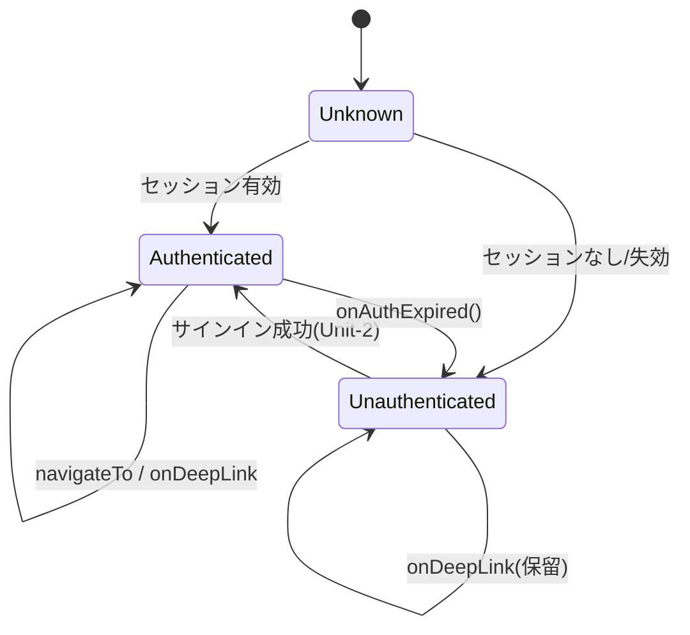

# Unit-1 Platform — Frontend Components

> Unit-1 の Mobile コンポーネント（M-01 AppShell / M-12 ApiClient / M-13 Telemetry）のフロントエンド機能設計。
> 各画面（Home / Reel / Debate 等）の UI は各 Unit で設計する。Unit-1 は**全画面が乗る土台**（ナビゲーション殻・API クライアント・テレメトリ）を提供する。
> 参照: [domain-entities.md](./domain-entities.md) / [business-logic-model.md](./business-logic-model.md) / [components.md](../../../inception/application-design/components.md)
> 確定方針: Q1=refinedA / Q2=A / Q3=A / Q4=refinedA / Q5=A / Q6=A / Q7=A

---

## 0. スコープ

Unit-1 の Mobile 責務は「アプリの骨格と横断インフラ」。具体的な業務画面（M-02〜M-07）は各 Unit が `mobile/src/features/<unit>/` 配下に実装し、Unit-1 が提供する以下の土台に乗る。

| 提供物 | コンポーネント | 役割 |
|---|---|---|
| ナビゲーション殻 | M-01 AppShell | タブ / スタック / Auth ゲート / ディープリンク |
| API クライアント | M-12 ApiClient | 認証ヘッダ / 相関 ID / リトライ / SSE / エラー変換 |
| テレメトリ | M-13 Telemetry | イベント計測 / バッファ / バッチ送信 |
| 状態管理基盤 | （TanStack Query Provider / Zustand store 雛形） | サーバー状態・クライアント状態の土台 |

---

## 1. コンポーネント階層

```
<AppRoot>
├── <QueryClientProvider>            # TanStack Query（サーバー状態）
│   ├── <ZustandStoreProvider>       # クライアント状態（UI / トースト / 設定ドラフト）
│   │   ├── <ApiClientProvider>      # M-12 ApiClient + correlation context
│   │   │   ├── <TelemetryProvider>  # M-13 Telemetry（画面遷移を自動 track）
│   │   │   │   └── <AppShell>       # M-01
│   │   │   │       ├── <AuthGate>            # 未認証 → Auth フロー（Unit-2）
│   │   │   │       ├── <DeepLinkHandler>     # 通知タップ・共有受領のルーティング
│   │   │   │       └── <TabNavigator>        # home / reel / debate / cart / report / safeguard
│   │   │   │           └── <FeatureScreens>  # 各 Unit が差し込む
│   │   │   │           └── <GlobalToast>     # 肯定フィードバック等の共通トースト土台
```

---

## 2. M-01 AppShell

### 2.1 Props / State

```ts
type AppShellState = {
  authStatus: 'unknown' | 'authenticated' | 'unauthenticated';
  currentScreen: Screen;             // 'home' | 'reel' | 'debate' | 'cart' | 'report' | 'safeguard'
  pendingDeepLink: DeepLinkTarget | null;
};

type DeepLinkTarget = {
  screen: Screen;
  params?: Record<string, unknown>;  // 例: { itemId } / { sessionId }
  source: 'push' | 'share' | 'url';
};
```

### 2.2 公開関数（component-methods.md 準拠）

| 関数 | 役割 |
|---|---|
| `navigateTo(screen, params?)` | タブ / スタック遷移。遷移時に M-13 へ画面イベントを track |
| `onDeepLink(url)` | URL を `DeepLinkTarget` に解決して navigate（UC-03 通知タップ復帰） |
| `onAuthExpired()` | セッションクリア → AuthGate を `unauthenticated` に戻す（ALG-REFRESH 失敗時に M-12 から呼ばれる） |

### 2.3 ナビゲーション状態遷移



### テキスト代替（Mermaid フォールバック）
- 起動時は `Unknown`。セッション検証後に `Authenticated` か `Unauthenticated` へ
- `Unauthenticated` でサインイン成功（Unit-2）すると `Authenticated`
- `Authenticated` で `onAuthExpired()` が呼ばれると `Unauthenticated` へ戻る
- 未認証時に来たディープリンクは `pendingDeepLink` に保留し、認証成功後に解決して遷移

### 2.4 ディープリンクルーティング規則

| 入力 source | type / 形式 | 解決先 Screen |
|---|---|---|
| push（M-09） | `cart-attack` + itemId | `cart`（CartInterceptScreen, params={itemId}） |
| push | `calendar` | `home` または対象カード |
| push | `admin` | `home` |
| share（M-08） | 共有 URL → ASIN | `cart`（取込カード表示） |
| url | アプリスキーム deeplink | マッピング表で解決 |

**規則**:
- 未認証時のディープリンクは `pendingDeepLink` に保持し、認証完了後に 1 回だけ解決する（取りこぼし防止）
- 解決不能な deeplink は `home` にフォールバックし、warn を track

---

## 3. M-12 ApiClient（フロント観点）

UI からの利用契約を定義（ロジック詳細は business-logic-model ALG-API）。

### 3.1 利用形態

```ts
// TanStack Query と組み合わせて使う
const { data } = useQuery({
  queryKey: ['home-snapshot'],
  queryFn: () => apiFetch<HomeSnapshotDto>('/v1/home'),
});

// ストリーミング（論破、Unit-3 が利用）
for await (const token of (await apiFetch<DebateTokenDto>('/v1/debate-sessions', { stream: true })) as AsyncIterable<DebateTokenDto>) {
  // ...
}
```

### 3.2 UI へのエラー伝播規則

| DomainError.category | UI の既定挙動（共通） |
|---|---|
| `validation` | フォーム近傍にインラインエラー表示（userMessage） |
| `auth` | `auth.token-expired` は自動リフレッシュ後に再試行。失敗時はサインイン画面へ |
| `safeguard` | block はセーフガード画面 / 冷却モード画面へ誘導（Unit-7）。warn はトースト通知のみ |
| `external-api` | 「ちょっと混み合ってるみたい、あとでもう一度」系の友達系トースト |
| `rate-limit` | リトライ可能なら自動、不可なら待機案内トースト |
| `internal` | 汎用エラートースト（詳細は出さない、SECURITY-09） |

- `userMessage` は友達系トーン（敬語でなくタメ口、product.md トーン方針）
- TanStack Query の `retry` は false にし、リトライは ApiClient 内（GET のみ）に一元化（二重リトライ防止）

---

## 4. M-13 Telemetry（フロント観点）

### 4.1 自動計測（TelemetryProvider が担う）

| イベント | track タイミング |
|---|---|
| `screen_view` | `navigateTo` / `onDeepLink` での画面遷移時 |
| `app_foreground` / `app_background` | アプリ状態変化（background で flush 発火） |
| `deeplink_open` | ディープリンク解決時（source 付き） |

### 4.2 利用規則（各 Unit 向け）

```ts
Telemetry.track('reel_swipe', { direction: 'left', originTrigger: 'calendar' });
// name は S-04 カタログに事前登録が必要。props は許可キーのみ（PII 混入防止）
```

| 規則 | 内容 |
|---|---|
| TEL-UI-01 | 業務イベント名は S-04 カタログに PR で追加してから使う（未登録は no-op） |
| TEL-UI-02 | props に PII / 自由文字列の本文を入れない（許可キー以外は送信前にドロップ） |
| TEL-UI-03 | 高頻度イベント（スワイプ等）はサンプリングを検討（NFR で閾値確定） |

---

## 5. 状態管理基盤（土台のみ提供）

| 状態種別 | 技術 | Unit-1 が提供する土台 |
|---|---|---|
| サーバー状態 | TanStack Query | QueryClient 設定（既定 staleTime / retry=false / エラー → DomainError） |
| クライアント状態 | Zustand | ルートストア雛形 + persist ミドルウェア（AsyncStorage）設定 |
| 横断 UI | Zustand slice | `GlobalToast` slice（肯定フィードバックトーストの共通土台、中身は各 Unit） |

> 各 Unit は自身の feature slice / query hook をこの土台に追加する。Unit-1 は store の分割規約（feature ごとに slice 分離）とフォルダ構造を確立する。

---

## 6. API 連携ポイント（Unit-1 が直接使うエンドポイント）

| コンポーネント | エンドポイント | 用途 |
|---|---|---|
| M-13 Telemetry / B-14 | `POST /v1/telemetry` | テレメトリバッチ送信 |
| M-12 ApiClient | （全エンドポイント共通土台） | 認証・相関 ID・エラー変換のラッパー |
| M-01 AuthGate | （Unit-2 の auth エンドポイントを利用） | セッション検証（実体は Unit-2） |

> その他の業務エンドポイント（/v1/debate-sessions, /v1/reel, /v1/cart-watch-items 等）は各 Unit が利用。Unit-1 は OpenAPI 骨格（Q1=refinedA）でこれらのパスを凍結し、Prism モックで各 Unit の UI 並行開発を可能にする。

---

## 7. アクセシビリティ土台（A11y）

Unit-1 は全画面共通の A11y 基盤を確立する（個別画面の対応は各 Unit）。

| 項目 | Unit-1 の提供 |
|---|---|
| スクリーンリーダー | ナビゲーション殻にアクセシビリティロール / ラベルの規約を設定 |
| フォーカス管理 | 画面遷移時のフォーカス移動規約 |
| 動的フォントサイズ | ルートのテキストスケーリング対応土台 |
| カラーコントラスト | テーマトークン（mockup の Indigo / cold rose / cyan パレット）を WCAG AA 目標で定義 |

> A11y の具体的な達成基準・検証方法は NFR Requirements ステージで Unit-1 向けに定義する。
