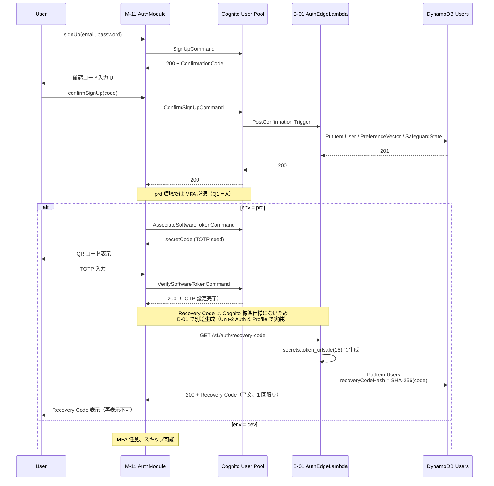
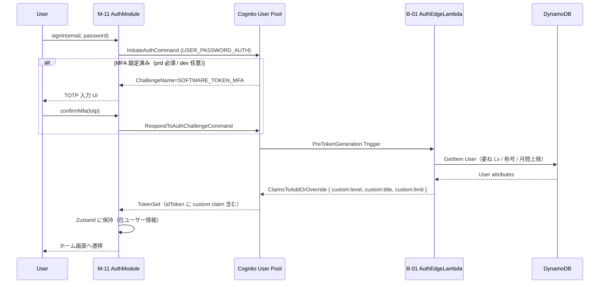
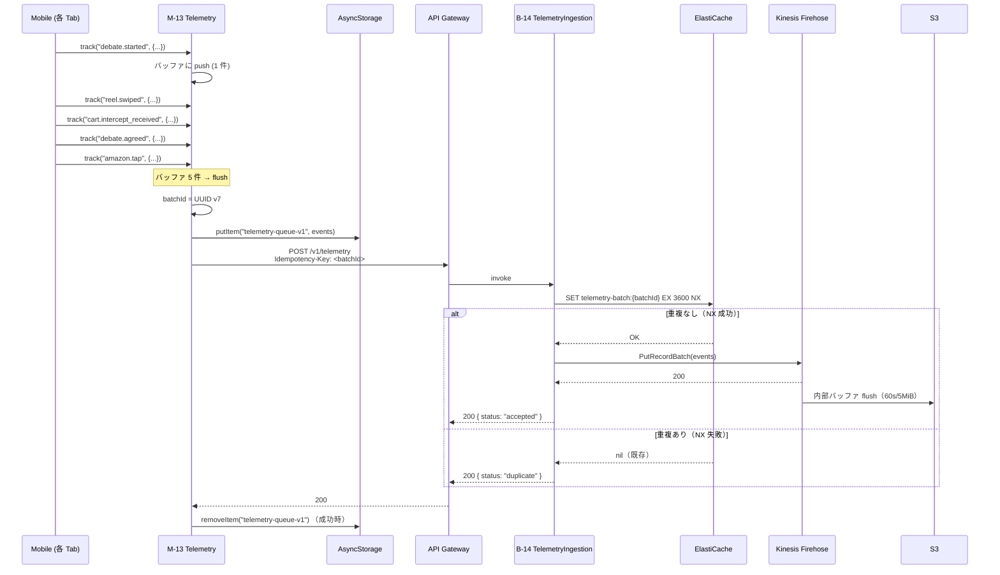
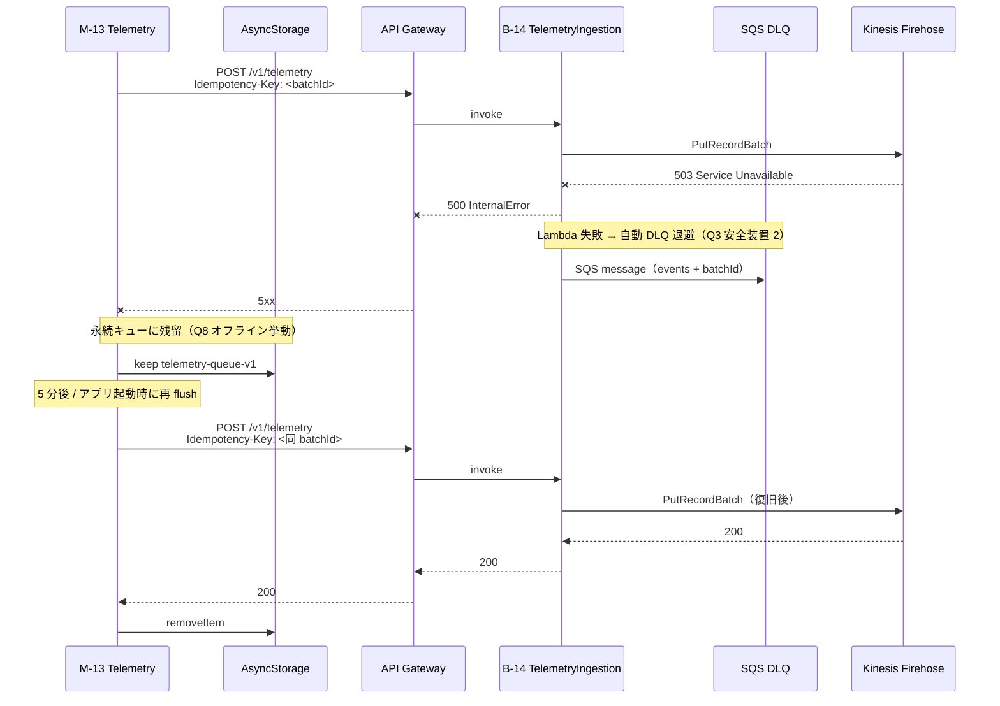
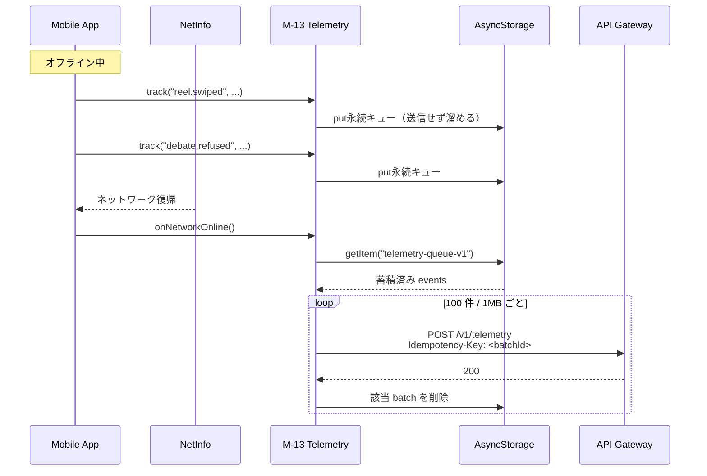
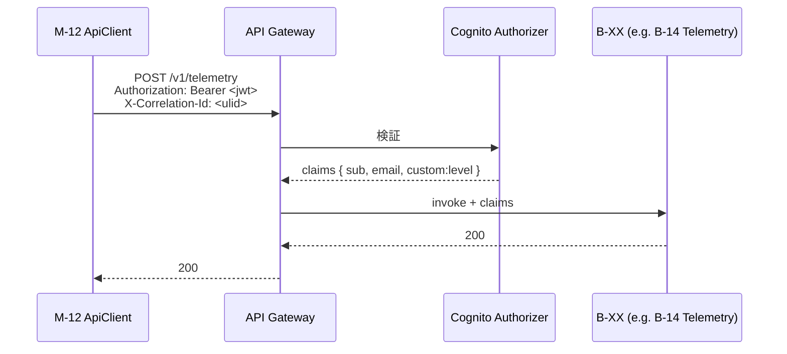
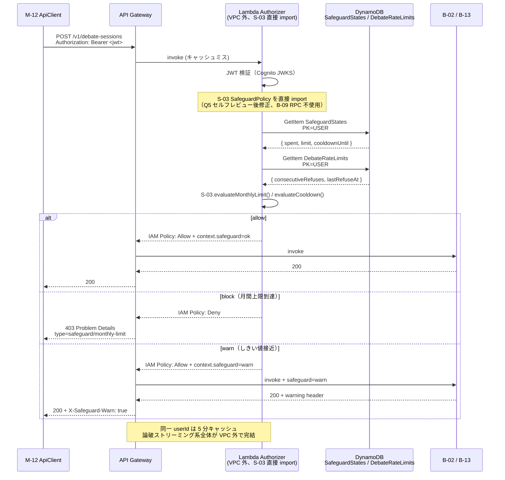
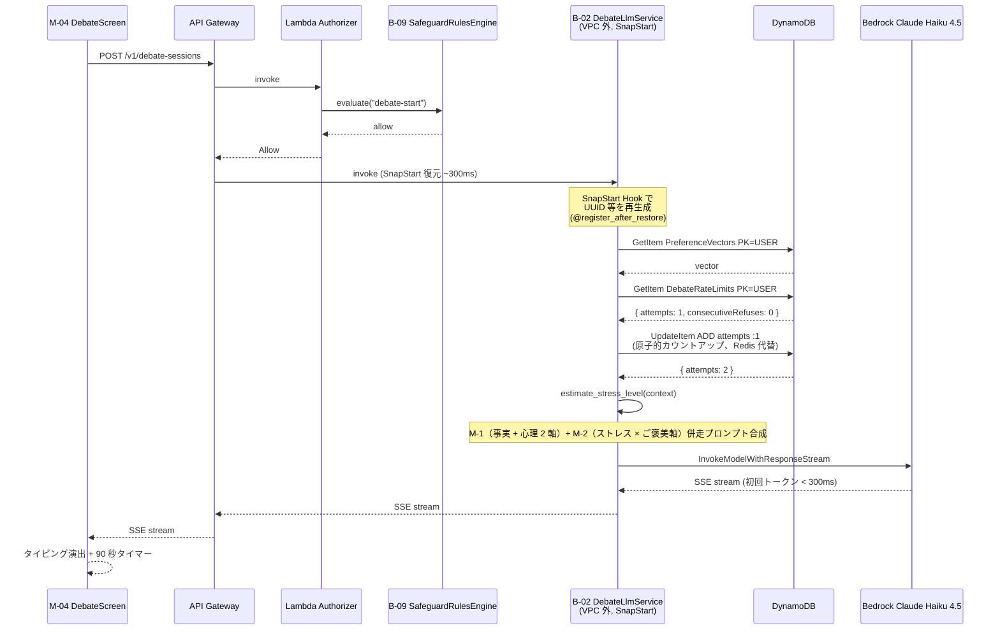
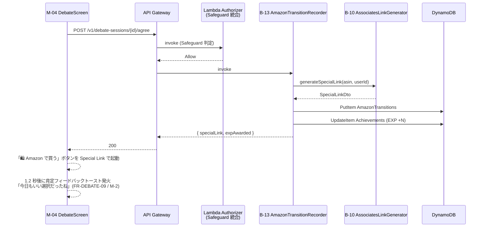
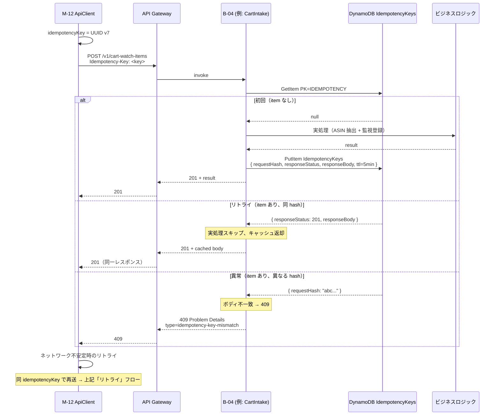

# Unit-1 Platform — Sequence Diagrams

> Q1〜Q10 の確定を Mermaid sequence diagram で可視化する。
>
> 参照: [functional-design.md](./functional-design.md) / [data-model.md](./data-model.md)

---

## 1. Cognito 認証フロー（Q1 = A 反映: dev 任意 / prd 強制 MFA）

### 1.1 サインアップ + MFA 設定

### 1.2 サインイン + JWT 取得

---

## 2. Telemetry 投入フロー（Q3 = B + 安全装置 3 点反映）

### 2.1 通常時の flush（5 件バッファ → 成功）

### 2.2 失敗時のリトライ（DLQ + 永続キュー復元）

### 2.3 オフライン → オンライン復帰時の flush（Q8 反映）

---

## 3. API Gateway Authorizer フロー（Q2 = C ハイブリッド反映）

### 3.1 軽量 API（Cognito Authorizer のみ）

### 3.2 Safeguard 介入 API（Lambda Authorizer + Safeguard 判定、Q5 セルフレビュー後修正反映）

**Q5 セルフレビュー後修正の反映（2026-05-27）**:

- 当初設計（B-09 RPC + ElastiCache）から、Lambda Authorizer 内に S-03 SafeguardPolicy を直接 import + DDB 直接参照に変更
- B-09 SafeguardRulesEngine Lambda は管理 UI / バッチ処理 / 監査ログ専用に責務縮小（Lambda Authorizer の前段配置から外れる）
- これにより VPC 内 Lambda は B-03 / B-11 / B-14 の 3 つに限定され、論破ストリーミング系全体（API Gateway → Lambda Authorizer → B-02）が VPC 外で完結
- 詳細は [functional-design.md §3.1 / §4.2](./functional-design.md) を参照

---

## 4. 論破ストリーミングフロー（Q5 確定: B-02 DDB 化 + SnapStart）

### 4.1 論破セッション開始（B-02 が VPC 外 + SnapStart で動作）

### 4.2 論破成功 → Amazon 遷移 → 肯定フィードバック

---

## 5. 冪等キーフロー（Q7 = B 反映）

---

## 6. ハッカソン書類審査・予選評価軸へのインパクト

| 評価軸 | 本ドキュメントの貢献 |
|---|---|
| Unit 分解の適切さ | **強化**: Cognito Trigger / Authorizer / Telemetry / 論破 / 冪等キーの 5 系統が Mermaid で可視化、Unit 跨ぎの責任分界が明示 |
| ドキュメント品質 | **強化**: Q1〜Q10 確定が sequence レベルで具体化、誤実装リスクを低減 |
| AI-DLC プロセス（予選評価軸） | **強化**: Functional Design Part 2 の証跡として残る |
