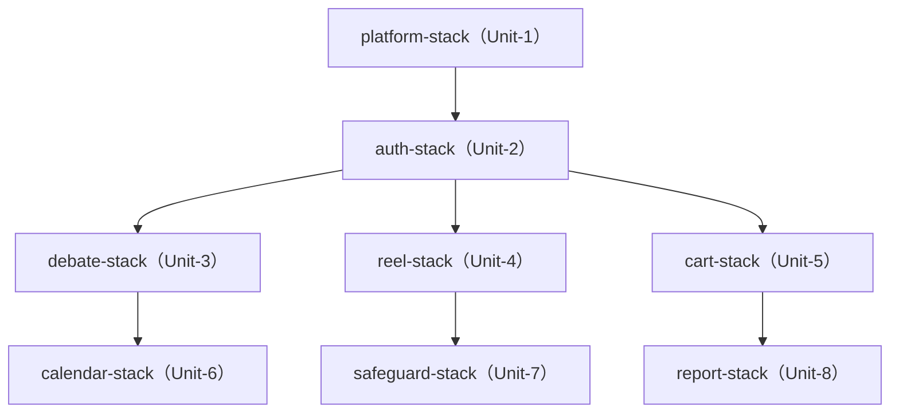
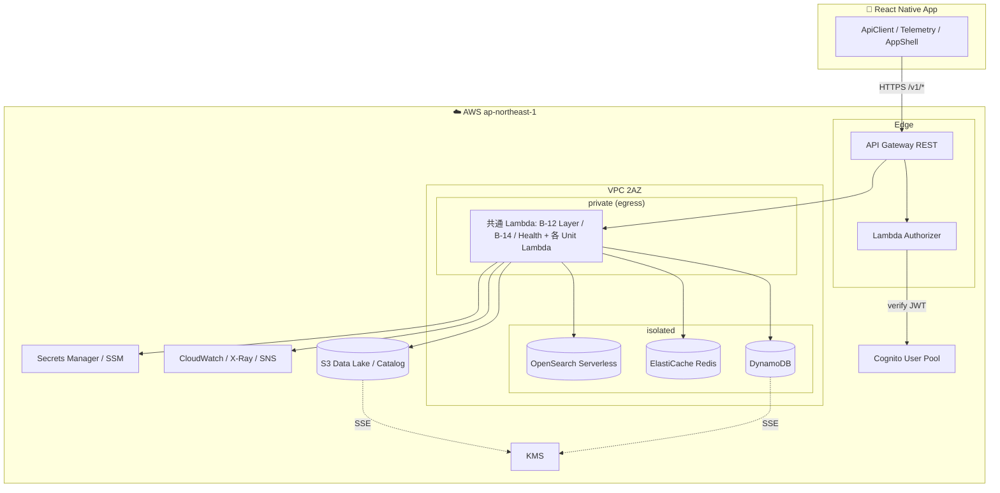

# Unit-1 Platform — Deployment Architecture

> `platform-stack` のデプロイアーキテクチャ、環境戦略、スタック依存、デプロイ順序。
> 参照: [infrastructure-design.md](./infrastructure-design.md) / [tech-cdk.md](../../../../.kiro/steering/tech-cdk.md) / [unit-of-work-dependency.md](../../../inception/application-design/unit-of-work-dependency.md)
> 確定方針: Infra Q6=A（dev + prd 2 環境）

---

## 1. 環境戦略（Q6=A）

| 環境 | 用途 | removalPolicy | NAT | 構築タイミング |
|---|---|---|---|---|
| `dev` | 開発・予選 MVP（モックデータ可） | DESTROY | 1 基 | Unit-1 着手時 |
| `prd` | 決勝 AWS 本番デモ | RETAIN | AZ ごと | 決勝前 |

- 環境切替は CDK context（`-c env=dev|prd`）
- 書類審査・予選はモックデータで代替（要件書 §8 A-10）、決勝で Approved Mobile Application + 本番デプロイ

---

## 2. スタック依存とデプロイ順序

### スタック構成（モノレポ `infra/lib/`）
```
platform-stack   … Unit-1（本 Unit）VPC / API GW / Cognito / DynamoDB 共通 / S3 / Redis / OpenSearch / KMS / IAM / 観測
auth-stack       … Unit-2
debate-stack     … Unit-3
reel-stack       … Unit-4
cart-stack       … Unit-5
calendar-stack   … Unit-6
safeguard-stack  … Unit-7
report-stack     … Unit-8
```

### 依存方向（unit-of-work-dependency.md 準拠）


### テキスト代替
- platform-stack（Unit-1）が全ての土台。最初にデプロイ
- auth-stack（Unit-2）が platform に依存
- コア 3（debate/reel/cart）が auth に依存し並行
- サポート 3（calendar/safeguard/report）がコアに依存

### スタック間連携（tech-cdk.md §3）
- **CloudFormation Export/Import を避け、SSM Parameter Store 経由**で連携
- platform-stack が公開する SSM パラメータ:
  - `/yudane/<env>/platform/vpc-id`
  - `/yudane/<env>/platform/private-subnet-ids`
  - `/yudane/<env>/platform/api-id` / `api-root-resource-id`
  - `/yudane/<env>/platform/userpool-id` / `userpool-client-id`
  - `/yudane/<env>/platform/redis-endpoint`
  - `/yudane/<env>/platform/kms-key-arn`
  - `/yudane/<env>/platform/alerts-topic-arn`
- 各 Unit スタックは上記を `StringParameter.valueForStringParameter` で参照

---

## 3. デプロイフロー（CI/CD）

```
GitHub Actions
  ├─ npm ci（ロックファイル厳守）
  ├─ Lint（ESLint / cdk-nag）+ 型チェック（tsc --noEmit）
  ├─ Unit/PBT テスト + CDK snapshot test（infra/test）
  ├─ SBOM 生成（Snyk / Dependabot、SECURITY-10）
  ├─ npx cdk synth（cdk-nag AwsSolutionsChecks 自動検査）
  ├─ npx cdk diff
  └─ npx cdk deploy <stack>   ← デプロイはユーザー承認必須（tech-cdk §9）
```

- `cdk destroy`（prd 相当）/ IAM・DynamoDB・S3・KMS の削除は **事前承認必須**（tech-cdk §10）

---

## 4. cdk-nag 方針

- `AwsSolutionsChecks` rule pack 全適用
- 予選前は `aws-solutions-iam4` / `aws-solutions-l1` 等の本番相当ルールまで適用
- Suppression は `NagSuppressions.addResourceSuppressions()` + 理由コメント必須（無言サプレッション禁止）

---

## 5. デプロイアーキテクチャ図（論理）



### テキスト代替
- RN アプリ → HTTPS で API Gateway（REST）→ Lambda Authorizer が Cognito で JWT 検証 → 各 Lambda（VPC private egress）
- Lambda は isolated サブネットの DynamoDB / Redis / OpenSearch、および S3 / CloudWatch / Secrets にアクセス
- DynamoDB / S3 は KMS で暗号化

---

## 6. コスト最適化メモ（dev）

- NAT 1 基（AZ 冗長は prd のみ）
- ElastiCache 最小ノード（t4g.micro）
- OpenSearch Serverless は Unit-4 着手まで未作成
- DynamoDB オンデマンド（アイドル時課金なし）
- Lambda（従量課金、アイドルコストなし）

---

## 7. 未確定（Code Generation で確定）

| 項目 | 確定タイミング |
|---|---|
| Lambda メモリ / タイムアウト / 同時実行数の具体値 | Code Generation |
| DynamoDB 各テーブルの PK/SK/GSI 具体設計 | 各 Unit の Functional/Code |
| API GW の詳細ルート定義（OpenAPI 連携） | Code Generation（Unit-1 が骨格凍結） |
| CDK Construct の具体実装 | Code Generation |
