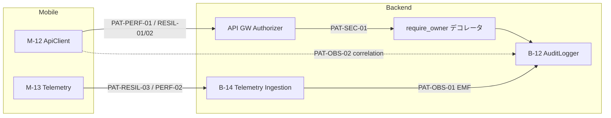

# Unit-1 Platform — NFR Design Patterns

> NFR Requirements を **設計パターン** に落とし込んだ成果物。Unit-1 が確立し他 7 Unit が継承する横断パターン。
> 参照: [NFR Requirements](../nfr-requirements/) / [Functional Design](../functional-design/) / [logical-components.md](./logical-components.md)
> 確定方針: NFR-Req Q1=A/Q2=A/Q3=B/Q4=A/Q5=A/Q6=B/Q7=A ＋ NFR-Design Q1=A/Q2=A/Q3=A/Q4=A

---

## 0. パターン一覧

| ID | パターン | 対応 NFR | 適用コンポーネント |
|---|---|---|---|
| PAT-RESIL-01 | Retry with Exponential Backoff + Jitter | NFR-PERF-06 | M-12 ApiClient |
| PAT-RESIL-02 | Token Refresh (single-shot) | SECURITY-12 連携 | M-12 / M-11 |
| PAT-RESIL-03 | At-least-once Telemetry Delivery | NFR-OBS / PBT-04 | M-13 / B-14 |
| PAT-RESIL-04 | Health Check (shallow) | NFR-AVAIL-01 | platform API |
| PAT-PERF-01 | Request Policy (REST / SSE 分離) | NFR-PERF-01/02 | M-12 ApiClient |
| PAT-PERF-02 | Client-side Batching + Background Flush | NFR-PERF-04/05 | M-13 Telemetry |
| PAT-SEC-01 | Authorizer + sub-claim 照合デコレータ | SECURITY-08（IDOR） | API GW + 全 Lambda |
| PAT-SEC-02 | Allowlist Sanitizer (default-deny) | SECURITY-03 / Q4=refinedA | B-12 AuditLogger |
| PAT-SEC-03 | Fail-closed Global Error Handler | SECURITY-09/15 | 全 Lambda / ApiClient |
| PAT-SEC-04 | Rate Limit at Edge | SECURITY-11 | API Gateway |
| PAT-OBS-01 | Metric Facade (EMF) + 命名規約 | NFR-OBS-01/02 | B-12 metric() |
| PAT-OBS-02 | Correlation ID Propagation | SECURITY-13 | 全層 |

---

## 1. レジリエンスパターン

### PAT-RESIL-01 Retry with Exponential Backoff + Jitter（Q5/FD、NFR-PERF-06）
- **適用**: M-12 ApiClient の GET のみ（非冪等メソッドは対象外）
- **トリガー**: HTTP 429 / 503 / ネットワークタイムアウト
- **バックオフ**: `delay = 300ms * 2^attempt + random_jitter(0–100ms)`、最大 2 回（計 3 試行）
- **不変条件**: リトライ中も correlationId 不変（REQ-02）。試行回数上限を超えたら `retryable=false` の DomainError
- **fail-closed**: 上限到達時はエラーを握りつぶさず必ず DomainError を伝播（PAT-SEC-03 連携）

### PAT-RESIL-02 Token Refresh（single-shot）
- **適用**: M-12 で 401 を受けたとき
- **規則**: `AuthModule.refresh()` を 1 回だけ → 成功で同一 correlationId 再送、失敗で `onAuthExpired()` + `auth.token-expired`
- **不変条件**: リフレッシュ後の再送でも 401 なら再リフレッシュしない（無限ループ防止、RETRY-05）

### PAT-RESIL-03 At-least-once Telemetry Delivery（Q3=A）
- **クライアント**: メモリキュー → flush 失敗時 AsyncStorage 退避 → 次回再送（退避上限超過で古い順破棄、TEL-05）
- **サーバー**: B-14 の EMF put は idempotent。重複イベントは集計誤差で吸収（厳密 dedup しない）
- **MVP 方針（Q3=A）**: サーバー側専用キュー（SQS）は設けず API 同期受信。§6.3 の規模（同時 50→500）に十分
- **PBT**: TelemetryEnvelope の round-trip（PBT-02）+ 二重送信しても集計が壊れない idempotency（PBT-04）

### PAT-RESIL-04 Health Check（shallow、Q6=B）
- `GET /v1/health` が依存サービス（DynamoDB / Redis）の浅い疎通のみ返す
- **Q6=B の帰結**: サーキットブレーカ・degrade フックは Unit-1 では持たない。各 Unit が必要時に自前で縮退

---

## 2. 性能パターン

### PAT-PERF-01 Request Policy（REST / SSE 分離、Q2=A / Design-Q1=A）
- 単一 `apiFetch` に `RequestPolicy` を渡す。interceptor チェーンで適用:
  ```
  auth(JWT付与) → correlation(ID付与) → timeout(policy別) → retry(GETのみ) → errorMap(Problem→DomainError)
  ```
- **タイムアウト 2 系統（NFR-PERF-01/02）**:
  - REST: 接続 3s / 全体 10s
  - SSE: 接続 3s / アイドル 30s / 全体無制限
- 横断既定値を Unit-1 が提供、各 Unit が `apiFetch(path, { timeout })` で上書き可

### PAT-PERF-02 Client-side Batching + Background Flush（NFR-PERF-04/05）
- track はメモリ enqueue のみ（< 1ms、UI スレッド非ブロック）
- flush 条件: 20 件 / 30s / background 化（TEL-04）。flush は背景タスク
- 高頻度イベント（スワイプ等）はサンプリング余地を各 Unit に残す

---

## 3. セキュリティパターン

### PAT-SEC-01 Authorizer + sub-claim 照合デコレータ（Q4=A、SECURITY-08）
- **第1層**: API Gateway Lambda Authorizer が JWT を検証（認証の一元化）
- **第2層**: 全 Lambda 冒頭に共通デコレータ `@require_owner` を適用し、JWT `sub` と path の `{userId}` 照合（IDOR 対策）
- **業務判定は各 Unit**: リソースオーナーの細かい業務ルール（例: 他人の論破セッション参照可否）は各 Unit が実装
- **fail-closed**: claim 欠落・不一致は 403（`auth.idor`）。曖昧時は拒否

### PAT-SEC-02 Allowlist Sanitizer（default-deny、Q2=A / Q4=refinedA、SECURITY-03）
- B-12 AuditLogger は Lambda Powertools Logger を薄くラップ
- ログ出力直前に context を再帰走査する純関数 `sanitize(record)` を必ず噛ませる:
  ```
  for each key in record (再帰):
    cls = classify(key)   # allowed / pii / unclassified
    apply mask:
      allowed → passthrough
      pii(email) → partial-email / pii(other) → full-mask
      unclassified → full-mask   ← fail-safe の核心
  message 本文 → 正規表現で email/電話/カード番号の二次マスク
  ```
- **fail-safe**: 新規 PII 列が allowlist 未登録なら自動 full-mask。CI（check-pii-fields 拡張）で未分類を検出して fail（PII-07）

### PAT-SEC-03 Fail-closed Global Error Handler（SECURITY-09/15）
- 全 Lambda にグローバル例外ハンドラ。未捕捉例外は `internal.unexpected`（500）に正規化し、**detail に内部情報を出さない**（ERR-05）
- 外部呼び出しは try/catch 必須、失敗時は安全側（拒否 / 縮退）に倒す

### PAT-SEC-04 Rate Limit at Edge（SECURITY-11）
- API Gateway の usage plan / throttling で全 POST に rate limit
- 超過は 429 + `X-RateLimit-*` ヘッダ（API-09）

---

## 4. 観測パターン

### PAT-OBS-01 Metric Facade（EMF）+ 命名規約（Q3=B、NFR-OBS）
- B-12 `metric()` が Powertools Metrics（EMF）をラップした Facade
- 命名規約 `<unit>.<domain>.<metric>`、次元は低カーディナリティのみ（userId/asin を次元に入れない）
- **Q3=B の帰結**: Unit-1 は Facade + 命名規約 + overhead 上限のみ提供。具体メトリクス名カタログは各 Unit が S-04 に追記

### PAT-OBS-02 Correlation ID Propagation（SECURITY-13）
- M-12 が UUID v4 を生成 → `X-Correlation-Id` → Backend が受領 → B-12 ログ / X-Ray セグメントに伝搬
- リトライ・リフレッシュ再送でも不変

---

## 5. パターン適用の依存関係



### テキスト代替
- ApiClient は Request Policy（PAT-PERF-01）+ リトライ/リフレッシュ（PAT-RESIL-01/02）を適用して API GW Authorizer（PAT-SEC-01）に到達
- Authorizer 通過後、各 Lambda は `require_owner` デコレータで sub 照合 → B-12 でログ（PAT-SEC-02 sanitize）
- Telemetry は At-least-once（PAT-RESIL-03）+ batching（PAT-PERF-02）で B-14 へ、B-14 は EMF（PAT-OBS-01）で出力
- correlation ID（PAT-OBS-02）は全経路を貫通

---

## 6. Extension コンプライアンスサマリ（NFR Design 段階）

| Extension | 状態 | 反映パターン |
|---|---|---|
| SECURITY-08（IDOR） | ✅ | PAT-SEC-01 |
| SECURITY-03（ログ） | ✅ | PAT-SEC-02 |
| SECURITY-09/15（fail-closed / エラー秘匿） | ✅ | PAT-SEC-03 / RESIL-01 |
| SECURITY-11（rate limit / 分離） | ✅ | PAT-SEC-04 |
| SECURITY-13（整合性 / 監査） | ✅ | PAT-OBS-02 |
| PBT-02/04（round-trip / idempotency） | ✅ | PAT-RESIL-03 |
| SECURITY-07（VPC） | ⏭ Infrastructure Design | — |
