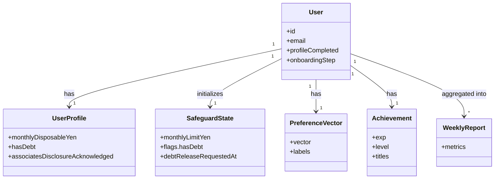

# Unit-2 Auth & Profile — Domain Entities

> Unit-2 のドメインモデル（永続化を伴う業務エンティティ）。技術非依存の概念モデル。
> 参照: [Functional Design Plan](../../plans/unit-2-auth-profile-functional-design-plan.md) / [stories US-AUTH](../../../inception/user-stories/stories.md) / [component-methods.md](../../../inception/application-design/component-methods.md) / [Unit-1 domain-entities](../../unit-1-platform/functional-design/domain-entities.md)
> 確定方針: Q1=A / Q2=A / Q3=A / Q4=A / Q5=A / Q6=A

---

## 0. エンティティ一覧

| エンティティ | 所有 | 永続化先（DynamoDB） |
|---|---|---|
| `User` | Unit-2 | `yudane-auth-<env>-users` |
| `UserProfile`（オンボ情報、User 集約の一部） | Unit-2 | 同上（埋め込み or 同テーブル） |
| `PreferenceVector` | Unit-2（B-08 が更新） | `yudane-auth-<env>-preference-vectors` |
| `SafeguardState` | Unit-2 が初期化、Unit-7 が運用 | `yudane-auth-<env>-safeguard-states` |
| `Achievement`（Lv / 称号 / Streak） | Unit-2 | `yudane-auth-<env>-achievements` |
| `WeeklyReport` | Unit-2（B-08 週次生成）→ Unit-8 表示 | `yudane-report-<env>-weekly-reports` |

> Unit-1 で定義した横断型（DomainError / CorrelationContext 等）は再利用する。

---

## 1. User / UserProfile（US-AUTH-01）

### 1.1 `User`

```ts
type User = {
  id: string;              // Cognito sub（不変）
  email: string;           // x-pii。ログ・テレメトリでは必ずマスク
  createdAt: string;       // ISO 8601
  profileCompleted: boolean; // オンボ完了フラグ
  onboardingStep: number;  // 0〜5。途中再開用（Q1=A 段階保存、AC-3）
};
```

### 1.2 `UserProfile`（オンボ 5 項目、User 集約の一部、Q1=A）

```ts
type UserProfile = {
  userId: string;
  monthlyDisposableYen: number | null;  // 画面1: 月間使える額
  monthlySavingsYen: number | null;     // 画面2: 月間貯金額
  favoriteBrands: string[];             // 画面3: 好きなブランド（5+ 推奨）
  ngCategories: string[];               // 画面4: NG カテゴリ
  hasDebt: boolean | null;              // 画面5: 負債フラグ（US-AUTH-03）
  associatesDisclosureAcknowledged: boolean; // FR-PROFILE-04 / NG-8
  updatedAt: string;
};
```

**段階保存（Q1=A）**: 各画面で部分保存し `onboardingStep` を進める。途中離脱時は `onboardingStep` から再開（AC-3、PBT-04 冪等）。完了時に `profileCompleted=true`。

**不変条件**:
- `monthlyDisposableYen >= 0`、`favoriteBrands` は重複なし
- `profileCompleted=true` の必要十分条件は 5 項目すべてが非 null + 開示確認済み

---

## 2. PreferenceVector（UC-07、B-08 が更新）

```ts
type PreferenceVector = {
  userId: string;
  vector: number[];        // Titan Embeddings 次元
  labels: string[];        // 人間可読タグ（ダメ化ポートフォリオの素）
  updatedAt: string;       // 日次バッチ更新時刻
};
```

**初期状態（Q2=A）**: Post Confirmation で空ベクトル（`vector: []`, `labels: []`）を作成。B-08 日次バッチが購買履歴・スキップ・論破成功率・カレンダーパターンから更新。

---

## 3. SafeguardState（US-AUTH-03、Q3=A）

Unit-2 が初期化し、Unit-1 の `SafeguardPolicy.decideAllow` が判定に使う入力源。

```ts
type SafeguardState = {
  userId: string;
  monthlyLimitYen: number;       // オンボの月間使える額から算出（DEFAULT 比率 0.7）
  currentBudgetUsedYen: number;  // 今月の遷移額（Unit-4/B-13 が加算）
  transitionCountMonth: number;
  flags: {
    cooldownOn: boolean;
    quietWeek: boolean;
    hasDebt: boolean;            // US-AUTH-03。true で decideAllow が 0.35 比率適用
  };
  debtReleaseRequestedAt: string | null; // 負債解除リクエスト時刻（72h クーリングオフ、AC-4）
  monthAnchor: string;           // 当月の集計基準（YYYY-MM）
};
```

**負債連動（Q3=A）**: `flags.hasDebt=true` のとき、Unit-1 `SafeguardPolicy.decideAllow` が自動的に実効上限を DEBT_MONTHLY_LIMIT_RATIO(0.35) / DEFAULT(0.7) = 半減する。Unit-2 は has_debt の保存と解除フロー（72h クーリングオフ）のみ実装し、判定ロジックは再実装しない。

---

## 4. Achievement（UC-05、Lv / 称号 / Streak）

```ts
type Achievement = {
  userId: string;
  exp: number;             // 散財 EXP（Unit-4/B-13 の Amazon 遷移で加算）
  level: number;           // exp から算出
  titles: string[];        // 獲得称号（「本日の湯水使い」「静かな信徒」「伝道師」等）
  currentStreakDays: number;
  longestStreakDays: number;
  updatedAt: string;
};
```

**Lv 判定（UC-05、Q5/B-08 連携）**: exp → level は単調増加の閾値関数。称号は level / streak / 特定行動で付与。判定ロジックは business-logic-model.md ALG-LEVEL。

---

## 5. WeeklyReport（UC-06/07、B-08 週次生成 → Unit-8 表示）

```ts
type WeeklyReport = {
  userId: string;
  weekAnchor: string;      // YYYY-Www
  metrics: {
    debateToAmazonRate: number;   // 論破→Amazon 遷移率（北極星指標、§6.1）
    cartInterceptConversionRate: number;
    lateNightUsageRatio: number;  // 深夜帯利用比率
    monthlySpendYen: number;
  };
  generatedAt: string;
};
```

**Q5=A**: B-08 の週次ハンドラが CloudWatch Metrics + DynamoDB から集計して生成。Unit-8 DameReportScreen が `GET /v1/report` で参照（services.md 北極星指標経路）。

---

## 6. エンティティ関連図



### テキスト代替
- User は UserProfile / SafeguardState / PreferenceVector / Achievement を 1:1 で持ち、WeeklyReport は週次に 1:多
- SafeguardState.flags.hasDebt は Unit-1 SafeguardPolicy が参照（実効上限 0.35 適用）
- exp / level / titles は Unit-4 の Amazon 遷移（B-13）で更新される
