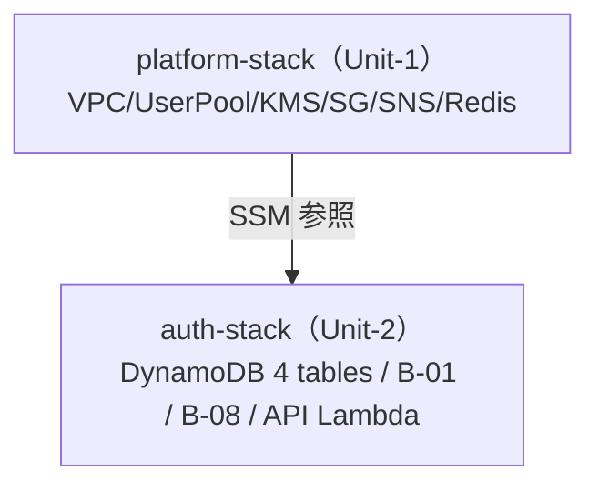

# Unit-2 Auth & Profile — Deployment Architecture

> `auth-stack` のデプロイアーキテクチャ。platform-stack に依存し SSM 経由で参照。
> 参照: [infrastructure-design.md](./infrastructure-design.md) / [shared-infrastructure.md](../../shared-infrastructure.md) / [Unit-1 deployment-architecture](../../unit-1-platform/infrastructure-design/deployment-architecture.md)
> 確定方針: Infra Q4=A（dev + prd）

---

## 1. スタック依存



### テキスト代替
- platform-stack を先にデプロイ → SSM パラメータ公開
- auth-stack は `StringParameter.valueForStringParameter` で VPC/UserPool/KMS/SG/SNS を参照
- CloudFormation Export/Import は使わない（tech-cdk §3）

---

## 2. デプロイ順序

```
1. platform-stack（Unit-1）  ← 既に構築済み
2. auth-stack（Unit-2）
   - DynamoDB 4 テーブル作成
   - B-01 を platform User Pool のトリガーにアタッチ
   - B-08 + EventBridge cron 2 本
   - auth API Lambda 群
3. （以降）コア 3 Unit が auth に依存
```

---

## 3. 環境戦略（Q4=A）

| 環境 | removalPolicy（DynamoDB） | 備考 |
|---|---|---|
| dev | DESTROY | 開発・予選 MVP |
| prd | RETAIN | 決勝。ユーザーデータ保全 |

- env は platform-stack と揃える（`-c env=dev|prd`）
- DynamoDB は prd で RETAIN（誤削除防止）。削除は tech-cdk §10 の事前承認必須

---

## 4. デプロイフロー（CI/CD）

```
GitHub Actions（infra ジョブ、Unit-1 CI に統合済み）
  ├─ npm ci
  ├─ npx cdk synth -c env=dev（cdk-nag AwsSolutionsChecks）
  ├─ npx cdk diff auth-dev-stack
  └─ npx cdk deploy auth-dev-stack   ← ユーザー承認必須（tech-cdk §9）
```

- 破壊的操作（DynamoDB 削除 / cdk destroy prd）は事前承認必須（tech-cdk §10）

---

## 5. bin/app.ts への追加（予定）

```typescript
// platform-stack に続けて auth-stack を定義
new AuthStack(app, `auth-${env}-stack`, {
  envName: env,
  env: { region },
  // platform の SSM を参照（VPC/UserPool/KMS/SG）
});
```

- Code Generation 時に `infra/lib/auth-stack.ts` を実装し、bin/app.ts に追加

---

## 6. cdk-nag 方針
- AwsSolutionsChecks を auth-stack にも適用
- DynamoDB / Lambda の IAM は最小権限。Suppression は理由コメント必須

---

## 7. 未確定（Code Generation で確定）
| 項目 | 確定タイミング |
|---|---|
| auth-stack.ts の CDK 実装 | Code Generation |
| Lambda メモリ / タイムアウト / 同時実行 | Code Generation |
| EventBridge cron の正確な式（タイムゾーン） | Code Generation |
