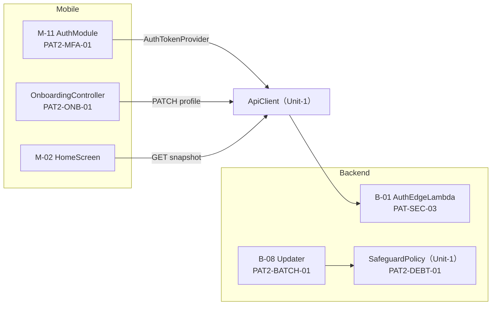

# Unit-2 Auth & Profile — NFR Design Patterns

> Unit-2 の設計パターン。Unit-1 のパターンを継承し、Unit-2 固有分を定義する。
> 参照: [Unit-2 NFR Requirements](../nfr-requirements/) / [Unit-2 Functional Design](../functional-design/) / [Unit-1 NFR Design](../../unit-1-platform/nfr-design/)
> 確定方針: NFR-Design Q1=A / Q2=A / Q3=A / Q4=A

---

## 0. Unit-1 から継承するパターン

| ID | パターン | Unit-2 での適用 |
|---|---|---|
| PAT-RESIL-01/02 | Retry / Token Refresh | ApiClient 経由で自動継承（M-11 が refresh 実体を提供） |
| PAT-SEC-01 | Authorizer + require_owner | 全 users/{userId} エンドポイント |
| PAT-SEC-02 | Allowlist Sanitizer | B-01/B-08 ログ、Unit-2 PII は allowlist 外（自動マスク） |
| PAT-SEC-03 | Fail-closed Error Handler | B-01/B-08 ハンドラ |
| PAT-OBS-01/02 | Metric Facade / Correlation | `auth.signin.success_rate` を EMF で |

---

## 1. Unit-2 固有パターン

| ID | パターン | 対応 | 適用 |
|---|---|---|---|
| PAT2-ONB-01 | Server-authoritative Step + Client Draft | Q1=A | オンボ段階保存 |
| PAT2-DEBT-01 | Timestamp + Lazy Evaluation | Q2=A | 負債 72h クーリングオフ |
| PAT2-BATCH-01 | Cron-triggered Multi-entry Lambda | Q3=A | B-08 日次/週次 |
| PAT2-MFA-01 | Challenge-driven State Machine | Q4=A | MFA フロー |

---

## 2. PAT2-ONB-01 オンボ段階保存（Q1=A）

```
[サーバー権威] User.onboardingStep が正
[クライアント] Zustand persist でドラフト保持（端末再起動耐性）

各画面 onNext():
  PATCH /v1/users/{userId}/profile { partial fields, step: n }
  → サーバーは upsert（冪等）+ onboardingStep = max(current, n)
再開:
  起動時に GET /v1/users/{userId} → onboardingStep から画面復元
```

- **冪等性（PBT-04）**: 同一 step の再 PATCH で onboardingStep は後退しない（max 演算）
- **整合性**: サーバーが正。クライアントドラフトは UX 用の先行表示のみ

---

## 3. PAT2-DEBT-01 負債クーリングオフ（Q2=A、Step Functions 不採用）

```
解除リクエスト:
  PATCH safeguard → debtReleaseRequestedAt = now（解除理由ログ）
遅延評価（専用スケジューラを持たない）:
  - SafeguardPolicy 評価のたび or 日次バッチで判定:
    if debtReleaseRequestedAt != null and now - debtReleaseRequestedAt >= 72h:
        flags.hasDebt = false; flags.cooldownOn = false; debtReleaseRequestedAt = null
```

- **利点**: EventBridge Scheduler ジョブを増やさず、状態 + 時刻比較で実現（services.md Step Functions 不採用と整合）
- **不変条件**: 72h 未満の解除は no-op。`hasDebt` が false になる唯一の経路はこの遅延評価

---

## 4. PAT2-BATCH-01 B-08 バッチ（Q3=A）

```
EventBridge cron（日次, 例 04:00 JST） → B-08 Lambda handler: update_preference
EventBridge cron（週次, 日曜 22:00 JST） → B-08 Lambda handler: generate_weekly_report
（同一 Lambda デプロイ、エントリポイントを 2 つ持つ。曜日判定の混在を避ける）
```

- 負債クーリングオフの遅延評価（PAT2-DEBT-01）は日次バッチ内でも実行（取りこぼし防止）
- 集計は CloudWatch Metrics + DynamoDB（北極星指標、services.md 経路）

---

## 5. PAT2-MFA-01 MFA チャレンジ（Q4=A、Amplify Auth v6）

```
AuthModule 内の有限状態機械:
  idle → signingIn → (MFA_REQUIRED) → mfaChallenge → confirmingMfa → authenticated
                   → (no MFA) → authenticated
  失敗: signingIn/confirmingMfa → error（失敗カウントは Cognito 側、5 回で 15 分ロック）
  リセット: authenticated/error → mfaResetRequested →（72h 冷却）→ mfaReset

状態は Zustand（クライアント状態）で管理、トークンは Amplify が保持。
ApiClient の AuthTokenProvider.refresh はこの状態機械の refresh 遷移を呼ぶ。
```

- ロックアウト（5 回 / 15 分）・リセット冷却（72h）の**ロジックは MVP**（NFR2-SEC-02/03）
- CloudWatch Alarm の作り込みは決勝（NFR2-SEC-04）

---

## 6. パターン適用図



### テキスト代替
- AuthModule（MFA 状態機械）は Unit-1 ApiClient に AuthTokenProvider を提供
- OnboardingController はサーバー権威 step で段階保存
- B-01 は fail-closed エラーハンドラ、B-08 は cron 2 本でバッチ + 負債遅延評価（SafeguardPolicy）

---

## 7. Extension コンプライアンスサマリ
| Extension | 状態 | 反映 |
|---|---|---|
| SECURITY-08/09 | ✅ | Unit-1 PAT-SEC-01/03 継承 |
| SECURITY-12 | ✅ MVP | PAT2-MFA-01（ロック/リセット冷却ロジック） |
| SECURITY-14 | ⏭ 決勝 | Alarm 作り込み |
| NG-4 | ✅ MVP | PAT2-DEBT-01（72h クーリングオフ） |
| PBT-04 | ✅ | PAT2-ONB-01（段階保存の冪等性） |
