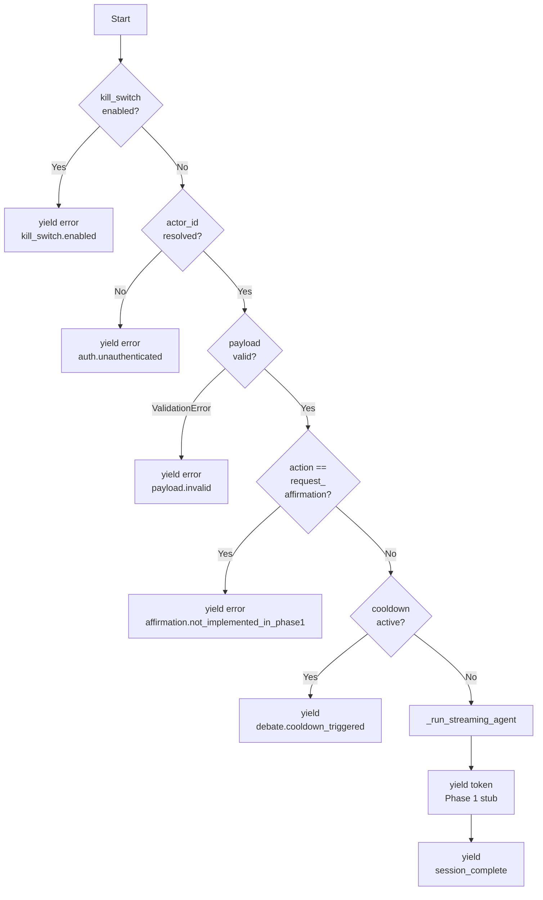

# Unit-3 Debate — main.py 実装サマリ（Phase 1 Step 5）

> Phase 1 Step 5（Backend / AgentCore Runtime Entrypoint Router 最小実装）の実装結果。
>
> 参照: [Phase 1 Plan §1 Step 5](../../../plans/unit-3-debate-code-generation-phase1-plan.md) / [strands-agent-design.md §1](../functional-design/strands-agent-design.md) / [business-rules.md §1 DEBATE](../functional-design/business-rules.md)
>
> 完了日: 2026-05-30 / 担当: Member B（AI 代行実装）/ TDD スタイル: クラシック TDD

---

## 1. 生成ファイル

| ファイル | 役割 |
|---|---|
| `backend/src/debate/main.py`（170 行）| AgentCore Runtime entrypoint（最小実装、Phase 2 で Strands SDK 実 import）|
| `backend/tests/debate/test_main_smoke.py`（240 行）| 8 smoke tests（actor_id 解決 / 制御フロー）|

---

## 2. API 仕様

### 2.1 `parse_jwt_actor_id(context) -> str | None`

AgentCore Runtime context から actor_id（Cognito JWT.sub）を取得する純関数（PAT-D-SEC-01）。

| 入力 | 戻り値 |
|---|---|
| `context.user.sub = 'user-1'` | `'user-1'` |
| `context.user = None` | `None`（auth.unauthenticated）|
| `context` に `user` 属性なし | `None` |

### 2.2 `debate_handler(payload, context, *, now=None) -> AsyncIterator[dict]`

論破セッションのメインハンドラ。**6 段の制御フロー** を順に実行：

各分岐で **早期 return** することで、Bedrock 呼び出し前に**コスト保護**（PAT-D-COST-01 / 04）+ **倫理担保**（NFR-ETHICS-DEBATE-04）を物理層で実現。

---

## 3. テスト 8 ケース

| # | テストケース | 検証 |
|---|---|---|
| 1 | `parse_jwt_actor_id_returns_user_sub_from_context` | 正常系 |
| 2 | `parse_jwt_actor_id_returns_none_when_user_is_missing` | fail-safe（user=None） |
| 3 | `parse_jwt_actor_id_returns_none_when_context_has_no_user_attr` | fail-safe（属性なし）|
| 4 | `debate_handler_yields_auth_error_when_actor_unresolved` | actor_id 未解決 → auth.unauthenticated |
| 5 | `debate_handler_yields_cooldown_event_when_active` | クールダウン中 → cooldown_triggered + Bedrock 呼ばない（PAT-D-COST-01）|
| 6 | `debate_handler_yields_validation_error_on_invalid_payload` | 空 user_input → payload.invalid |
| 7 | `debate_handler_ignores_actor_id_in_payload` | **SECURITY-08 不変条件**: actor_id 偽装は破棄、JWT.sub のみ使用 |
| 8 | `debate_handler_yields_kill_switch_event_when_enabled` | kill-switch=enabled → 即時 fail-fast（PAT-D-COST-04）|

**実行結果**: 8/8 green / 0.76s / Coverage Line **81%** Branch **85%**（達成）。

---

## 4. 設計上の判断

### 4.1 Phase 1 では Strands SDK / bedrock-agentcore SDK の実 import を保留

理由:
- Phase 1 計画書 §0 のコンテキスト「基盤疎通の最小限の本格実装」に従い、Phase 2 の Lambda bundling 時に依存解決する
- pip install `bedrock-agentcore` `strands-agents` の依存解決にはネットワークアクセス + 30 分以上の build 時間がかかる可能性（task-breakdown リスク表）
- テストの mock 容易性: `_run_streaming_agent` を分離 + import 遅延化により、`patch.object(main, '_run_streaming_agent')` で簡潔にモック差し替え可能

代替: `requirements.txt` に依存を列挙、Phase 2 で AgentCore Runtime デプロイ時に `aws-cdk-lib AgentRuntimeArtifact.fromCodeAsset(bundling=...)` で `pip install -r requirements.txt -t /asset-output` を実行する設計。

### 4.2 `now` パラメータをテスト容易性のため引数化

`debate_handler(payload, context, *, now=None)` で `now` を keyword-only 引数として受け取る。本番では `None` で `datetime.now(UTC)` を使用、テストでは固定値を渡して時刻依存テストを安定化。同じパターンを `cooldown.py` と統一。

### 4.3 `_get_*_lazy()` で起動時環境変数の遅延評価

`_MODEL_ID` / `_COOLDOWNS_TABLE_NAME` をモジュールトップレベルで `None` 初期化し、最初の呼び出し時に SSM / 環境変数から取得。Lambda コールドスタート 1 回のみ実行。テスト時は `ENV_NAME` 未設定でも import 失敗しない設計。

### 4.4 SECURITY-08 不変条件の 3 重保証

| レイヤ | 保証 |
|---|---|
| **Pydantic** | `DebateInvocationPayload(extra='ignore')` で actor_id を破棄（Step 3）|
| **debate_handler** | `parse_jwt_actor_id(context)` で context.user.sub のみを actor_id として伝播（Step 5）|
| **テスト** | `test_debate_handler_ignores_actor_id_in_payload` で攻撃者の偽装が無視されることを明示検証 |

### 4.5 Phase 2 への引き継ぎ

| 項目 | Phase 2 で対応 |
|---|---|
| `_run_streaming_agent` の実装 | Strands SDK の `agent.stream_async(composed.text)` に置換 |
| `compose_debate_prompt` 連携 | T2.1 プロンプト合成 6 モジュール完成後に `prompts.compose.compose_debate_prompt` を import |
| MemoryHook 連携 | T2.3 で `Agent(hooks=[DebateMemoryHook()])` に追加 |
| 90s graceful shutdown | T3.1 で `started_at` チェック + `graceful_shutdown_initiated` event |
| `action='request_affirmation'` | T2.5 で affirmation 生成パスを実装 |
| `debate.refused` payload 受信時の `increment_refuse_count` 呼び出し | T2.4 で `action='refuse'` payload 拡張 |

---

## 5. ハッカソン評価軸へのインパクト

- **Unit 分解の適切さ**: 170 行の薄い entrypoint で 6 段の早期 return パターン、Phase 2 拡張時に各段に追加処理を挿入可能
- **創造性とテーマ適合性**: kill-switch / cooldown / actor_id 検証の 3 段倫理担保を物理層で実装、NG-6 滑落の最終防衛線
- **ドキュメント品質**: 全 docstring + Mermaid 制御フロー図 + 8 テストケースで「動作すべき動作」を明示
- **AI-DLC プロセス**: Red → Green → Refactor サイクルを 1 セッションで完結、Phase 2 への明確な引き継ぎ事項
