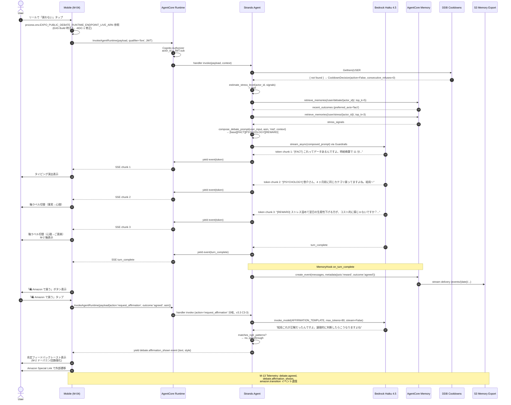
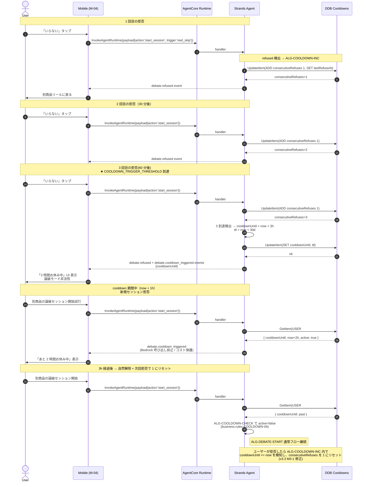
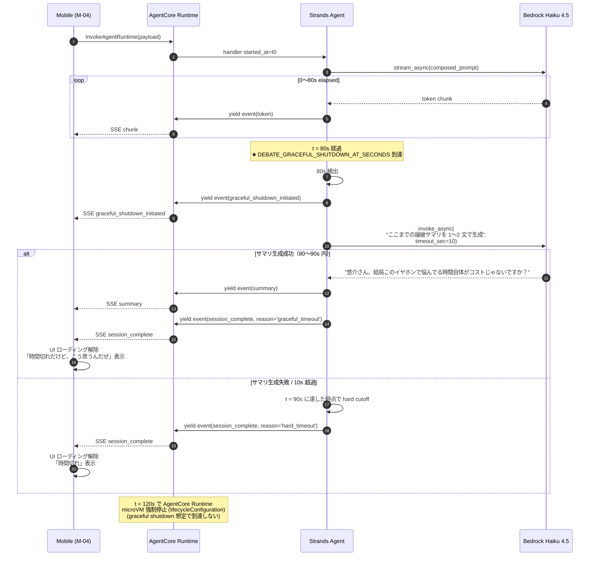
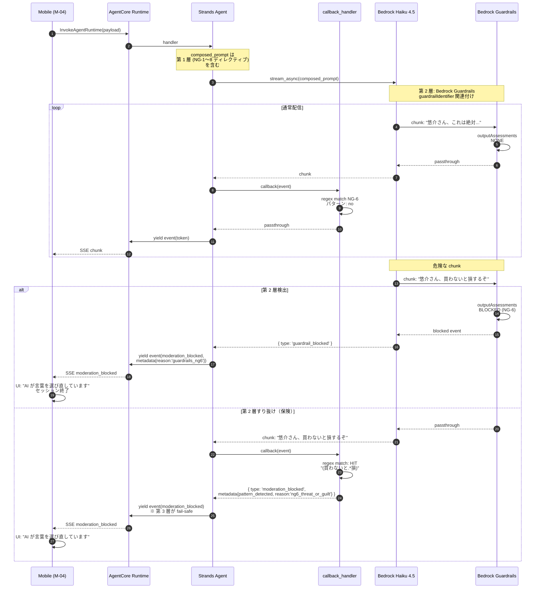
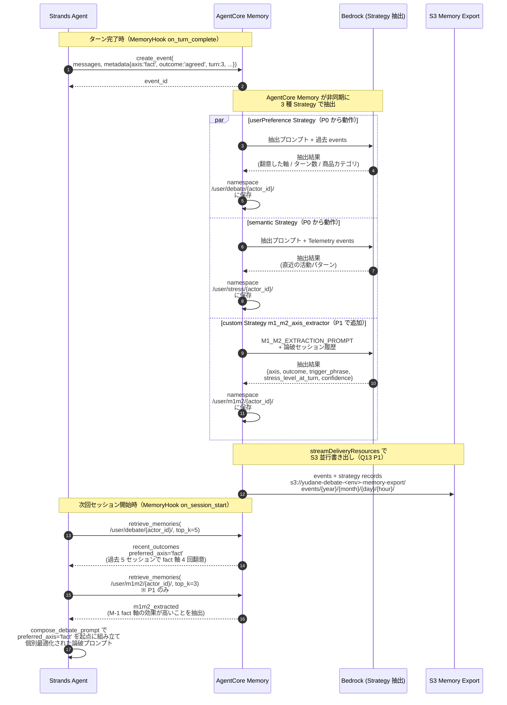
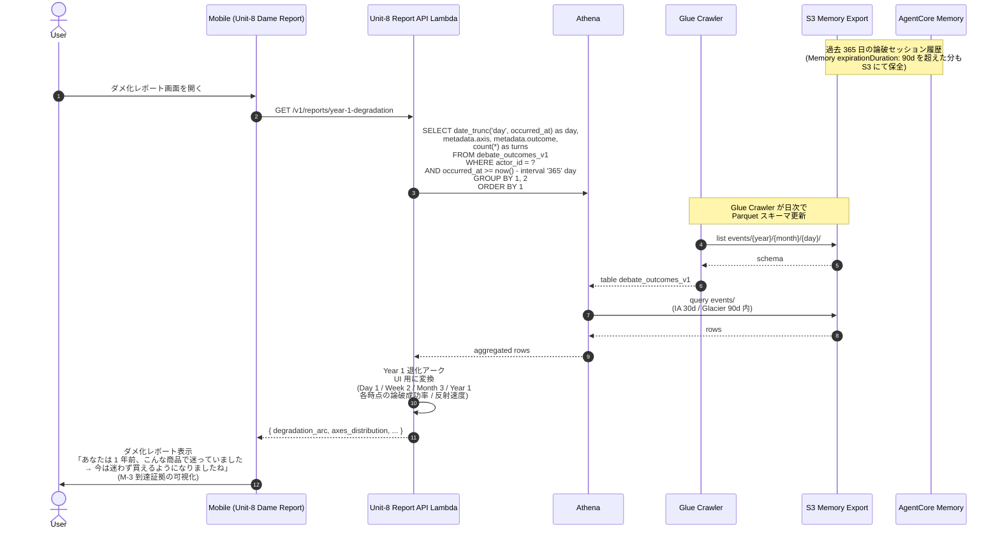
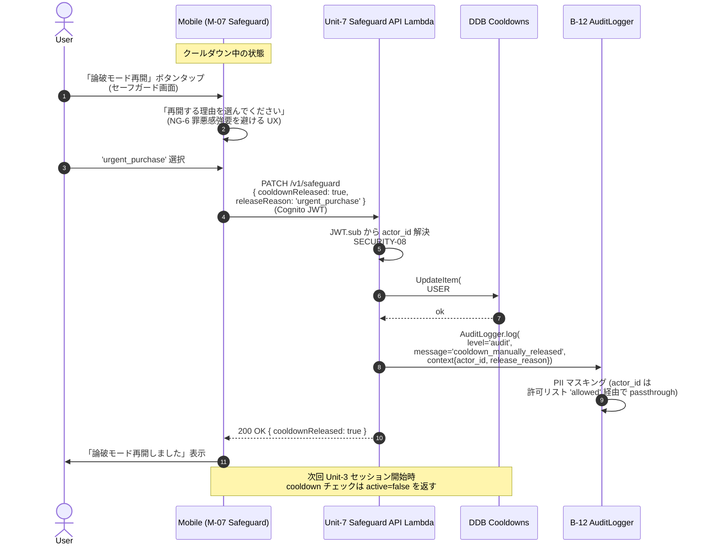
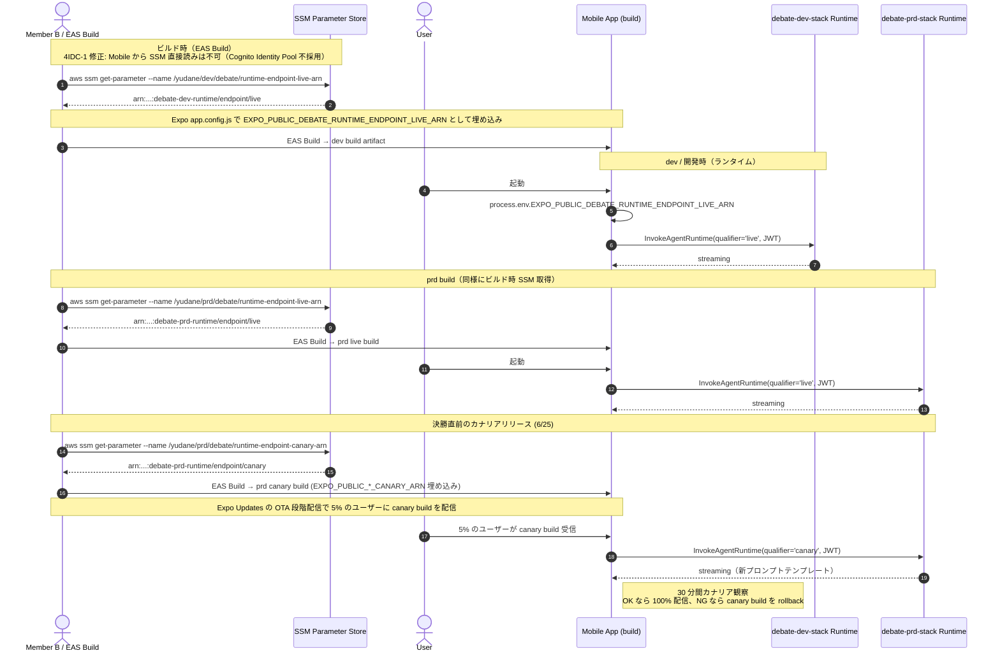

# Unit-3 Debate — Sequence Diagrams

> Unit-3 Debate の主要シーケンスを Mermaid で可視化。Mobile（M-04）⇔ AgentCore Runtime ⇔ Bedrock + Memory + DDB Cooldowns + S3 の連携を確定。
>
> 参照: [business-logic-model.md](./business-logic-model.md) / [strands-agent-design.md](./strands-agent-design.md) / [domain-entities.md](./domain-entities.md)
>
> 確定方針: Q3=A Strands streaming / Q5=A Cognito Authorizer / Q11=A+graceful shutdown 80s / Q12=D 多層 / Q13=D+S3 / Q17=B live+canary

---

## 1. 論破セッション開始 → 翻意 → Amazon 遷移（FR-DEBATE-01〜04 / 09、E2E-01）

最も典型的な「翻意成功」パス。M-1 + M-2 併走 + Memory retrieve + Cooldown チェック + Strands streaming + 肯定フィードバックの全体像。

---

## 2. 連続拒否 3 回 → クールダウン発動（FR-DEBATE-05、Q2=C）

---

## 3. 90 秒タイムアウト + graceful shutdown（FR-DEBATE-06 / v3.2 Q11）

---

## 4. 多層モデレーション（NG-6 検出）（FR-DEBATE-07 / Q12=D）

---

## 5. 個別最適化学習（Memory userPreference 自動抽出 + custom Strategy、FR-DEBATE-04 / Q1=C / Q10=B / Q16=B）

---

## 6. UC-06/07 Year 1 退化レポート参照経路（v3.2 Q13 / Unit-8 申し送り）

---

## 7. クールダウン手動解除（Q9=D / Unit-7 連携）

---

## 8. Mobile env 切替（Q17=B + v3.3 M-5 / live + canary、4IDC-1 修正）

---

## 9. シーケンス一覧サマリ

| # | シーケンス | 主担当 | 関連 FR / Q | E2E ID |
|---|---|---|---|---|
| 1 | 翻意 → Amazon 遷移 → 肯定フィードバック | 全体 | FR-DEBATE-01〜04, 09 | E2E-01 |
| 2 | 連続拒否 → クールダウン発動 → 自動解除 | DDB | FR-DEBATE-05, Q2=C | E2E-02 |
| 3 | 90s タイムアウト + graceful shutdown | Strands Agent | FR-DEBATE-06, Q11 | E2E-01 派生 |
| 4 | 多層モデレーション（NG-6 検出）| Bedrock + callback_handler | FR-DEBATE-07, Q12=D | E2E-03 |
| 5 | Memory 個別最適化（3 Strategy）| Memory + Strategy | FR-DEBATE-04, Q1=C / Q10=B / Q16=B | — |
| 6 | UC-06/07 Year 1 退化レポート参照 | Unit-8 + Athena + S3 | UC-06/07, Q13 P1 | — |
| 7 | クールダウン手動解除 | Unit-7 | Q9=D, FR-AUTH-06 連携 | E2E-02 派生 |
| 8 | Mobile env 切替（live + canary）| Mobile + EAS Build 環境変数 | Q17=B, v3.3 M-5, 4IDC-1 | — |

> シーケンス 1〜4 は MVP P0 で実装、5〜8 は P1 / 決勝向け（task-breakdown.md Phase 3〜5 参照）。
