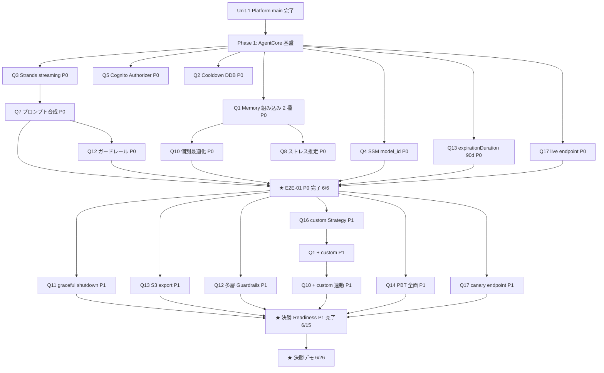

# Unit-3 Debate — 実装タスク分解と優先度マトリクス（v3.3 通常運用版全採用、セルフレビュー修正反映）

> [functional-design-plan.md v3.3](./functional-design-plan.md) のオプション C 採用後、Code Generation 前の実装タスク分解と優先度付け。
>
> **3 段階優先度**:
>
> * **P0（MVP 必須）**: 5/30 予選デモは §4 暫定構成で対応、6/6 までに E2E-01 動作（dev 環境本格実装）
>
> * **P1（決勝向け）**: 6/26 決勝までに必達。L1 機能面の穴を全て塞ぎ通常運用版を完成
>
> * **P2（ポスト決勝）**: 決勝後の運用最適化。backlog 化候補
>
> **基準日**: 2026-05-29（plan v3.3 確定日）。Member B が Unit-3 主担当（[unit-of-work.md §4](../../../inception/application-design/unit-of-work.md)）。
>
> **総工数**: 9〜11d（v3 の 5〜6d + v3.2/v3.3 で +4〜5d）。Member B は 5/29 〜 6/15 の 17 営業日中、休日除く 12 営業日相当を Unit-3 に投下可能（Unit-6 着手前の余力あり）。
>
> **v3.3 修正**: Critical C-1（Q4 SSM 切替を P0 化）/ C-3（5/30 マイルストーン矛盾解消、4 段階整理）/ C-6（依存 DAG 論理矛盾解消）を反映。設計判断自体に変更なし、優先度配分とスケジュール表現の整合化のみ。

***

## 1. 全体スケジュール（Member B、v3.3 で C-3 修正反映）

```
2026-05-29 (Fri) ─┬─ Q1〜Q17 確定（v3.3、本日完了）
                  │
2026-05-30 (Sat) ─┼─ ★ 予選 MVP 暫定デモ ← §4 暫定構成（疎通レベル + AI-DLC プロセス証跡）
                  │
2026-05-31 (Sun) ─┼─ 振り返り + Code Generation Plan 作成
2026-06-01 (Mon) ─┤
2026-06-02 (Tue) ─┼─ Phase 1: Backend AgentCore Runtime + Memory（P0）+ SSM model_id（P0、v3.3 C-1）
2026-06-03 (Wed) ─┤
2026-06-04 (Thu) ─┼─ Phase 2: プロンプト合成 + Mobile DebateScreen（P0）
2026-06-05 (Fri) ─┤
2026-06-06 (Sat) ─┼─ ★ P0 完了 = E2E-01 dev 環境動作（本格プロンプト + Memory STM + Cooldown DDB）
                  │
2026-06-07 (Sun) ─┼─ Phase 3: L1 機能面の穴塞ぎ（P1: Q11/Q13/Q12）
2026-06-08 (Mon) ─┤
2026-06-09 (Tue) ─┤
2026-06-10 (Wed) ─┼─ Phase 4: custom Strategy + PBT 全面（P1: Q1/Q10/Q16/Q14）
2026-06-11 (Thu) ─┤
2026-06-12 (Fri) ─┤
2026-06-13 (Sat) ─┼─ Phase 5: RuntimeEndpoint canary 追加（P1: Q17）
2026-06-14 (Sun) ─┼─ ★ 決勝 Readiness 全 P1 完了（前倒し可）
2026-06-15 (Mon) ─┼─ Phase 6 着手前倒し: 統合テスト + cdk-nag green 確認
                  │
2026-06-16 (Tue) ─┼─ 統合テスト + cdk-nag + 性能テスト
...                │
2026-06-26 (Fri) ─┼─ ★ 決勝デモ（prd live endpoint）
                  │
6/27 以降           ─── P2 / backlog（B-304/305/306/307）
```

### マイルストーン（v3.3 で C-3 修正、4 段階に整理）
| 日付 | マイルストーン | Readiness 条件 |
|---|---|---|
| 2026-05-30 | 予選 MVP **暫定**デモ | §4 暫定構成で動作（疎通レベル + 簡易プロンプト + dummy Memory）、AI-DLC プロセスを plan v3.3 + task-breakdown のスクリーンショットで提示 |
| **2026-06-06** | **P0 完了** | E2E-01 動作（dev 環境、本格プロンプト + Memory STM + Cooldown DDB + SSM model_id）、PBT-03 / PBT-07 green |
| 2026-06-15 | 決勝 Readiness | P1 完了、E2E-01〜03 全 pass、cdk-nag green、PBT-01〜10 適合 |
| 2026-06-26 | 決勝デモ | prd live endpoint で動作確認済、6/25 staging で canary endpoint カナリア成功 |

***

## 2. 優先度マトリクス（Q × Phase × Person × Effort、v3.3 で C-1 修正反映）

| Q   | 設計判断                | 優先度    | Phase | 工数      | 依存             | 担当       | DoD（完了条件）                                                        |
| --- | ------------------- | ------ | ----- | ------- | -------------- | -------- | ---------------------------------------------------------------- |
| Q3  | Strands streaming   | **P0** | 1     | 1.0d    | Unit-1 SSM     | Member B | Mobile が dev Runtime に接続し token を受信、`event-source-parser` で UI 表示 |
| Q5  | Cognito Authorizer  | **P0** | 1     | 0.3d    | Unit-1 Cognito | Member B | Mobile JWT で Runtime invoke、actor\_id 取得確認                       |
| Q6  | Public Network      | **P0** | 1     | 0.1d    | Q5             | Member B | networkConfiguration: usingPublicNetwork() で deploy 成功          |
| Q15 | `agentcore dev`     | **P0** | 1     | 0.2d    | -              | Member B | ローカル `agentcore dev` で hot reload 起動、`agentcore invoke` で疎通     |
| **Q4** | **SSM model_id 切替（v3.3 で P0 化）** | **P0** | **1** | **0.2d** | -        | Member A 共同 | `/yudane/<env>/debate/model-id` SSM 出力、Strands Agent 起動時取得確認、IAM ワイルドカード Haiku+Sonnet 付与 |
| Q7  | プロンプト合成テンプレート       | **P0** | 2     | 1.5d    | Q3             | Member B | M-1 + M-2 併走の最低限プロンプト（compose.py）が Strands に統合                 |
| Q8  | ストレスレベル推定           | **P0** | 2     | 0.5d    | Q1 P0          | Member B | stress.py のヒューリスティックで low/mid/high が確実に返る（PBT-07）              |
| Q1  | Memory 組み込み 2 種（P0 段階）| **P0** | 2     | 0.5d    | Q5             | Member B | userPreference + semantic Strategy を deploy、`create_event` / `retrieve_memories` で疎通 |
| Q2  | クールダウン DDB          | **P0** | 2     | 0.5d    | -              | Member B | yudane-debate-dev-cooldowns に increment_refuse_count が動作（PBT-03） |
| Q9  | クールダウン解除            | **P0** | 2     | 0.3d    | Q2 + Unit-7    | Member B | Unit-7 PATCH /v1/safeguard で cooldownReleased が反映                |
| Q10 | 個別最適化（P0: 簡易）       | **P0** | 2     | 0.5d    | Q1 P0          | Member B | userPreferenceMemoryStrategy のみ動作（custom 抜き）、retrieve_memories 取得 |
| Q11 | 90s タイマー（基本）        | **P0** | 2     | 0.2d    | Q3             | Member B | lifecycleConfiguration.idleTimeoutSeconds: 120 でタイマー切れ確認        |
| Q12 | プロンプトガードレール（P0）     | **P0** | 2     | 0.3d    | Q7             | Member B | プロンプトに NG-1〜8 の指示文埋め込み                                          |
| **Q13** | **Memory expirationDuration 90 日（P0 段階、v3.3 C-2 整合）**| **P0** | 2 | 0.1d    | Q1 P0          | Member B | Memory リソースに expirationDuration: 90 日 設定 |
| **Q17** | **RuntimeEndpoint live のみ（P0 段階、v3.3 M-5 整合）**| **P0** | 2 | 0.2d    | Q3             | Member B | live endpoint deploy、SSM `runtime-endpoint-live-arn` 出力 |
| **P0 小計** |                     |        |       | **6.4d**|                |          |                                                                  |
| Q11 | **+ Strands graceful shutdown 80s** | **P1** | 3 | 0.3d | Q11 P0 | Member B | 80s 経過で stop_streaming_with_summary() が発火、UI に綺麗なクローズ表示 |
| Q13 | **+ streamDeliveryResources + S3 export** | **P1** | 3 | 0.5d | Q13 P0 | Member B | S3 に Memory stream 出力、Athena からクエリ可能、Unit-8 から S3 参照可能 |
| Q12 | **+ Bedrock Guardrails streaming + 正規表現多層** | **P1** | 3 | 0.5d | Q12 P0 | Member B | 3 層 Guardrails が NG-6 検出、Strands callback_handler で chunk 後処理 |
| Q1  | **+ custom Strategy** | **P1** | 4 | 0.3d | Q1 P0 + Q16 | Member B | customMemoryStrategy(name="m1_m2_axis_extractor") deploy 成功 |
| Q10 | **+ custom Strategy 連動** | **P1** | 4 | 0.5d | Q1 P1 | Member B | custom Strategy の抽出結果がプロンプト合成に反映、論破成功率向上計測 |
| Q16 | **Memory custom Strategy 設計** | **P1** | 4 | 0.5d | Q1 P0 | Member B | Haiku 4.5 ベースの抽出プロンプト設計、抽出結果を S3 に保存して定性評価 |
| Q14 | **PBT 全面適用** | **P1** | 4 | 1.5d | Q1〜Q13 P1 | Member B | Hypothesis + fast-check で重点 5 関数 + 5 統合点 = 10 property、PBT-01〜10 適合 |
| Q17 | **+ canary endpoint 追加（v3.3 M-5 整合）** | **P1** | 5 | 0.3d | Q17 P0 | Member B | canary endpoint deploy、SSM `runtime-endpoint-canary-arn` 出力、staging で A/B テスト疎通 |
| **P1 小計** |                  |        |       | **4.4d** |              |          |                                                                  |
| Q14 | PBT Coverage 85% 維持      | P2     | -     | 0.5d    | Q14 P1         | Member B | 決勝後の継続改善                                                          |
| Q16 | custom Strategy プロンプト改善版 | P2 (B-306) | -     | 1.0d    | Q16 P1         | Member B | 決勝後 |
| -   | RuntimeEndpoint Auto-Pause   | P2 (B-307) | -     | 0.3d    | Q17 P1         | Member B | コスト最適化、dev/staging のみ |
| -   | AgentCore Online Evaluation | P2 (B-304) | -     | 1.0d    | -              | Member B | 決勝後の運用評価 |
| -   | Sonnet 4.6 切替検証          | P2 (B-305) | -     | 0.5d    | Q4 P0          | Member B | 決勝後（IAM は P0 で先行付与済） |

**v3.2 → v3.3 工数差分**: P0 = 6.0d → 6.4d（Q4 SSM 0.2d を P0 化、Q13 expirationDuration 0.1d / Q17 live 0.2d を P0 として明示）/ P1 = 4.8d → 4.4d（Q4 P1 廃止、Q17 を canary 追加のみに縮小）/ 合計は変わらず 10.8d。

***

## 3. Phase 別タスクリスト

### Phase 1（5/31 〜 6/2）: AgentCore Runtime / Memory 基盤の P0 確立 + SSM model_id（v3.3 C-1）

**目的**: Member B が dev 環境で `agentcore dev` ローカルから dev Runtime まで疎通させ、SSM model_id 切替の基盤を作る。

**タスク**:

* [ ] T1.1: `infra/lib/debate-stack.ts` 新規作成（CDK Snapshot TDD）
  * `aws-cdk-lib/aws-bedrockagentcore` の `Runtime` / `Memory` L2 を import
  * Unit-1 SSM 参照: `userpool-id` / `userpool-client-id` / `kms-key-arn` / `alerts-topic-arn` / `auditlogger-layer-arn`
  * `Runtime` 設定: Direct Code Deploy + Cognito Authorizer + Public Network + `lifecycleConfiguration: { idleTimeoutSeconds: 120, maxLifetimeSeconds: 120 }`
  * `Memory` 設定: **expirationDuration: 90 日** + `userPreferenceMemoryStrategy` + `semanticMemoryStrategy`（P0 段階、組み込み 2 種、v3.3 M-3 整合）
  * **`live` RuntimeEndpoint** 1 個 deploy（v3.3 M-5 整合、canary は P1）
  * **SSM Parameter `/yudane/dev/debate/model-id`**（既定 `anthropic.claude-haiku-4-5`、v3.3 C-1）
  * **IAM Bedrock ワイルドカード**: Haiku 4.5 + Sonnet 4.6 の 2 ARN 先行付与（v3.3 M-4 整合）
  * DDB `yudane-debate-dev-cooldowns` 新規作成（KMS + TTL `ttl` 属性、PITR 有効）
  * SSM 出力: `/yudane/dev/debate/{runtime-arn, memory-id, runtime-endpoint-live-arn, model-id, cooldowns-table-arn, kill-switch}`（6 個、v3.3 C-5 + NC2-2、Phase 3 で `memory-export-bucket-arn`、Phase 5 で `runtime-endpoint-canary-arn` 追加で計 8 個）
  * cdk-nag AwsSolutionsChecks 適用
* [ ] T1.2: `backend/src/debate/main.py` 新規作成（クラシック TDD）
  * `BedrockAgentCoreApp` + `@app.entrypoint` の最小実装
  * **起動時に SSM `/yudane/<env>/debate/model-id` から `model_id` を取得**（v3.3 C-1）
  * Strands Agent 初期化（`model=model_id`、callback_handler=None）
  * dummy `compose_debate_prompt()` で疎通確認
* [ ] T1.3: `mobile/src/features/debate/agentcore-client.ts` 新規作成（Outside-In TDD）
  * `@aws-sdk/client-bedrock-agentcore` インストール
  * `InvokeAgentRuntimeCommand` ラッパー
  * **Runtime ARN は EAS Build 時に `app.config.js` で SSM CLI 経由取得し `EXPO_PUBLIC_DEBATE_RUNTIME_ENDPOINT_LIVE_ARN` として埋め込み**（4IDC-1 修正、Cognito Identity Pool 不採用のため Mobile は SSM API 直接呼び出し不可）。ランタイムは `process.env.EXPO_PUBLIC_*` から参照のみ
* [ ] T1.4: `mobile/src/features/debate/event-parser.ts` 新規作成
  * Strands streaming chunk → UI イベント変換（最小 4 種: token / turn_complete / session_complete / error）
* [ ] T1.5: 疎通確認 — `agentcore dev` ローカル → dev Runtime → token 受信

**Phase 1 完了条件**: Mobile から dev Runtime に Cognito JWT で接続し、token を 1 つでも受信できる。SSM 値変更で model_id が反映される（Lambda 再起動）。Snapshot test と Unit test が green。

### Phase 2（6/3 〜 6/6）: P0 機能完成 + 予選 MVP デモ

**目的**: 5/30 の予選 MVP デモに間に合わせる最小プロンプト + UI + クールダウン。

> ⚠️ **注**: 5/30 までに本格的な P0 完成は時間的に厳しい（plan v3.3 確定が 5/29 のため）。**5/30 は Phase 1 中盤のスナップショットで簡易デモ（モックプロンプト + dummy ストリーミング）を行い、本格的な P0 は 6/6 まで延長**。代わりに E2E-01 の dev 環境動作確認を 6/6 までに完了。

**タスク**:

* [ ] T2.1: `backend/src/debate/prompts/{base,m1_fact_axis,m1_psychology_axis,m2_reward_axis,affirmation,compose}.py` を実装
  * M-1 + M-2 併走テンプレート（FR-DEBATE-02 / FR-DEBATE-09 整合）
  * `compose.py` の不変条件: stress_level=mid/high なら必ず m2_reward_axis が含まれる（PBT-03 で検証）
  * NG-1〜8 の指示文埋め込み（プロンプトガードレール、Q12 P0）
* [ ] T2.2: `backend/src/debate/stress.py` 実装
  * Memory retrieval 結果 + ヒューリスティック（時間帯 / 連続論破拒否数 / カート介入頻度）で low/mid/high 判定
  * 戻り値が必ず `low/mid/high` の 3 種（PBT-07）
* [ ] T2.3: Memory 統合 — `create_event` / `get_last_k_turns` / `retrieve_memories` を Strands hooks で自動化（P0: STM のみ）
* [ ] T2.4: Cooldowns DDB 統合
  * `increment_refuse_count()` 関数（PBT-03: 3 回到達で必ず +3h cooldownUntil）
  * Mobile 側で 429 Retry-After ヘッダ受信時の UI 表示
* [ ] T2.5: `mobile/src/features/debate/M-04-DebateScreen.tsx` 実装
  * タイピング演出 / 90 秒カウントダウン / 事実-心理 2 軸ラベル / Amazon 遷移確認オーバーレイ / 肯定フィードバックトースト（簡易版）
* [ ] T2.6: M-13 Telemetry 拡張 — `debate.session_started` / `debate.token_streamed` / `debate.refused` / `debate.agreed` / `debate.session_complete{reason}` / `debate.cooldown_triggered` / `debate.affirmation_shown` / `debate.moderation_blocked` / `debate.graceful_shutdown_initiated` / `debate.stress_estimated` の 10 イベント追加（v3.3 整合）
* [ ] T2.7: E2E-01 シナリオ実装 — Cart Intercept → 論破セッション開始 → 翻意 → Amazon 遷移

**Phase 2 完了条件**: E2E-01 が dev 環境で pass、PBT-03 / PBT-07 が green、Mobile UI で論破実機動作確認。

### Phase 3（6/7 〜 6/9）: L1 機能面の穴塞ぎ（P1）

**目的**: v3.2 で塞ぐと宣言した L1 機能面の穴 3 件を実装。

**タスク**:

* [ ] T3.1: **Q11 + Strands graceful shutdown 80s**
  * Strands Agent 内に `if elapsed > 80: stop_streaming_with_summary()` フックを追加
  * 残り 10 秒で「ここまでの論破サマリ」を生成して綺麗にクローズ
  * 90s ちょうどで切れた場合との UX 比較テスト
* [ ] T3.2: **Q13 + Memory `streamDeliveryResources` + S3 export**
  * CDK で Memory に `streamDeliveryResources` を設定（S3 bucket + KMS）
  * S3 Lifecycle: Standard → IA (30d) → Glacier (90d) → 削除 (365d)
  * Athena テーブル定義 + Glue Crawler スケジュール設定
  * Unit-8 Dame Report の参照経路ドキュメント化
* [ ] T3.3: **Q12 + Bedrock Guardrails streaming + 多層**
  * Bedrock Guardrails 作成（DENIED_TOPICS: NG-1〜NG-8）
  * Strands Agent の `bedrock_kwargs` で `guardrailIdentifier` 指定
  * Strands `callback_handler` で各 chunk を後処理（正規表現マッチング）
  * 3 層検出が動作することを property test で確認

**Phase 3 完了条件**: L1 機能面の穴 3 件が解消、E2E-01 で動作確認、PBT で安全装置が green。

### Phase 4（6/10 〜 6/13）: custom Strategy + PBT 全面（P1）

**目的**: ハッカソン創造性軸「ダメ化メカニズム特化 AI」の本格実装。

**タスク**:

* [ ] T4.1: **Q16 Memory custom Strategy 設計**
  * Haiku 4.5 ベースの抽出プロンプト作成（M-1 / M-2 軸を構造化抽出）
  * 抽出結果のスキーマ定義（`{axis: "fact"|"psychology"|"reward", outcome: "agreed"|"refused", turn: int, ...}`）
  * 抽出精度の定性評価（dev 環境で 100 セッション分のデータ生成）
* [ ] T4.2: **Q1 + Q10 + Q16 を CDK 反映**
  * `customMemoryStrategy(name="m1_m2_axis_extractor", configuration=...)` を `Memory` に追加
  * 既存 Memory リソースへの strategy 追加なので migration 設計が必要（CDK で `addStrategy` API 確認）
* [ ] T4.3: プロンプト合成側で custom Strategy の抽出結果を組み込み
  * `compose.py` 拡張 — Memory retrieve 結果から「翻意した軸」を System Prompt に注入
  * 個別最適化精度の A/B 計測（custom あり vs なし）
* [ ] T4.4: **Q14 PBT 全面適用**
  * 重点 5 関数（既存）+ 5 統合点（新規）= 計 10 property
  * 統合点: `prompts/compose.py` 全体 / `memory_hooks.py` / `stress.py` / Mobile `event-parser.ts` / `agentcore-client.ts`
  * Hypothesis（Python）+ fast-check（TypeScript）併用
  * Coverage 70% → 85%

**Phase 4 完了条件**: custom Strategy が動作、論破成功率の改善を計測、PBT-01〜10 が green。

### Phase 5（6/13）: canary endpoint 追加 + 統合準備（v3.3 C-1 で Q4 を P0 に移動済、5IDM-1 修正で 6/13 に統一）

**目的**: 決勝直前のカナリアリリース対応（Q4 SSM model_id 切替は Phase 1 で P0 完了済）。Phase 5 は 1 日完結、6/14 前倒し目標、決勝 Readiness 最終マイルストーン日は 6/15。

**タスク**:

* [ ] T5.1: **Q17 + canary RuntimeEndpoint 追加**（v3.3 M-5 整合）
  * dev / staging / prd の各 Stack に `canary` RuntimeEndpoint を追加（live は P0 で deploy 済）
  * SSM `/yudane/<env>/debate/runtime-endpoint-canary-arn` に出力
  * Mobile から `qualifier: 'canary'` で canary endpoint 呼び出しテスト
  * staging で A/B テスト用プロンプト切替テスト

**Phase 5 完了条件**: 全 Stack で canary endpoint deploy、staging で A/B テスト疎通、Mobile 側 qualifier 切替動作確認。

### Phase 6（6/16 〜 6/26）: 決勝 Readiness 仕上げ

**タスク**:

* [ ] T6.1: 統合テスト（IT-01〜07 のうち Unit-3 関連）
* [ ] T6.2: cdk-nag green 確認（debate-prd-stack）
* [ ] T6.3: 性能テスト — 同時 100 セッション、Bedrock Throttling 対策
* [ ] T6.4: 決勝前カナリアリリース（6/25 staging 30 分間）
* [ ] T6.5: 決勝デモシナリオリハーサル × 3 回

***

## 4. P0 を 5/30 までに間に合わせる現実的な対応

5/29 plan v3.3 確定 → 5/30 予選デモまで 1 日。Phase 2 の本格実装は不可能なので **デモ用の暫定構成** で凌ぐ:

| 項目             | 暫定構成（5/30 デモ用）                          | 本格構成（6/6 までに）                     |
| -------------- | ------------------------------------- | --------------------------------- |
| AgentCore Runtime | dev 環境に最小コードで deploy（疎通のみ）            | プロンプト合成 + Memory 統合 + クールダウン      |
| プロンプト          | ハードコード `compose.py` 1 関数（M-1 + M-2 各 1 例） | 6 モジュール構造化（base/m1_fact/m1_psy/m2/aff/compose） |
| Memory         | dummy（in-memory dict）                  | AgentCore Memory STM + userPreference |
| Cooldown       | dummy（in-memory dict）                  | DDB `yudane-debate-dev-cooldowns`     |
| Mobile UI      | mockup/index.html の流用                 | M-04 DebateScreen 本格実装              |
| Telemetry      | console.log のみ                         | M-13 Telemetry 経由 + EMF メトリクス       |

**5/30 デモのトーク**: 「AgentCore Runtime + Memory 採用判断 / リージョン可用性 / CDK 適性調査 / MVP-通常運用 3 層整理 / オプション C 全採用 / セルフレビュー Critical 8 + Major 8 修正 / Phase 1〜6 計画」を AI-DLC プロセスとして強調。デモは **疎通レベル + plan.md v3.3 + task-breakdown.md** をスクリーンショットで魅せる。

***

## 5. 依存関係 DAG（v3.3 で C-6 修正）



***

## 6. リスクと緩和策

| リスク                                                     | 影響     | 緩和策                                                                                                      |
| ------------------------------------------------------- | ------ | -------------------------------------------------------------------------------------------------------- |
| AgentCore Memory `addStrategy` API が migration 時に再作成必要      | 中（P1 Phase 4） | 6/10 開始時に dev で migration 検証、必要なら Memory リソース新規作成 + データ移行スクリプト準備                                                  |
| Bedrock Guardrails streaming 対応の挙動が Strands SDK で不安定         | 中（P1 Phase 3） | Phase 3 開始時に dev で挙動確認、不安定なら正規表現多層検査のみで P1 達成、Bedrock Guardrails は P2 化                                            |
| RuntimeEndpoint 別途料金が高額                                            | 低（P1 Phase 5） | dev/staging endpoint は手動 stop（B-307 backlog）、prd は decision後                                                |
| custom Strategy の抽出精度が組み込み Strategy より低い                          | 中（P1 Phase 4） | Phase 4 序盤で 100 セッション定性評価、組み込み 2 種で十分なら custom は決勝後のアピール材料 + 改善継続項目（B-306）に転換                              |
| Member B の工数オーバー（Unit-6 Calendar 着手遅延）                                | 中      | P1 Phase 4 / Phase 5 を Member D（Unit-5 完了後）にも分担可能、PBT 全面（Q14 P1）は Member A 横断レビューで効率化                              |
| 5/30 予選 MVP に P0 が間に合わない                                | 高      | §4 暫定構成で AI-DLC プロセスをアピール、デモは plan.md / task-breakdown.md スクリーンショットを主軸に                                          |
| Year 1 退化レポート（M-3）のデータが 6/26 までに溜まらない                              | 中      | 決勝デモ用に dev 環境で意図的にダミーデータ投入（30 日分）、UI は実データの形式で表示                                                                  |

***

## 7. ハッカソン評価軸へのインパクト

| 評価軸                | 本 task-breakdown による貢献                                                                       |
| ------------------ | ----------------------------------------------------------------------------------------------- |
| ビジネス意図の明確さ         | P0 / P1 / P2 の 3 段階優先度で M-1 / M-2 / M-3 の実装到達順序を明示                                            |
| Unit 分解の適切さ        | Phase 1〜6 で Member B の作業をスケジューリング、他 Unit との依存（Unit-1 / Unit-7 / Unit-8）を明示                    |
| 創造性とテーマ適合性         | custom Strategy（Q1 / Q10 / Q16）と PBT 全面（Q14）が「ダメ化メカニズム特化 AI」のアピール材料                          |
| ドキュメント品質           | plan.md v3.2 + 本 task-breakdown.md で意思決定 → 実装到達経路が完全 traceable                                   |
| AI-DLC プロセス（予選評価軸） | 「機能面 / アーキテクチャ面 / 保守運用面」の 3 層整理 → C 全採用 → 9〜11d 工数 → P0/P1/P2 優先度 の意思決定プロセスが説得力ある証跡         |
| 決勝デモ完成度            | Phase 5 で staging endpoint カナリアリリース対応、Phase 6 で性能テスト・cdk-nag green まで明記                       |

***

## 8. 改訂履歴

| 版          | 日付             | 変更概要                                                                                                                  |
| ---------- | -------------- | --------------------------------------------------------------------------------------------------------------------- |
| v1（初版）     | 2026-05-29     | plan v3.2 オプション C 採用後の実装タスク分解。Phase 1〜6 + P0/P1/P2 優先度 + 5/30 暫定構成 + リスク 7 件 + 依存 DAG を策定                   |
| v1.1 | 2026-05-29 | **plan v3.3 のセルフレビュー修正に対応**。C-1（Q4 SSM 切替を P1 → P0 に移動、Phase 1 T1.1/T1.2 に統合）/ C-3（5/30 マイルストーンを「P0 完了」から「暫定デモ」に修正、6/6 = P0 完了の 4 段階に整理）/ C-6（依存 DAG の論理矛盾を修正、P1 タスクは P1_Done より前に配置）。M-3 整合（Q1 / Q10 / Q16 の P0/P1 段階実装を明示）/ M-5 整合（Q17 を live + canary に分割）。設計判断自体に変更なし、優先度配分とスケジュール表現の整合化のみ |
| **v1.2（本版）** | **2026-05-29** | **plan v3.4 トーン局所オーバーライド + NC2-2 kill-switch 追加に対応**。Phase 1 T1.1 の SSM 出力を 6 個（最終 8 個に拡張、kill-switch 追加）。Phase 2 T2.1 のプロンプト合成を「論理優位ディベート系（敬語ベース、論理で黙らせるスタイル）」に変更。設計判断の本質は変更なし、トーン局所変更 + SSM 数の整合化のみ |
