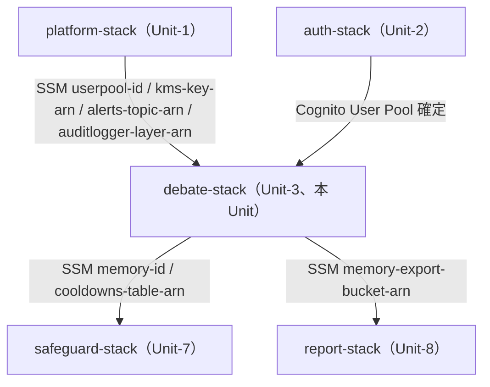
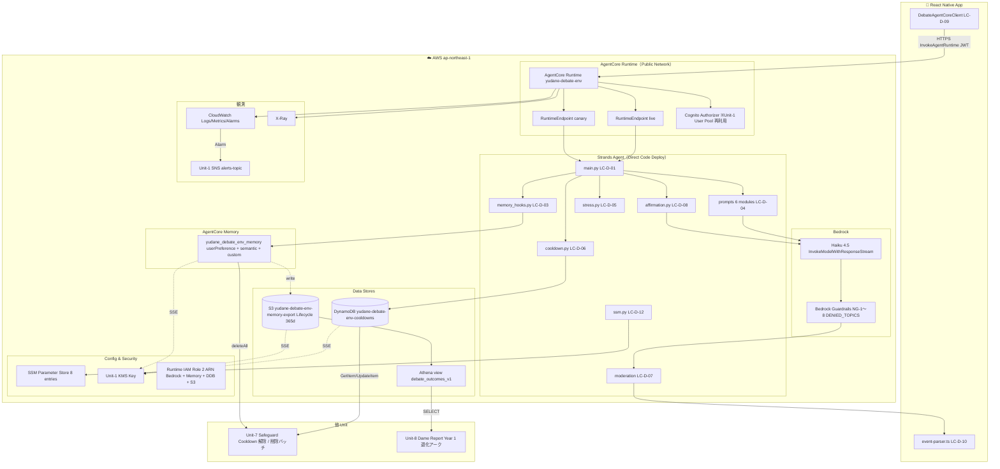

# Unit-3 Debate — Deployment Architecture

> `debate-stack` のデプロイアーキテクチャ、環境戦略、スタック依存、デプロイ順序、カナリアリリース手順。
>
> 参照: [infrastructure-design.md](./infrastructure-design.md) / [Unit-1 deployment-architecture.md](../../unit-1-platform/infrastructure-design/deployment-architecture.md) / [task-breakdown.md](../functional-design/task-breakdown.md) / [tech-cdk.md](../../../../.kiro/steering/tech-cdk.md) / [unit-of-work-dependency.md](../../../inception/application-design/unit-of-work-dependency.md)
>
> 確定方針: 環境戦略 = dev + staging + prd の 3 環境（Unit-1 の dev/prd 2 環境と異なり、Unit-3 は **canary endpoint で staging を活用**）。Q17=B live + canary RuntimeEndpoint。

---

## 1. 環境戦略（Unit-3 固有: 3 環境）

| 環境 | 用途 | removalPolicy | RuntimeEndpoint | 構築タイミング |
|---|---|---|---|---|
| `dev` | 開発、Member B のローカル `agentcore dev` 接続先 | DESTROY | live（P0、Phase 1）→ canary 追加（P1、Phase 5）| Phase 1（5/31〜6/2）|
| `staging` | 6/25 の決勝前カナリアリリース検証 | RETAIN | live + canary（両方 P1、Phase 5 で deploy）| Phase 5（6/13）|
| `prd` | 決勝 AWS 本番デモ | RETAIN | live + canary（両方 P1、Phase 5 で deploy）| Phase 5（6/13）|

- 環境切替は CDK context（`-c env=dev|staging|prd`）
- Unit-1 と異なり 3 環境を持つ理由: **`canary` endpoint を使った 30 分カナリアリリース（NFR-AVAIL-DEBATE-06）に staging が必要**。staging は Mobile A/B テスト + プロンプト改善検証に活用
- 書類審査・予選 5/30 は dev で対応（Phase 2 の §4 暫定構成）、決勝 6/26 は prd を使う
- staging のコスト最適化: **dev / staging endpoint の Auto-Pause は B-307 backlog**（決勝後）

---

## 2. スタック依存（Unit-1 / Unit-2 / Unit-7 / Unit-8 連携）

### 2.1 デプロイ順序

```
1. platform-stack（Unit-1）       ← 必ず先
2. auth-stack（Unit-2）            ← Unit-1 SSM を参照、Cognito User Pool 構築
3. debate-stack（Unit-3、本 Unit）← Unit-1 SSM + Unit-2 SSM を参照
4. report-stack（Unit-8）  ┐       ← どちらも debate-stack に依存。
   safeguard-stack（Unit-7）┘        Unit-7 と Unit-8 の間に依存はないため並列デプロイ可
```

### 2.2 SSM 経由の連携（CloudFormation Export/Import は使わない、tech-cdk §3）

#### debate-stack が参照する SSM（Unit-1 / Unit-2 出力）

| SSM Parameter | 出力元 | Unit-3 での用途 |
|---|---|---|
| `/yudane/<env>/platform/userpool-id` | Unit-1 | AgentCore Cognito Authorizer の `userPoolId` |
| `/yudane/<env>/platform/userpool-client-id` | Unit-1 | AgentCore Cognito Authorizer の `clientIds` |
| `/yudane/<env>/platform/kms-key-arn` | Unit-1 | DDB Cooldowns / S3 Memory Export / Memory の暗号化キー |
| `/yudane/<env>/platform/alerts-topic-arn` | Unit-1 | CloudWatch Alarms 5 種の SNS 通知先 |
| `/yudane/<env>/platform/auditlogger-layer-arn` | Unit-1 | Strands Agent コード内の構造化ログで使う Lambda Layer |

#### debate-stack が出力する SSM（8 個、infrastructure-design.md §5）

| SSM Parameter | 参照する Unit |
|---|---|
| `/yudane/<env>/debate/runtime-arn` | （SSM 経由の参照は他 Backend Unit のみ。Mobile は環境変数経由で値を受け取る、4IDC-1 修正）|
| `/yudane/<env>/debate/memory-id` | Unit-7 Safeguard（FR-AUTH-06 削除）|
| `/yudane/<env>/debate/runtime-endpoint-live-arn` | Mobile アプリのビルド時に Expo `app.config.js` で読み取り、`EXPO_PUBLIC_DEBATE_RUNTIME_ENDPOINT_LIVE_ARN` として埋め込み（Cognito Identity Pool 不採用のため、Mobile は SSM API を直接呼べない）|
| `/yudane/<env>/debate/runtime-endpoint-canary-arn` | 同上（カナリアリリース時のみ Mobile で参照）|
| `/yudane/<env>/debate/model-id` | （Strands Agent 内部のみ、外部参照なし）|
| `/yudane/<env>/debate/memory-export-bucket-arn` | Unit-8 Dame Report（Athena query 用）|
| `/yudane/<env>/debate/cooldowns-table-arn` | Unit-7 Safeguard（PATCH /v1/safeguard で UpdateItem）|
| `/yudane/<env>/debate/kill-switch` | （Strands Agent 内部のみ、運用者が手動切替）|

> **Mobile への SSM 値配布方法**: Cognito Identity Pool を採用しない設計（[tech-stack-decisions.md §2.2](../nfr-requirements/tech-stack-decisions.md)）のため、Mobile アプリは **AWS IAM 認証情報を持たず SSM GetParameter API を直接呼べない**。代わりに **EAS Build 時に SSM 値をビルド環境変数として注入**（Expo `app.config.js` で `process.env.SSM_*` を `EXPO_PUBLIC_*` プレフィックスに変換、`@expo/cli` で SSM CLI 経由取得）。値変更時は再ビルド + OTA 更新が必要。runtime-endpoint-arn は機密ではないので環境変数化に問題なし（4IDC-1 修正）。

### 2.3 Mermaid 依存図



#### テキスト代替

- platform-stack（Unit-1）が共通基盤。debate-stack はこれを SSM 経由で継承
- auth-stack（Unit-2）が Cognito User Pool を確定後、debate-stack が AgentCore Cognito Authorizer に紐付け
- debate-stack の出力（Memory ID / Cooldowns Table / Memory Export Bucket）を Unit-7（削除バッチ）/ Unit-8（Year 1 退化レポート）が参照

---

## 3. デプロイフロー（CI/CD、Unit-1 と同様 + Bedrock Guardrails の事前承認）

```
GitHub Actions
  ├─ npm ci（ロックファイル厳守）
  ├─ Lint（ESLint / cdk-nag）+ 型チェック（tsc --noEmit）
  ├─ pytest backend/tests/debate/  + property tests（PBT-01〜10 適合）
  ├─ CDK snapshot test（infra/test/debate-stack.test.ts）
  ├─ SBOM 生成（Snyk / Dependabot、SECURITY-10）
  ├─ npx cdk synth（cdk-nag AwsSolutionsChecks 自動検査）
  ├─ npx cdk diff
  └─ npx cdk deploy debate-stack-<env>   ← デプロイはユーザー承認必須（tech-cdk §9）
```

- `cdk destroy debate-stack-prd` / DDB Cooldowns・Memory・S3 Memory Export Bucket の削除は **事前承認必須**（tech-cdk §10）
- Bedrock Guardrails の DENIED_TOPICS 変更は **Bedrock コンソール上での承認フロー**を経由（プロンプト改善 PR 時、Member A レビュー必須）
- AgentCore Runtime の **Direct Code Deploy** は CDK Asset Bundling で `pip install -r requirements.txt -t /asset-output` 実行、ECR 不要

---

## 4. cdk-nag 方針（Unit-3 固有の Suppression）

- `AwsSolutionsChecks` rule pack 全適用
- 予選前は本番相当ルールまで適用
- **Suppression が必要な箇所と理由**:

| ルール | 対象リソース | Suppression 理由 |
|---|---|---|
| `aws-solutions-iam5` | DebateRuntime IAM Role | Bedrock 2 ARN ワイルドカード（Haiku 4.5 + Sonnet 4.6）。SSM model-id 切替時の AccessDenied 防止のため先行付与（NFR-SEC-DEBATE-07 / M-4）|
| `aws-solutions-l1` | AgentCore Runtime | L2 Construct が AgentCore Runtime の最新ランタイムバージョンを内部固定するため、L1 個別指定は不要 |
| なし | DDB Cooldowns / S3 Memory Export | KMS / PITR / TTL / BlockPublicAccess 全有効、Suppression 不要 |

無言サプレッション禁止。`NagSuppressions.addResourceSuppressions()` + 理由コメント必須。

---

## 5. 物理デプロイアーキテクチャ図（論理）



### テキスト代替

- React Native アプリの DebateAgentCoreClient（LC-D-09）が HTTPS で AgentCore Runtime に InvokeAgentRuntime 呼び出し（JWT Authorization ヘッダ付き）
- AgentCore Runtime が Cognito Authorizer で認証 → live または canary RuntimeEndpoint → Strands Agent コード（main.py）へ
- main.py が cooldown.py / stress.py / memory_hooks.py / prompts/ を順に呼び出し、最終的に Bedrock Haiku 4.5 を streaming invoke
- Bedrock Guardrails が chunk 単位で NG-1〜8 を BLOCKED 検出、moderation/ が第 3 層で正規表現検査
- 結果は event-parser.ts（LC-D-10）が parse して UI に反映
- Memory が S3 Memory Export bucket に並行書き出し、Glue Crawler 経由で Athena view 化、Unit-8 から SELECT 可能
- Cooldown DDB / Memory は Unit-7 が削除バッチで参照
- 全リソースは Unit-1 KMS で暗号化、CloudWatch Alarms は Unit-1 SNS alerts-topic に通知

---

## 6. カナリアリリース手順（NFR-AVAIL-DEBATE-06、6/25 実施）

> **トラフィック振り分け方式**: Mobile アプリは **EAS Build で `live` 専用ビルド + `canary` 専用ビルド** を別々に作成（`EXPO_PUBLIC_DEBATE_RUNTIME_ENDPOINT_LIVE_ARN` / `_CANARY_ARN` のいずれか 1 つを埋め込む）。staging 環境では Member B + Member A が canary build を端末にインストールして手動検証。prd 環境では **OTA Update（Expo Updates）の段階配信機能**で 5% のユーザーに canary build を配信、24 時間後に 100% 配信または rollback（4IDC-2 修正）。

### 6.1 段階的ロールアウト

```
【6/24 23:00】 staging Stack の canary endpoint にプロンプト改善版 deploy
【6/25 09:00〜09:30】 Member B + Member A が Mobile staging build で canary endpoint を 30 分間検証
                      - E2E-01〜03 を手動再生
                      - Bedrock コスト / Throttling / Guardrails BLOCKED 率 監視
                      - 異常なし → 9:30 に GO 判定
【6/25 14:00〜14:30】 prd Stack の canary endpoint に同改善版 deploy + 30 分監視
                      - 5 % のユーザーを canary に向けて A/B
                      - 論破成功率 / Bedrock コスト / Cooldown 発火率 を monitor
                      - 異常なし → 14:30 に prd live endpoint へ昇格（live endpoint へ Direct Code Deploy 再 deploy。Mobile アプリは `EXPO_PUBLIC_DEBATE_RUNTIME_ENDPOINT_LIVE_ARN` の値を変更せず、AgentCore Runtime 側のコードが新リビジョンに置き換わる仕組み）
【6/26 09:00】 決勝デモ開始（prd live endpoint）
```

### 6.2 ロールバック手順

異常検知時:

```
1. Mobile staging / prd は live build を配信（OTA Update で canary build から live build に切替、`EXPO_PUBLIC_DEBATE_RUNTIME_ENDPOINT_LIVE_ARN` を埋め込んだビルドのみが取得される、4IDC-1 修正）
2. canary endpoint deploy 前のコミットへ git revert
3. Bedrock Guardrails の変更があれば Bedrock コンソールで前バージョンへロールバック
4. Member A + Member B が原因分析、6/26 までに修正
5. 修正後は再度 staging canary 30 分検証から実施
```

### 6.3 GO/NO-GO チェックリスト

| 項目 | GO 条件 |
|---|---|
| E2E-01 翻意 → Amazon 遷移 → 肯定フィードバック | 30 分中 5 回試行、全 pass |
| E2E-01 派生 graceful shutdown | 80s 経過時にサマリ生成 + 綺麗な session_complete reason='graceful_timeout' を確認 |
| E2E-02 連続拒否 → クールダウン発動 → 自動解除 | 3 回拒否でクールダウン発動、3h 後自動解除を確認 |
| E2E-03 多層モデレーション（NG-6 検出）| Bedrock Guardrails BLOCKED + 第 3 層正規表現の両方を 1 回ずつ確認 |
| Bedrock コスト | 30 分で `<` $1.0（prd 月予算 $3,000 を 30 日 × 24 時間 × 60 分で按分すると $0.07/30分。10 倍上限を許容しても $1.0 未満）|
| Bedrock Throttling | 連続 5 件 0 |
| Guardrails BLOCKED 率 | 1% 未満 |
| Memory retrieve 失敗率 | 5% 未満 |
| Cooldown DDB 障害 | 0 件 |

---

## 7. コスト最適化メモ（環境別）

### dev（Phase 1〜4 開発期間）

- AgentCore Runtime: 課金は Bedrock 呼び出し従量のみ（コンテナアイドルコストなし）
- Bedrock Haiku 4.5: 1 セッション $0.001、$10/日上限（NFR-COST-DEBATE-02）を Cost Anomaly Detection で監視（Unit-1 既存）
- AgentCore Memory: events 課金 + retrieve_memories 課金で月額 < $50（dev トラフィック規模）
- DDB Cooldowns: On-Demand、開発トラフィックではほぼ $0
- S3 Memory Export: 月額 < $5（dev データ量）
- RuntimeEndpoint canary: P1 で追加（Phase 5）、Auto-Pause は B-307 backlog

### staging（決勝前検証期間 6/13〜6/26、5IDM-1/6IDM-1 修正）

- 通常時はトラフィックなし、デプロイ済みコンテナのアイドルコストは AgentCore Runtime 標準（実質無料）
- 6/25 のカナリア 30 分のみ Bedrock 課金発生、$1 未満

### prd（決勝デモ 6/26 + 決勝後）

- 月額予算 $3,000（10K DAU 想定、NFR-COST-DEBATE-03）
  - Bedrock Haiku 4.5: $2,500
  - AgentCore Memory: $200
  - DDB Cooldowns + S3 Export + その他: $300
- B-307 backlog で dev / staging の Auto-Pause 自動化（決勝後）

---

## 8. 未確定（Code Generation で確定）

| 項目 | 確定タイミング |
|---|---|
| Strands Agent の具体的 callback_handler 実装 | Phase 2 T2.1（プロンプト合成と並行）|
| Bedrock Guardrails の各 DENIED_TOPIC の definition / examples 文 | Phase 3 T3.3（多層モデレーション完成）|
| Athena view `debate_outcomes_v1` の DDL | Code Generation Phase 3（Unit-8 着手時）|
| custom Strategy `m1_m2_axis_extractor` の抽出プロンプト最終版 | Phase 4 T4.1（Q16=B 設計）|
| dev / staging endpoint の Auto-Pause 自動化（B-307）| 決勝後（P2）|
| DDB 障害自動 kill switch 切替 Lambda | 決勝後（P2、infrastructure-design §6.3 NC2-2 Alarm 連携）|
| 性能テストの具体的負荷シナリオ（同時 100 セッション）| Phase 6 T6.3 |

---

## 9. ハッカソン評価軸へのインパクト

| 評価軸 | 本 Infrastructure Design による貢献 |
|---|---|
| ビジネス意図の明確さ | 物理リソースに M-1 / M-2 / M-3 の要件をマッピング（Memory + S3 365d で Year 1 退化アーク証跡）|
| Unit 分解の適切さ | Unit-1 / 2 / 7 / 8 との SSM 連携を明示、debate-stack 単独デプロイ可能 |
| 創造性とテーマ適合性 | AgentCore Runtime + Memory + Bedrock Guardrails の組み合わせで「ダメ化メカニズム特化 AI」を物理層に翻訳 |
| ドキュメント品質 | 論理 → 物理マッピング表 / Mermaid 依存図 / カナリア手順 / コスト見積もり / 未確定項目 が完全 traceable |
| AI-DLC プロセス（予選評価軸） | NFR Design パターン → 物理 AWS リソース確定の意思決定経路を 6 段階（Functional → NFR-Req → NFR-Design → Infra-Design → Code → Build/Test）で連続化 |
| 決勝デモ完成度 | カナリアリリース手順 + ロールバック手順 + GO/NO-GO チェックリストで本番運用品質を担保 |
