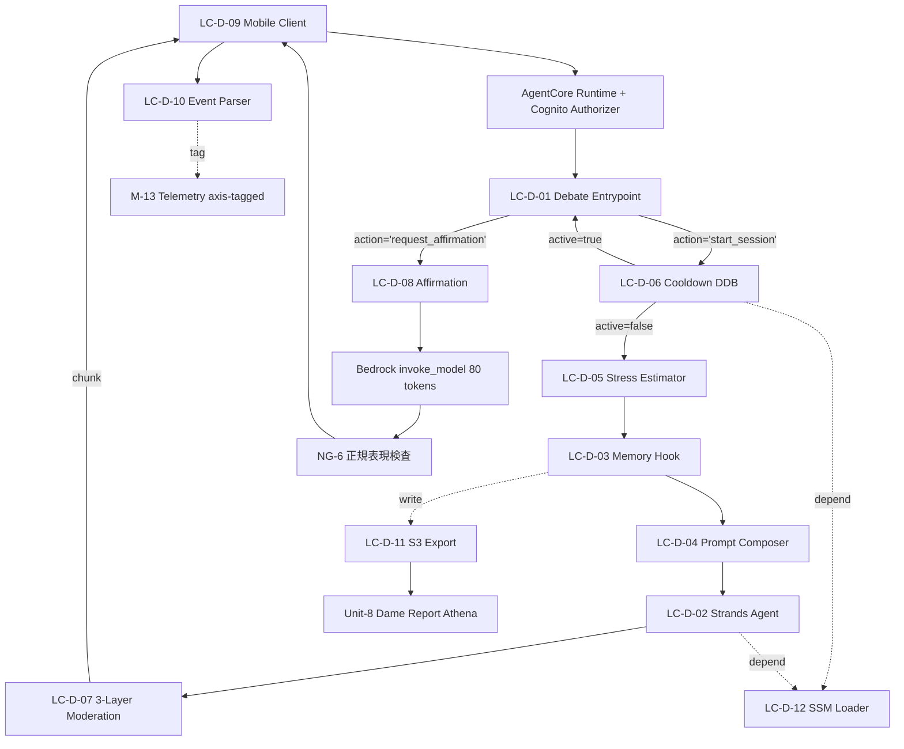

# Unit-3 Debate — Logical Components

> NFR 設計パターンを実現する **論理コンポーネント** の構成。技術非依存の論理構造（物理インフラは Infrastructure Design で確定）。
>
> 参照: [nfr-design-patterns.md](./nfr-design-patterns.md) / [Functional Design](../functional-design/) / [components.md B-02](../../../inception/application-design/components.md)

---

## 0. 論理コンポーネント一覧

| ID | 論理コンポーネント | 物理マッピング先（予定） | 実現パターン |
|---|---|---|---|
| LC-D-01 | Debate Entrypoint Router | `backend/src/debate/main.py` | PAT-D-COST-01 / PAT-D-ETHICS-03 / PAT-D-SEC-01 |
| LC-D-02 | Strands Agent Streaming Pipeline | Strands Agent + Bedrock Haiku 4.5 | PAT-D-PERF-01 / PAT-D-PERF-02 |
| LC-D-03 | Memory Hook Manager | `backend/src/debate/memory_hooks.py` | PAT-D-PERF-03 / PAT-D-RESIL-01 / PAT-D-SEC-02 |
| LC-D-04 | Prompt Composition Engine | `backend/src/debate/prompts/` 配下 6 モジュール | PAT-D-PERF-04 / PAT-D-ETHICS-01（第 1 層）|
| LC-D-05 | Stress Estimator | `backend/src/debate/stress.py` | PAT-D-PERF-03 連携 |
| LC-D-06 | Cooldown DDB Adapter | `backend/src/debate/cooldown.py` | PAT-D-COST-01 / PAT-D-COST-04 / PAT-D-RESIL-02 |
| LC-D-07 | 3-Layer Moderation Pipeline | base prompt + Bedrock Guardrails + callback_handler | PAT-D-ETHICS-01 / PAT-D-RESIL-03 |
| LC-D-08 | Affirmation Generator | `backend/src/debate/prompts/affirmation.py` | PAT-D-ETHICS-02 / PAT-D-ETHICS-03 |
| LC-D-09 | Mobile AgentCore Client | `mobile/src/features/debate/agentcore-client.ts` | PAT-D-COST-02 / PAT-D-OBS-03 |
| LC-D-10 | Mobile Event Parser | `mobile/src/features/debate/event-parser.ts` | PAT-D-OBS-01（軸タグ抽出）|
| LC-D-11 | Memory S3 Export Pipeline | `agentcore.Memory.streamDeliveryResources` + S3 + Athena | NFR-COST-DEBATE-04/05 / Q13 |
| LC-D-12 | SSM Configuration Loader | `backend/src/debate/ssm.py` | PAT-D-COST-03 / PAT-D-COST-04 |

---

## 1. LC-D-01 Debate Entrypoint Router（main.py）

### 構成

```
@app.entrypoint
debate_handler(payload, context):
  ├─ JWT-only actor_id resolution（PAT-D-SEC-01）
  ├─ payload Pydantic 検証（DebateInvocationPayload）
  ├─ action 分岐:
  │   ├─ 'request_affirmation' → LC-D-08 Affirmation Generator
  │   └─ 'start_session' (default) → 通常フロー:
  │       ├─ LC-D-06 Cooldown 判定（PAT-D-COST-01 / PAT-D-COST-04）
  │       ├─ LC-D-05 Stress 推定
  │       ├─ LC-D-03 Memory 構築（PAT-D-RESIL-01）
  │       ├─ LC-D-04 Prompt 合成（PAT-D-PERF-04）
  │       ├─ LC-D-02 Strands streaming（PAT-D-PERF-01 / 02）
  │       └─ LC-D-07 多層モデレーション（PAT-D-ETHICS-01）
  └─ session_complete event yield
```

### 依存

- AgentCore Runtime Cognito Authorizer（context.user.sub）
- Unit-1 SSM `/yudane/<env>/platform/{userpool-id, userpool-client-id, kms-key-arn}`
- 全 LC-D-* に対するオーケストレータ

### 設定可能パラメータ

- `DEBATE_MAX_DURATION_SECONDS = 90`
- `DEBATE_GRACEFUL_SHUTDOWN_AT_SECONDS = 80`
- `DEBATE_GRACEFUL_SUMMARY_TIMEOUT_SECONDS = 10`

---

## 2. LC-D-02 Strands Agent Streaming Pipeline

### 構成

```
Strands Agent
  ├─ model: SSM `/yudane/<env>/debate/model-id` から取得（既定 Haiku 4.5）
  ├─ hooks: [DebateMemoryHook（LC-D-03）]
  ├─ callback_handler: build_callback_handler（LC-D-07 第 3 層）
  └─ bedrock_kwargs:
      ├─ guardrailIdentifier: <Bedrock Guardrails ID>（LC-D-07 第 2 層）
      └─ guardrailVersion: 'DRAFT'

agent.stream_async(prompt)
  ├─ Bedrock Haiku 4.5 streaming invoke
  ├─ chunk ごとに Memory Hook on_token / Guardrails 判定 / callback_handler
  └─ AsyncIterator[event] を yield
```

### タイマー二段（PAT-D-PERF-02）

```
async for event in agent.stream_async(...):
    elapsed = utcnow() - started_at
    if elapsed >= DEBATE_GRACEFUL_SHUTDOWN_AT_SECONDS:  # 80s（business-rules カタログ §12）
        yield graceful_shutdown_initiated
        summary = await agent.invoke_async(<summary prompt>, timeout=DEBATE_GRACEFUL_SUMMARY_TIMEOUT_SECONDS)
        yield summary_event + session_complete reason='graceful_timeout'
        return
    if elapsed >= DEBATE_MAX_DURATION_SECONDS:  # 90s（business-rules カタログ §12）
        yield session_complete reason='hard_timeout'
        return
    yield event
```

### 依存
- Bedrock Haiku 4.5（Sonnet 4.6 IAM 先行付与済、PAT-D-SEC-03）
- AgentCore Runtime lifecycleConfiguration（idle/maxLifetime: 120s）

---

## 3. LC-D-03 Memory Hook Manager（memory_hooks.py）

### 構成

```
class DebateMemoryHook(StrandsHook):
  ├─ memory_client: MemoryClient(memory_id=DEBATE_MEMORY_ID)
  ├─ on_session_start(session_state):
  │     try:
  │       context = build_memory_context(actor_id)  # top_k=5（PAT-D-PERF-03）
  │       session_state.system_prompt_addendum = render(context)
  │     except (MemoryError, TimeoutError):
  │       # PAT-D-RESIL-01 fail-open
  │       session_state.system_prompt_addendum = render(empty_context)
  │       log.warn("Memory retrieve failed, using empty context")
  └─ on_turn_complete(turn):
        # 副作用書き込み（軽量、IO は非同期）
        memory_client.create_event(
            actor_id=turn.actor_id,
            session_id=turn.session_id,
            messages=[(turn.user_input, "USER"), (turn.assistant_output, "ASSISTANT")],
            event_metadata={
                'axis': turn.detected_axis,
                'outcome': turn.outcome,
                'turn': turn.turn_number,
                'stress_level': turn.stress_level,
                'asin': turn.asin,
                # PII は含めない（PAT-D-SEC-02 / MEMORY-07）
            },
        )
```

### Memory Strategy（CDK で構成、tech-stack §1.3）

| Strategy | name | namespace | Phase |
|---|---|---|---|
| userPreference（組み込み）| `debate_outcomes` | `/user/debate/{actorId}/` | P0 |
| semantic（組み込み）| `stress_signals` | `/user/stress/{actorId}/` | P0 |
| custom（Q16=B）| `m1_m2_axis_extractor` | `/user/m1m2/{actorId}/` | P1 |

### 依存
- AgentCore Memory（apne1 GA）
- LC-D-04（system_prompt_addendum を渡す）
- LC-D-11 Memory S3 Export Pipeline（streamDeliveryResources で並行書き出し）

---

## 4. LC-D-04 Prompt Composition Engine（prompts/）

### 構成

```
backend/src/debate/prompts/
  ├─ base.py                  # base_block: ペルソナ + 論理優位ディベート系トーン + NG-1〜8（第 1 層）
  ├─ m1_fact_axis.py          # m1_fact_block: 時給換算 / 在庫希少性 / 予定整合
  ├─ m1_psychology_axis.py    # m1_psychology_block: 個別最適化（preferred_axis）
  ├─ m2_reward_axis.py        # m2_reward_block: stress_level=mid/high で発火
  ├─ affirmation.py           # AFFIRMATION_TEMPLATE + FALLBACK
  ├─ m1_m2_axis_extractor.py  # P1: custom Strategy 用抽出プロンプト
  └─ compose.py               # ALG-PROMPT 公開関数（純関数）

compose_debate_prompt(user_input, asin, stress_level, memory_context, price_yen=None) -> ComposedPrompt:
  blocks = [base, m1_fact, m1_psychology]
  axes = ['fact', 'psychology']
  if stress_level in ('mid', 'high'):
      blocks.append(m2_reward)
      axes.append('reward')
  text = '\n\n---\n\n'.join(blocks)
  if len(text) > 8000:
      text = truncate_safely(text, 8000)
  return ComposedPrompt(text=text, axes=axes)
```

### 不変条件（PBT-03 重点）
- `stress_level=mid/high` で必ず `[REWARD]` を含む
- base block 必ず先頭
- 純関数（同一入力 → 同一出力）

### 依存
- LC-D-03（MemoryContext を受け取る）
- LC-D-05 Stress Estimator（stress_level を受け取る）

---

## 5. LC-D-05 Stress Estimator（stress.py）

### 構成

```
estimate_stress_level(actor_id, now, client_signals: ClientSignals?) -> 'low' | 'mid' | 'high':
  score = 0
  
  # 軽量ヒューリスティック（Day 1 から動作）
  hour = parse_hour(now)
  if 23 <= hour or hour < 4: score += 2  # 深夜帯
  elif 18 <= hour < 23: score += 1       # 残業帯
  
  if client_signals:
      if client_signals.recent_cart_intercepts >= 3: score += 1
      if client_signals.recent_debate_refuses >= 1: score += 1
      if client_signals.last_signin_at_late_night: score += 1
  
  # Memory semantic Strategy（成熟期）
  signals = memory_client.retrieve_memories(
      namespace=f"/user/stress/{actor_id}/",
      query="ユーザーの最近のストレス兆候",
      top_k=3,  # PAT-D-PERF-03
  )
  if '会議過多' in signals or '深夜稼働' in signals: score += 1
  if '休日返上' in signals or '徹夜' in signals: score += 2
  
  if score >= 4: return 'high'
  elif score >= 2: return 'mid'
  else: return 'low'
```

### 不変条件（PBT-07）
- 戻り値は必ず `'low' | 'mid' | 'high'` の 3 種
- Memory retrieve 失敗で例外なし、score=0 で動作

### 依存
- AgentCore Memory（fail-open、PAT-D-RESIL-01 と整合）

---

## 6. LC-D-06 Cooldown DDB Adapter（cooldown.py）

### 構成

```
check_cooldown(actor_id, now) -> CooldownDecision:
  state = ddb.get_item(PK=USER#{actor_id}, SK=COOLDOWN#current)
  if not state:
      return CooldownDecision(active=False, consecutive_refuses=0)
  if state.cooldownUntil > now:
      return CooldownDecision(active=True, cooldown_until=..., consecutive_refuses=...)
  return CooldownDecision(active=False, consecutive_refuses=0)  # 自然解除

increment_refuse_count(actor_id, now) -> CooldownState:
  state = ddb.get_item(...)
  if state.cooldownUntil and state.cooldownUntil <= now:
      # 自然解除後リセット（PAT-D-RESIL-02）
      ddb.update_item(SET consecutiveRefuses = 1, REMOVE cooldownUntil)
      return CooldownState(consecutive_refuses=1, ...)
  
  result = ddb.update_item(ADD consecutiveRefuses 1)
  if result.consecutiveRefuses == 3:
      ddb.update_item(SET cooldownUntil = now + 3h, ttl = now + 30d)
  return result
```

### Kill Switch（PAT-D-COST-04）

LC-D-12 SSM Configuration Loader の `is_kill_switch_enabled(env_name)` ヘルパーを経由する（直接 ssm.get_parameter は呼ばない、カプセル化原則）。LC-D-01 から DDB 障害検出時に毎セッション開始時呼び出し、戻り値 `True` なら全ユーザーに `debate.cooldown_triggered` event を返す。

```
from .ssm import is_kill_switch_enabled

# LC-D-01 main.py 内 try/except DDB エラー時
try:
    cd = check_cooldown(actor_id, now=utcnow())
except DDBError:
    audit_logger.warn("Cooldown DDB error", actor_id=actor_id)
    if is_kill_switch_enabled(env_name=ENV_NAME):
        yield {"type": "debate.cooldown_triggered", "metadata": {"reason": "kill_switch"}}
        return
    # fail-open: cd を「非アクティブ」として続行
    cd = CooldownDecision(active=False, consecutive_refuses=0)
```

### 依存
- DynamoDB `yudane-debate-<env>-cooldowns`（唯一の自前テーブル）
- SSM Parameter `/yudane/<env>/debate/kill-switch`

---

## 7. LC-D-07 3-Layer Moderation Pipeline

### 構成（PAT-D-ETHICS-01）

```
[第 1 層] base.py プロンプトガードレール（静的指示文）
   ↓ Bedrock 呼び出し前にプロンプトに含まれる
   ↓ NG-1〜8 を AI が尊重する確率を高める

[第 2 層] Bedrock Guardrails（DENIED_TOPICS = NG-1〜8 の 8 トピック）
   ↓ Strands Agent の bedrock_kwargs.guardrailIdentifier で関連付け
   ↓ chunk 単位で BLOCKED → guardrail_blocked event

[第 3 層] callback_handler 正規表現検査（fail-safe）
   ↓ Strands Agent の callback で各 chunk を検査
   ↓ 罪悪感強要 / 侮辱語 / 勝ち誇り / 過度な見下し のパターンマッチ
   ↓ ヒット → moderation_blocked event + ストリーム終了
```

### 正規表現パターン（business-rules MOD-03）

```python
# 罪悪感強要
RE_GUILT = [
    r'買わないと.*損',
    r'買わないと.*ダメ',
    r'買わない.*罰',
    r'買わない.*後悔',
    r'買わない.*おかしい',
    r'買え$',
    r'買うべき',
]

# 侮辱・侮蔑語
RE_INSULT = [
    r'バカ|アホ|無能',
    r'頭.*悪い|センス.*ない|常識.*ない|能力.*低い',
]

# 勝ち誇り型
RE_VICTORY = [
    r'はい論破|論破完了|議論終わり|反論できない|論破できます',
]

# 過度な見下し
RE_PATRONIZING = [
    r'理解できますか',
    r'悠介さんレベル',
    r'分かりますか[？?]',
]

NG6_PATTERNS = RE_GUILT + RE_INSULT + RE_VICTORY + RE_PATRONIZING
```

### 不変条件（PBT-08 / NFR-ETHICS-DEBATE-02）

任意の出力で 3 層のうち少なくとも 1 層が NG-1〜8 を必ず検出する（100% 検出 property）

---

## 8. LC-D-08 Affirmation Generator（affirmation.py）

### 構成

```
async def generate_affirmation(actor_id, asin, client_signals, outcome) -> AffirmationMessage | None:
  if outcome != 'agreed':
      return None  # PAT-D-ETHICS-03 outcome gate
  
  stress_level = estimate_stress_level(actor_id, utcnow(), client_signals)  # LC-D-05
  context = await build_memory_context(actor_id)  # LC-D-03
  preferred_style = context.preferred_affirmation_style or 'casual'
  
  message = await bedrock.invoke_model_async(
      model_id=MODEL_ID,
      prompt=render(AFFIRMATION_TEMPLATE,
                    style=preferred_style,
                    asin=asin,
                    stress_level=stress_level),
      max_tokens=80,
      stream=False,
  )
  
  if matches_ng6_patterns(message):  # PAT-D-ETHICS-02
      return AffirmationMessage(text=AFFIRMATION_FALLBACK, style=preferred_style)
  
  return AffirmationMessage(text=message, style=preferred_style)
```

### `AFFIRMATION_FALLBACK`

「結局これが正解だったんですよ。論理的に判断したらこうなりますよね。」

### 依存
- Bedrock Haiku 4.5（非ストリーミング、80 token）
- LC-D-03 Memory（preferred_affirmation_style 取得）
- LC-D-07 第 3 層 ng6_patterns 検査

---

## 9. LC-D-09 Mobile AgentCore Client（agentcore-client.ts）

### 構成

```typescript
import { BedrockAgentCoreClient, InvokeAgentRuntimeCommand } from '@aws-sdk/client-bedrock-agentcore';

class DebateAgentCoreClient {
  private client: BedrockAgentCoreClient;
  private abortController: AbortController | null = null;

  async *invoke(payload: DebateInvocationPayload, qualifier: 'live' | 'canary' = 'live') {
    // Mobile アプリの環境変数（ビルド時に Expo `app.config.js` 経由で注入、SSM 直接呼び出しはしない）
    // ※ Cognito Identity Pool 不採用のため、Mobile は AWS IAM 認証情報を持たず SSM GetParameter 不可能。
    //   ARN は機密ではないので Expo `EXPO_PUBLIC_*` 環境変数で配布（dev / staging / prd ビルドで切替）
    const arn = qualifier === 'canary'
      ? process.env.EXPO_PUBLIC_DEBATE_RUNTIME_ENDPOINT_CANARY_ARN
      : process.env.EXPO_PUBLIC_DEBATE_RUNTIME_ENDPOINT_LIVE_ARN;
    // Amplify Auth から JWT を取得し、SDK は Cognito Authorizer 経由で actor_id を解決
    const session = await Auth.fetchAuthSession();  // @aws-amplify/auth v6（Identity Pool 不要、User Pool JWT のみ）
    const actorId = session.tokens?.idToken?.payload.sub as string;  // Cognito JWT.sub
    
    this.abortController = new AbortController();
    
    let attempt = 0;
    while (attempt < 2) {
      try {
        const response = await this.client.send(new InvokeAgentRuntimeCommand({
          agentRuntimeArn: arn,
          payload: new TextEncoder().encode(JSON.stringify(payload)),
          runtimeSessionId: `${payload.session_id}_${actorId}`,  // 26 + 1 + 36 = 63 文字
          qualifier,
        }), { abortSignal: this.abortController.signal });
        
        for await (const event of parseEventStream(response.response)) {
          yield event;
        }
        return;
      } catch (e) {
        if (e.name === 'ThrottlingException' && attempt === 0) {
          attempt += 1;
          continue;  // PAT-D-COST-02 single retry
        }
        yield { type: 'error', metadata: { reason: e.message } };
        return;
      }
    }
  }

  cancel() {
    this.abortController?.abort();  // 画面離脱時に呼ぶ
  }
}
```

### 依存
- `@aws-sdk/client-bedrock-agentcore`
- Cognito User Pool JWT（Amplify Auth から accessToken 取得）
- LC-D-10 Mobile Event Parser（response.response の AsyncIterable<Uint8Array> を流す）

---

## 10. LC-D-10 Mobile Event Parser（event-parser.ts）

### 構成

```typescript
import { createParser, EventSourceMessage } from 'event-source-parser';

export async function* parseEventStream(stream: AsyncIterable<Uint8Array>): AsyncIterable<StrandsStreamEvent> {
  const decoder = new TextDecoder();
  let buffer = '';
  
  const parser = createParser((event: EventSourceMessage) => {
    if (event.data) {
      const parsed = JSON.parse(event.data) as StrandsStreamEvent;
      
      // 軸タグ抽出（PAT-D-OBS-01）
      if (parsed.type === 'token' && parsed.delta_text) {
        const axis = extractAxis(parsed.delta_text);  // [FACT] / [PSYCHOLOGY] / [REWARD]
        if (axis) {
          parsed.metadata = { ...parsed.metadata, axis };
        }
      }
      
      yield parsed;
    }
  });
  
  for await (const chunk of stream) {
    buffer += decoder.decode(chunk, { stream: true });
    parser.feed(buffer);
    buffer = '';
  }
}

function extractAxis(text: string): 'fact' | 'psychology' | 'reward' | null {
  if (text.includes('[FACT]')) return 'fact';
  if (text.includes('[PSYCHOLOGY]')) return 'psychology';
  if (text.includes('[REWARD]')) return 'reward';
  return null;
}
```

### 不変条件（PBT-02 / NFR-PBT-DEBATE-08）

任意の Strands chunk JSON → EventType + delta_text → 元の chunk 形式に再構成可能（round-trip）

---

## 11. LC-D-11 Memory S3 Export Pipeline（CDK + Athena/Glue）

### 構成（Q13=D+S3）

```
agentcore.Memory(...)
  └─ streamDeliveryResources:
      └─ s3:
            bucket: yudane-debate-<env>-memory-export
            prefix: events/{year}/{month}/{day}/{hour}/
            kmsKey: platformKmsKey

S3 Lifecycle:
  ├─ Standard → IA (30d)
  ├─ IA → Glacier Instant Retrieval (90d)
  └─ Glacier → 削除 (365d)

Glue Crawler（日次）→ Athena Database（debate_outcomes_v1 view）
  └─ Unit-8 Dame Report が `SELECT date_trunc('day', occurred_at), metadata.axis, count(*)` でクエリ
```

### Year 1 退化レポート参照経路（NFR-COST-DEBATE-04/05）

Memory expirationDuration 90 日で消える events / strategy records も S3 で 365 日保全。Unit-8 が Athena view 経由で参照、UC-06/07 の M-3 到達証拠を可視化。

### 依存
- Unit-1 KMS Key
- Glue Crawler / Athena
- Unit-8 Dame Report（参照側）

---

## 12. LC-D-12 SSM Configuration Loader（ssm.py）

### 構成

```python
import boto3
import os

ssm_client = boto3.client('ssm')

def get_model_id(env_name: str) -> str:
    """起動時 1 回だけ取得（Lambda コールドスタート時）"""
    response = ssm_client.get_parameter(
        Name=f"/yudane/{env_name}/debate/model-id",
        WithDecryption=False,
    )
    return response['Parameter']['Value']

def is_kill_switch_enabled(env_name: str) -> bool:
    """毎セッション開始時に取得（リアルタイム反映）"""
    response = ssm_client.get_parameter(
        Name=f"/yudane/{env_name}/debate/kill-switch",
    )
    return response['Parameter']['Value'] == 'enabled'
```

### 取得タイミング

| Parameter | タイミング | 反映 |
|---|---|---|
| `model-id` | Lambda 起動時 1 回 | Runtime ローリング再起動で反映 |
| `kill-switch` | 毎セッション開始時 | リアルタイム反映（緊急停止用）|
| その他 SSM 6 個 | 起動時 1 回 | Runtime 再起動で反映 |

### 依存
- AWS Systems Manager（boto3）

---

## 13. 論理コンポーネント間の依存図



---

## 14. NFR Requirements / NFR Design Patterns との対応サマリ

| 論理コンポーネント | 実現する主要パターン | 対応 NFR |
|---|---|---|
| LC-D-01 | PAT-D-COST-01 / ETHICS-03 / SEC-01 | NFR-PERF-DEBATE-03 / SEC-DEBATE-01 / ETHICS-DEBATE-03 |
| LC-D-02 | PAT-D-PERF-01 / 02 | NFR-PERF-DEBATE-01/02/03/04 |
| LC-D-03 | PAT-D-PERF-03 / RESIL-01 / SEC-02 | NFR-PERF-DEBATE-07 / AVAIL-DEBATE-03 / SEC-DEBATE-04 |
| LC-D-04 | PAT-D-PERF-04 / ETHICS-01（第 1 層）| NFR-PERF-DEBATE-08 / ETHICS-DEBATE-08 |
| LC-D-05 | — | NFR-PERF-DEBATE-09 / OBS-DEBATE-06 |
| LC-D-06 | PAT-D-COST-01 / 04 / RESIL-02 | NFR-COST-DEBATE-07 / AVAIL-DEBATE-04 |
| LC-D-07 | PAT-D-ETHICS-01 / RESIL-03 | NFR-ETHICS-DEBATE-01/02 |
| LC-D-08 | PAT-D-ETHICS-02 / 03 | NFR-ETHICS-DEBATE-03 / AFF-04 |
| LC-D-09 | PAT-D-COST-02 / OBS-03 | NFR-AVAIL-DEBATE-02 / Q17 |
| LC-D-10 | PAT-D-OBS-01 | NFR-OBS-DEBATE-02 / NFR-PBT-DEBATE-08 |
| LC-D-11 | — | NFR-COST-DEBATE-04/05 / Q13 |
| LC-D-12 | PAT-D-COST-03 / 04 | NFR-COST-DEBATE-01 / Q4 / NFR-AVAIL-DEBATE-04 |
