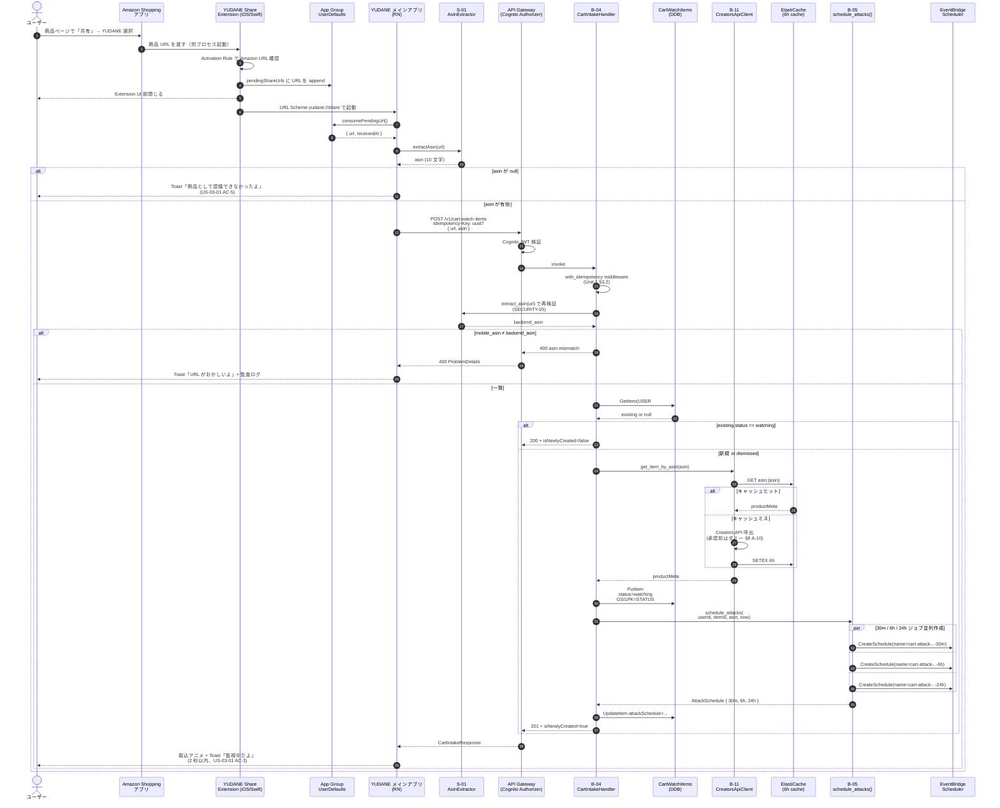
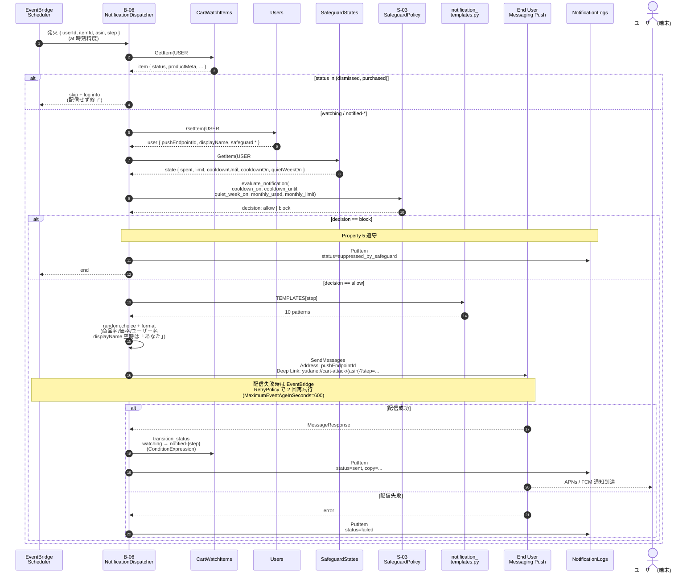
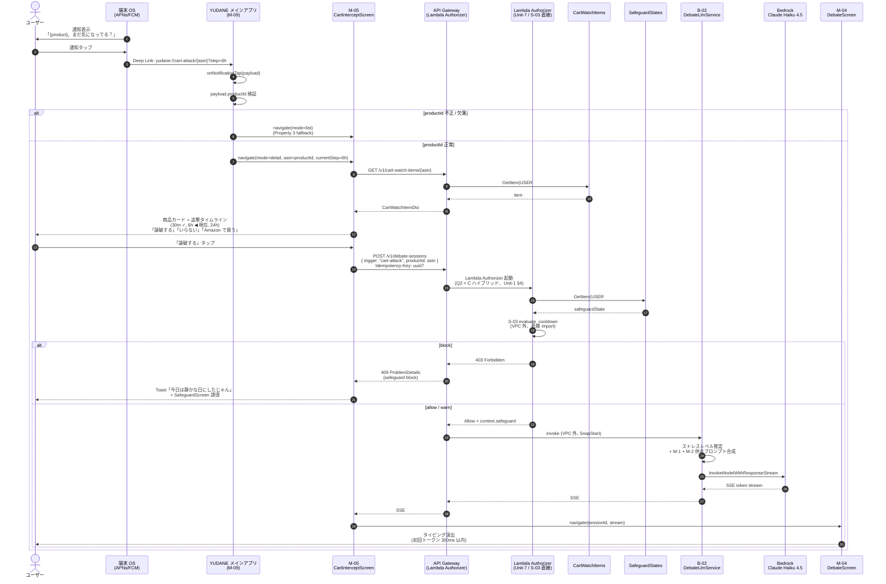
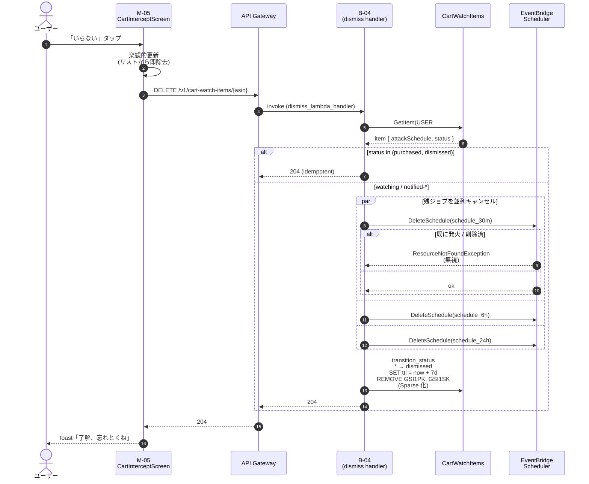
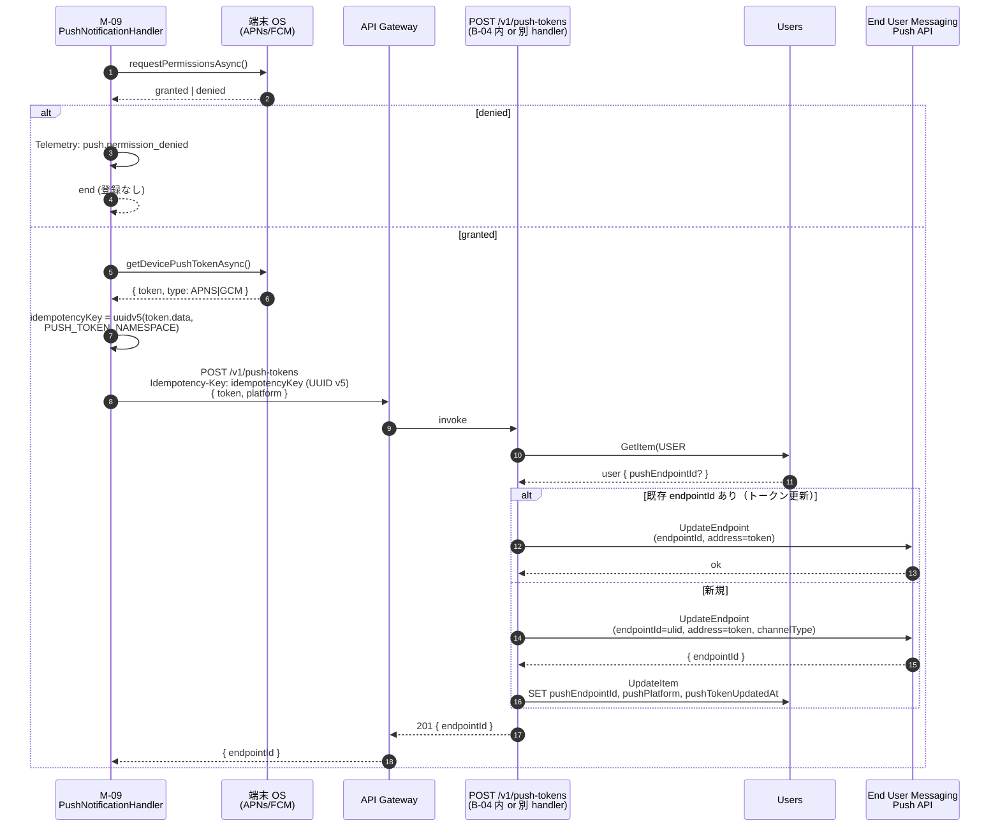
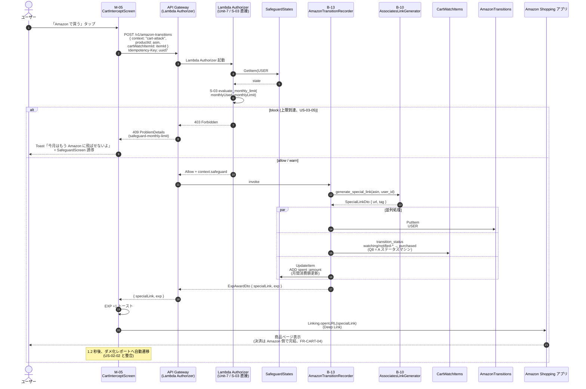
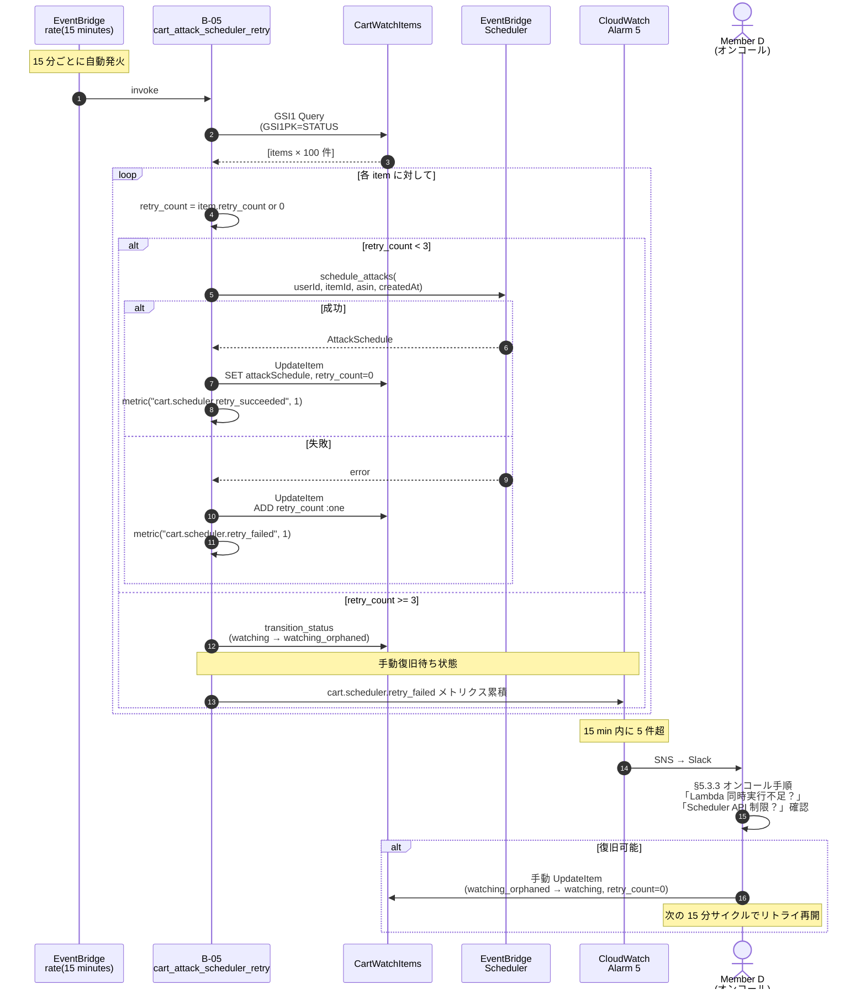

# Unit-5 Cart Intercept — Sequence Diagrams

> Q1〜Q8 確定に基づく主要シーケンス。Mermaid 記法で記述、Unit-1 [sequence-diagrams.md](../../unit-1-platform/functional-design/sequence-diagrams.md) の表記規則に整合。
>
> 参照: [functional-design.md](./functional-design.md) / [data-model.md](./data-model.md)

---

## 1. Share Extension → カート監視リスト登録（US-03-01）

Q1 = A（Expo Config Plugin + App Group）/ Q2 = A（Mobile 即時抽出 + Backend 再検証）反映。

---

## 2. 30m / 6h / 24h 追撃通知の発火（US-03-02）

Q3 = A（テンプレートベース）/ Q4 = A（One-time Schedule）/ Q5 = C（End User Messaging Endpoint）反映。
**2 巡目セルフレビュー後修正**: Scheduler Input に `asin` を追加（B-06 が CartWatchItems を `CART#asin` SK で直接 GetItem する）。

---

## 3. 通知タップ → 論破モード遷移（US-03-02 AC-3 / Q7 = A）

Q7 = A（CartInterceptScreen 経由 → 論破ボタン → DebateScreen）反映。
**2 巡目セルフレビュー後修正**: Deep Link / API パスを `asin` ベースに統一。

---

## 4. 「いらない」で監視解除 + 残追撃ジョブ取消（US-03-02 AC-4）

---

## 5. Push 通知トークン登録 / 更新（Q5 = C 反映）

---

## 6. CartInterceptScreen から Amazon 遷移（US-03-04）

US-03-04（Special Link で Amazon アプリを Deep Link 起動）対応。Safeguard の月間上限到達時は遷移阻止、許可時は B-10 経由で Special Link 生成 + B-13 で遷移ログ + EXP 加算。

> **Unit-5 owner としての責任範囲**:
>
> - M-05 CartInterceptScreen の「Amazon で買う」ボタン UI と onPress ハンドラ実装
> - 「Amazon で買う」ボタン近傍に **Associates 開示文言**（「YUDANE は Amazon Associates として、紹介リンク経由の購入で Amazon から紹介料を受け取っています」）を常時表示（US-03-04 AC-3 / FR-PROFILE-04 / NG-8）
> - 遷移確認オーバーレイに **「Amazon に移動します」** + ASIN + 商品名 + Associates 開示の 1 枚を必ず挟む（FR-CART-05 / Q3 が UC-03 主導線にも適用）
> - `POST /v1/amazon-transitions` への呼出し
> - Linking.openURL での Special Link 起動
> - Safeguard block 時の UI フィードバック
>
> **Special Link のリンク短縮方針（US-03-04 AC-5 / Associates Operating Agreement 遵守）**:
>
> - **本 Unit ではリンク短縮を採用しない**。B-10 AssociatesLinkGenerator（Unit-4 owner）が生成する Amazon ドメインの Special Link（`https://www.amazon.co.jp/dp/{asin}?tag={associatesTag}` 形式）をそのまま `Linking.openURL` に渡す
> - 短縮を行うと「Amazon への遷移であることが不明瞭」になり Associates Operating Agreement 違反となるため、bit.ly / cuttly 等の短縮サービス利用は **明示的に禁止**
> - 表示上はオーバーレイで「Amazon に移動します」と明示するため、URL 文字列が長くても UX 上の問題なし
>
> **Unit-4 owner（B-13 / B-10）への依存**:
>
> - B-13 AmazonTransitionRecorder 本体実装は Unit-4 Reel owner（[unit-of-work.md Unit-4](../../../inception/application-design/unit-of-work.md#unit-4-reel-エージェント型リール-uc-02)）
> - B-10 AssociatesLinkGenerator が「Amazon ドメインを保ったまま」Special Link を生成する責務を持つことを Unit-4 functional-design で確認必須
> - 本 Unit はリクエスト送信側のみ責任を持つ
> - API 契約 `POST /v1/amazon-transitions` は Unit-4 owner が OpenAPI 定義し、Unit-5 owner はクライアント側を実装

---

## 7. B-05 リトライバッチ（NFR Design Q4 = A' 追加）

部分失敗で `attackSchedule` が空の watching アイテムを 15 分間隔で補完。3 回失敗で `watching_orphaned` に遷移。

> **設計上の注意点**:
>
> - `retry_count` 属性を CartWatchItem に追加（NFR Design Q4 = A' 反映、data-model.md §1.2 の追加属性として定義）
> - リトライ batch 自体が失敗（Lambda Error）した場合は `cart_attack_scheduler_retry` の Lambda Error Alarm（Alarm 4）が発火
> - 同一アイテムを繰り返し処理しないよう **GSI1 Query 結果を retry_count 昇順** で返却
> - 100 件超のアイテムが滞留する場合、次回起動で残りを処理（自然な逐次補完）

---

## 8. ハッカソン書類審査・予選評価軸へのインパクト

| 評価軸 | 本ドキュメントの貢献 |
|---|---|
| Unit 分解の適切さ | **強化**: Unit-5 内のシーケンス（intake / attack / dismiss / push token）と Unit-1（Lambda Authorizer / S-03 / IdempotencyKeys）/ Unit-3（DebateLlmService）/ Unit-4（B-11 CreatorsApiClient）/ Unit-7（SafeguardStates）連携が時系列で可視化 |
| ドキュメント品質 | **強化**: 5 系統のシーケンス図に Q1〜Q8 確定が反映、Property 1〜5 の不変条件と整合 |
| AI-DLC プロセス | **強化**: Unit-1 sequence-diagrams.md と同一テンプレートで作成、整合性確保 |
