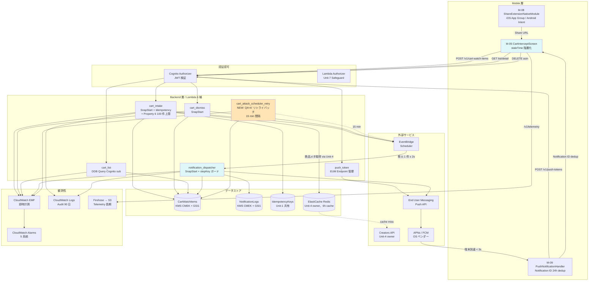

# Unit-5 Cart Intercept — Logical Components

> Construction Phase の Per-Unit Loop NFR Design Part 2 Generation 成果物。Unit-5 の論理コンポーネントの相互作用を可視化し、各コンポーネントの責任 / I/F / 設計パターン適用を統合する。
>
> 参照: [nfr-design-patterns.md](./nfr-design-patterns.md) / [nfr-requirements.md](../nfr-requirements/nfr-requirements.md) / [functional-design.md](../functional-design/functional-design.md)

---

## 1. コンポーネント構成図（高レベル）



---

## 2. コンポーネント別責務 + パターン適用

### 2.1 Mobile 層

#### M-05 CartInterceptScreen

| 項目 | 内容 |
|---|---|
| 責務 | Cart 監視リストの表示 / 通知タップ後の詳細表示 / 「論破する」「いらない」「Amazon で買う」操作 |
| 主要 I/F | `useQuery(['cart-watch-items'])` / `useCartWatchItem(asin)` / `useCartIntake()` / `useCartDismiss()` |
| 適用パターン | **staleTime 階層化（Q2 = A'）**: 一覧 60s / 詳細 0s / Associates 開示文言常時表示 / Reduce Motion 対応 |
| 対応 SLO | NFR §1.5 Mobile FPS 60fps / RAM < 50MB / 起動 < 3s |
| 依存先 | M-08（Share）/ M-09（通知タップ）/ B-04 cart_intake / cart_dismiss / cart_list / Unit-4 B-13 amazon-transitions / Unit-3 debate-sessions |

#### M-08 ShareExtensionNativeModule

| 項目 | 内容 |
|---|---|
| 責務 | iOS Share Extension（Swift、別プロセス）/ Android Intent Filter で Amazon URL 受信 → App Group UserDefaults 保存 → メインアプリ起動 |
| 主要 I/F | `consumePendingUrl()` / `onUrlShared` イベント |
| 適用パターン | **Expo Config Plugin**（Q1 = A 確定）/ Activation Rules で Amazon URL のみ通過 / iOS 15.0+ / Android API 29+ 対応 |
| 対応 SLO | NFR §1.1.1.1 ⑥-1 + ⑥-2 = 200ms（Native 起動 + URL キャプチャ）/ メモリ < 120MB |
| 依存先 | iOS App Group / Android Intent system / S-01 AsinExtractor（呼出は M-05 経由）|

#### M-09 PushNotificationHandler

| 項目 | 内容 |
|---|---|
| 責務 | APNs/FCM トークン取得 → Backend POST /v1/push-tokens → 通知受信 → Deep Link 解析 → M-05 詳細モード起動 |
| 主要 I/F | `registerForPushNotifications()` / `onNotificationTap(payload, navigation)` |
| 適用パターン | **Notification ID 24h dedup**（AsyncStorage キャッシュ）/ Cold Start / Warm Start / Foreground 受信の 3 系統対応 / staleTime=0 で詳細 fetch |
| 対応 SLO | NFR §1.1.2 Push 受信 → 表示 < 3s（OS 標準動作）/ 100 通知あたり < 1% バッテリー |
| 依存先 | OS APNs/FCM / Unit-2 push-tokens API（B-04 push_token Lambda 経由）|

---

### 2.2 Backend 層 / Lambda 6 種

#### B-04 cart_intake

| 項目 | 内容 |
|---|---|
| 責務 | URL 受信 → Idempotency check → ASIN 再検証 → Property 6 件数チェック → 既存登録チェック → Creators API 商品メタ取得 → DDB PutItem → B-05 schedule_attacks 同期呼出 |
| ハンドラ | `handlers.cart_intake.lambda_handler` |
| Lambda 設定 | ARM64 / 512MB / Timeout 5s / **Reserved Concurrency 100（MVP）/ 500（本番化）** / **SnapStart ON** |
| 適用パターン | Idempotency Middleware / Property 6 / IDOR 防御（PK=USER#cognito.sub）/ boto3 adaptive retries / EMF 即時計測 / 部分失敗許容（Saga 不採用、Q4 = A'）|
| 対応 SLO | end-to-end 2 秒の中で 900ms 内訳（NFR §1.1.1.1） |
| 依存先 | DDB CartWatchItems / DDB IdempotencyKeys / B-11 Creators API / B-05 schedule_attacks() ライブラリ呼出 |

#### B-04 cart_dismiss

| 項目 | 内容 |
|---|---|
| 責務 | DELETE /v1/cart-watch-items/{asin} → 残追撃ジョブ取消 → CartWatchItem を `dismissed` に遷移 + TTL 7 日 + GSI1 から外す |
| ハンドラ | `handlers.cart_dismiss.dismiss_lambda_handler` |
| Lambda 設定 | ARM64 / 256MB / Timeout 5s / **Reserved Concurrency 50** / **SnapStart ON** |
| 適用パターン | IDOR 防御 / boto3 adaptive retries / EMF 即時計測 |
| 対応 SLO | NFR §1.1.2 cart_dismiss p95 < 1 秒 |
| 依存先 | DDB CartWatchItems / EventBridge Scheduler DeleteSchedule × 3 |

#### B-04 cart_list

| 項目 | 内容 |
|---|---|
| 責務 | GET /v1/cart-watch-items?status={active}&cursor={base64} → DDB Query で active 群を返却 |
| ハンドラ | `handlers.cart_list.list_lambda_handler` |
| Lambda 設定 | ARM64 / 256MB / Timeout 3s / **Reserved Concurrency 100**（M-05 起動毎に呼ばれる高頻度）|
| 適用パターン | DDB On-Demand 単独（DAX 不採用、Q5 = A）/ IDOR 防御 / EMF 即時計測 / staleTime 60s で Mobile cache |
| 対応 SLO | NFR §1.1.2 cart_list p95 < 500ms |
| 依存先 | DDB CartWatchItems |

#### B-04 push_token

| 項目 | 内容 |
|---|---|
| 責務 | POST /v1/push-tokens → End User Messaging UpdateEndpoint → Users.pushEndpointId 更新 |
| ハンドラ | `handlers.push_token.register_lambda_handler` |
| Lambda 設定 | ARM64 / 256MB / Timeout 5s / **Reserved Concurrency 20** |
| 適用パターン | Idempotency Middleware（uuidv5(token)）/ boto3 adaptive retries |
| 対応 SLO | （独自数値化なし、低頻度のため） |
| 依存先 | End User Messaging Push UpdateEndpoint API / Unit-2 Users テーブル（pushEndpointId 属性追加） |

#### B-06 notification_dispatcher

| 項目 | 内容 |
|---|---|
| 責務 | EventBridge 発火受信 → CartWatchItem 状態確認（dismissed/purchased ならスキップ）→ SafeguardPolicy 判定 → テンプレート選択 → End User Messaging SendMessages → CartWatchItem ステータス遷移 → NotificationLogs 記録 |
| ハンドラ | `handlers.notification_dispatcher.lambda_handler` |
| Lambda 設定 | ARM64 / 512MB / Timeout 10s / **Reserved Concurrency 200（MVP）/ 500（本番化）** / **SnapStart ON** / **DLQ 設定済み** |
| 適用パターン | NotificationLogs stepKey ConditionExpression / boto3 adaptive retries / EventBridge Retry + DLQ / S-03 evaluate_notification 呼出 / EMF 即時計測 / Telemetry 命名分離（sent / failed / suppressed_by_safeguard / suppressed_as_duplicate） |
| 対応 SLO | NFR §1.1.4 配信遅延 ± 30s の Lambda 区間（5s）/ NFR §1.1.2 B-06 Lambda p95 < 5s |
| 依存先 | DDB CartWatchItems / DDB NotificationLogs / DDB Users（pushEndpointId）/ DDB SafeguardStates（Unit-7）/ End User Messaging SendMessages |

#### B-05 cart_attack_scheduler_retry（NEW、Q4 = A'）

| 項目 | 内容 |
|---|---|
| 責務 | 部分失敗で `attackSchedule` が空の watching アイテムを GSI1 で抽出 → schedule_attacks() 再実行 → 3 回失敗で `status=watching_orphaned` に遷移 |
| ハンドラ | `handlers.cart_attack_scheduler_retry.lambda_handler` |
| Lambda 設定 | ARM64 / 512MB / Timeout 60s / **Reserved Concurrency 10** |
| 起動 | EventBridge Schedule `rate(15 minutes)` 定期実行 |
| 適用パターン | DDB GSI1 Query / EMF 即時計測 / CloudWatch Alarm 5（retry_failed > 5/15min）|
| 対応 SLO | リトライバッチは UX に影響しないため独自 SLO なし |
| 依存先 | DDB CartWatchItems / EventBridge CreateSchedule / GetSchedule |

---

### 2.3 データストア

#### CartWatchItems（Multi Table Design、Unit-5 owner）

| 項目 | 内容 |
|---|---|
| キー | PK = `USER#{userId}` / SK = `CART#{asin}` |
| GSI1 | `STATUS#{status}` × `{createdAt}`（Sparse Index、watching/notified-* のみ）|
| 適用パターン | KMS CMEK 暗号化 / On-Demand 自動スケール / TTL（dismissed/purchased 後 7 日）/ status ステータスマシン + ConditionExpression / Property 6 件数上限 |
| アクセス Lambda | B-04 全種（intake/dismiss/list）/ B-06 / B-05 retry |

#### NotificationLogs（Unit-5 owner）

| 項目 | 内容 |
|---|---|
| キー | PK = `USER#{userId}` / SK = `NOTIFY#{ulid}` |
| GSI1 | `cartWatchItemId` × `sentAt` |
| 追加属性 | `stepKey = {itemId}#{step}` + `ConditionExpression: attribute_not_exists(stepKey)`（重複ガード）|
| 適用パターン | KMS CMEK 暗号化 / On-Demand 自動スケール / TTL（90 日保持）/ Audit/Telemetry 分離（Telemetry は EMF 直接、本テーブルは配信ログ専用）|
| アクセス Lambda | B-06 dispatch（PutItem）/ M-09（tappedAt 更新、`POST /v1/notifications/{id}/tap`）|

#### IdempotencyKeys（Unit-1 owner、本 Unit は consumer）

| 項目 | 内容 |
|---|---|
| キー | PK = `IDEMPOTENCY#{key}` / SK = `STATIC` |
| 適用パターン | atomic lock with ConditionExpression / 5 分 TTL / S3 レスポンスボディキャッシュ |
| 利用 API | POST /v1/cart-watch-items / POST /v1/push-tokens（POST /v1/cart-watch-items/{asin}/dismiss は idempotent のため不要） |

#### ElastiCache Redis（Unit-4 owner、本 Unit は consumer）

| 項目 | 内容 |
|---|---|
| 用途 | B-11 CreatorsApiClient の商品メタ 6h キャッシュ |
| キー | `asin:{asin}` |
| 適用パターン | Cache-aside / TTL 6h / boto3 adaptive retries で自動再試行 |
| 利用 Lambda | B-04 cart_intake（B-11 経由でアクセス）|

---

### 2.4 外部サービス

#### EventBridge Scheduler

| 項目 | 内容 |
|---|---|
| 用途 | 30m / 6h / 24h 追撃通知の One-time Schedule + cart_attack_scheduler_retry の rate(15 minutes) |
| 適用パターン | One-time Schedule + ActionAfterCompletion=DELETE / RetryPolicy 2 回 / Confused Deputy 対策（Trust Policy）/ Resource ARN 限定 |
| アクセス | B-04 cart_intake（CreateSchedule × 3）/ B-04 cart_dismiss（DeleteSchedule × 3）/ B-05 retry（GetSchedule + CreateSchedule）|

#### End User Messaging Push（AWS Pinpoint EoL 後継）

| 項目 | 内容 |
|---|---|
| 用途 | APNs/FCM への通知配信 + Endpoint 管理（Q5 = C 確定）|
| 適用パターン | Endpoint 経由抽象化 / トークンローテーション自動 / boto3 adaptive retries |
| アクセス | B-04 push_token（UpdateEndpoint / GetEndpoint）/ B-06 dispatch（SendMessages）|

#### Creators API（Unit-4 owner、本 Unit は consumer）

| 項目 | 内容 |
|---|---|
| 用途 | Amazon 商品メタ取得（PA-API 5.0 後継）|
| 適用パターン | Redis 6h キャッシュ前提 / boto3 adaptive retries / ダミーカタログ fallback（Approved Mobile Application 承認前）|
| 制約 | レート制限あり（Associates ID の直近 30 日売上による）/ ハッカソン期間中は §8 A-10 でダミー使用 |

---

### 2.5 認証認可

#### Cognito Authorizer

| 項目 | 内容 |
|---|---|
| 用途 | GET / POST / DELETE 系 API の JWT 検証 |
| 対象エンドポイント | GET /v1/cart-watch-items / GET /v1/cart-watch-items/{asin} / POST /v1/cart-watch-items / DELETE /v1/cart-watch-items/{asin} / POST /v1/push-tokens |

#### Lambda Authorizer（Unit-7 owner、本 Unit は consumer）

| 項目 | 内容 |
|---|---|
| 用途 | Safeguard 統合（月間上限 / クールダウン判定）|
| 対象エンドポイント | POST /v1/amazon-transitions（本 Unit が呼出）/ POST /v1/debate-sessions（本 Unit が呼出）|
| 適用パターン | S-03 SafeguardPolicy 直接 import + DDB SafeguardStates 直接参照（Redis 介在ゼロ）|

---

### 2.6 観測性

#### CloudWatch EMF（即時計測）

| 項目 | 内容 |
|---|---|
| 用途 | Telemetry の即時アラート可能経路 |
| 対象メトリクス | cart.intake.created / cart.dismissed / notification.dispatched(sent/failed/suppressed_*) / cart.scheduler.create_failed / cart.scheduler.retry_succeeded/failed |
| アラーム連携 | CloudWatch Alarms 5 系統で SNS → Slack 通知 |

#### CloudWatch Logs（Audit）

| 項目 | 内容 |
|---|---|
| 用途 | B-12 AuditLogger 構造化 JSON ログ / 90 日保持 |
| 対象 | 全 Lambda の info / warn / error ログ + 相関 ID + PII マスキング |

#### Firehose → S3 Parquet（Telemetry 長期）

| 項目 | 内容 |
|---|---|
| 用途 | Mobile 19 Telemetry イベントの長期保管 + 北極星指標分析 |
| 経路 | M-13 Telemetry → POST /v1/telemetry → B-14 → Firehose → S3（Unit-1 owner）|

---

## 3. 相互作用パターンの代表例

### 3.1 Share 受信 → Cart 登録 → 30m 通知（正常系）

```
M-08 Share → M-05 intake mutation
  → POST /v1/cart-watch-items（Idempotency Key + Cognito JWT）
    → API Gateway Cognito Authorizer 検証
      → B-04 cart_intake invoke (SnapStart 適用済み、Cold Start 短縮)
        → with_idempotency middleware（DDB IdempotencyKeys atomic lock）
          → S-01 ASIN 再検証
            → count_active(user_id)（Property 6、< 100 件確認）
              → B-11 CreatorsApiClient（Redis 6h キャッシュ）
                → DDB CartWatchItems PutItem（status=watching、GSI1 設定）
                  → B-05 schedule_attacks(user_id, item_id, asin, now)
                    → EventBridge CreateSchedule × 3 並列（30m/6h/24h）
                      → DDB UpdateItem（attackSchedule 更新）
                        → metric("cart.intake.created", 1) [EMF 即時]
                          → Response 201 + isNewlyCreated=true
                            → Mobile UI 更新（intake-success 1.5s 経由 list へ）

[30 分後]
EventBridge 30m Schedule 発火（± 2s 精度）
  → B-06 notification_dispatcher invoke (SnapStart 適用済み、Cold Start 短縮)
    → DDB GetItem CartWatchItems（status=watching 確認）
      → DDB GetItem Users（pushEndpointId）
        → DDB GetItem SafeguardStates（cooldown / monthlyUsed）
          → S-03 evaluate_notification → allow
            → TEMPLATES["30m"] random.choice + format
              → End User Messaging SendMessages
                → APNs/FCM → 端末到達（< 3s）
                  → DDB PutItem NotificationLogs（stepKey ConditionExpression OK、status=sent）
                    → DDB transition_status(watching → notified-30m)
                      → metric("notification.dispatched", 1, status=sent) [EMF]
                        → Lambda 終了（end-to-end ± 30s 内）
```

### 3.2 部分失敗 → B-05 リトライバッチ補完（Q4 = A' 反映）

```
M-08 Share → M-05 intake mutation
  → ... → B-04 cart_intake
    → DDB PutItem（status=watching、attackSchedule={}）
      → B-05 schedule_attacks 失敗（EventBridge 5xx）
        → Exception → log "error" + CartWatchItem は維持
          → Response 201（attackSchedule 不完全）

[15 分後]
EventBridge 定期 Schedule（rate(15 minutes)）発火
  → cart_attack_scheduler_retry invoke
    → DDB GSI1 Query（status=watching, attackSchedule 不完全, createdAt < 24h）
      → 100 件取得
        → 各々 schedule_attacks() 再実行
          → 成功 → DDB UpdateItem attackSchedule
          → 3 回失敗 → DDB UpdateItem status=watching_orphaned
            → CloudWatch Alarm 5 発火（cart.scheduler.retry_failed > 5）
              → Slack #yudane-emergency 通知
                → Member D 1 次調査（オンコール手順 §5.3）
```

### 3.3 通知タップ → 論破モード遷移（Q2 = A' staleTime 階層化）

```
EventBridge → B-06 → APNs → 端末到達
  → ユーザータップ
    → OS Deep Link: yudane://cart-attack/{asin}?step=6h
      → M-01 AppShell.onDeepLink（Cold Start なら Cognito 復元待ち）
        → M-09 onNotificationTap delegate
          → notification_id 24h dedup check（重複なら無視）
            → navigation.navigate('CartIntercept', { mode: 'detail', asin, currentStep: '6h' })
              → M-05 detail mode 起動
                → useCartWatchItem(asin, { staleTime: 0 })  ← 常に refetch
                  → GET /v1/cart-watch-items/{asin}（B-04 cart_list 経由）
                    → DDB GetItem（最新 status=notified-6h を取得）
                      → 商品カード + 追撃タイムライン表示（30m ✓ / 6h ◀ / 24h pending）
                        → ユーザー「論破する」タップ
                          → POST /v1/debate-sessions { trigger: "cart-attack", productId: asin }
                            → API Gateway Lambda Authorizer（Unit-7 Safeguard 統合）
                              → S-03 evaluate_cooldown → allow
                                → Unit-3 B-02 DebateLlmService SSE 開始
                                  → M-04 DebateScreen 遷移
```

---

## 4. ハッカソン書類審査・予選評価軸へのインパクト

| 評価軸 | 本ドキュメントの貢献 |
|---|---|
| ビジネス意図の明確さ | （直接貢献なし、技術文書のため）|
| Unit 分解の適切さ | **強化**: Unit-5 内の 6 Lambda + 2 DDB + 4 外部サービス + 認証認可 + 観測性の論理コンポーネント図が Mermaid で可視化、Unit 横断依存（Unit-1 共有 / Unit-4 consume / Unit-7 統合）が明示 |
| 創造性とテーマ適合性 | （直接貢献なし）|
| ドキュメント品質 | **強化**: コンポーネント別責務 + パターン適用の表 + 3 つの相互作用パターン代表例で Code Generation 時の実装トレース容易化 |
| AI-DLC プロセス（予選評価軸） | **強化**: Functional Design / NFR Requirements / NFR Design の段階的精緻化が論理コンポーネント図で集約 |
