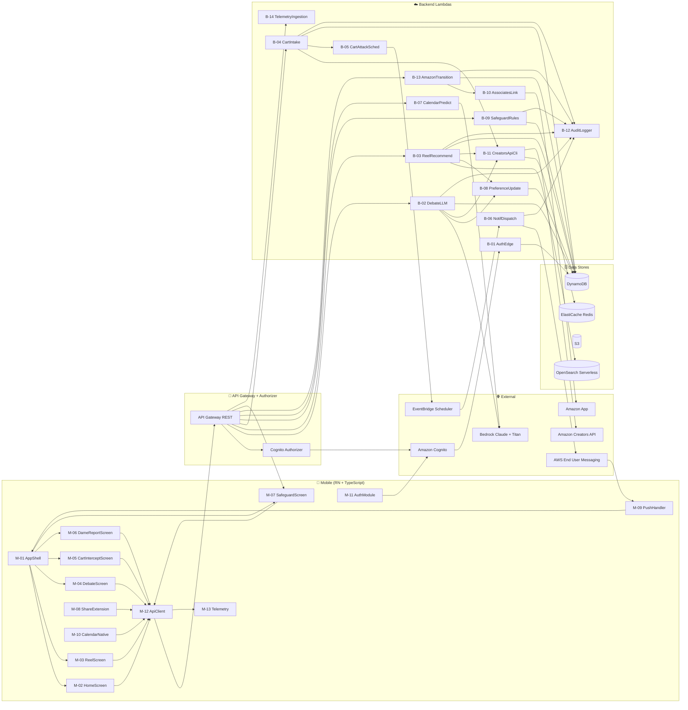
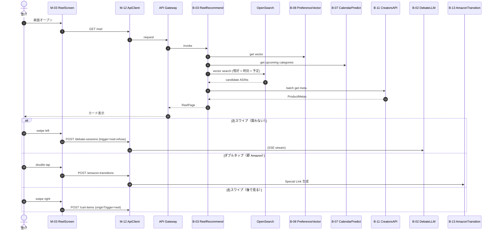
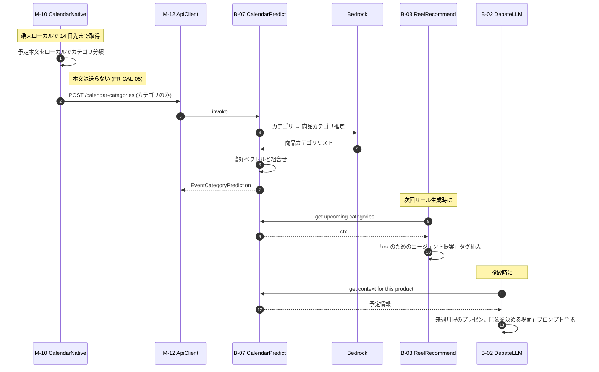
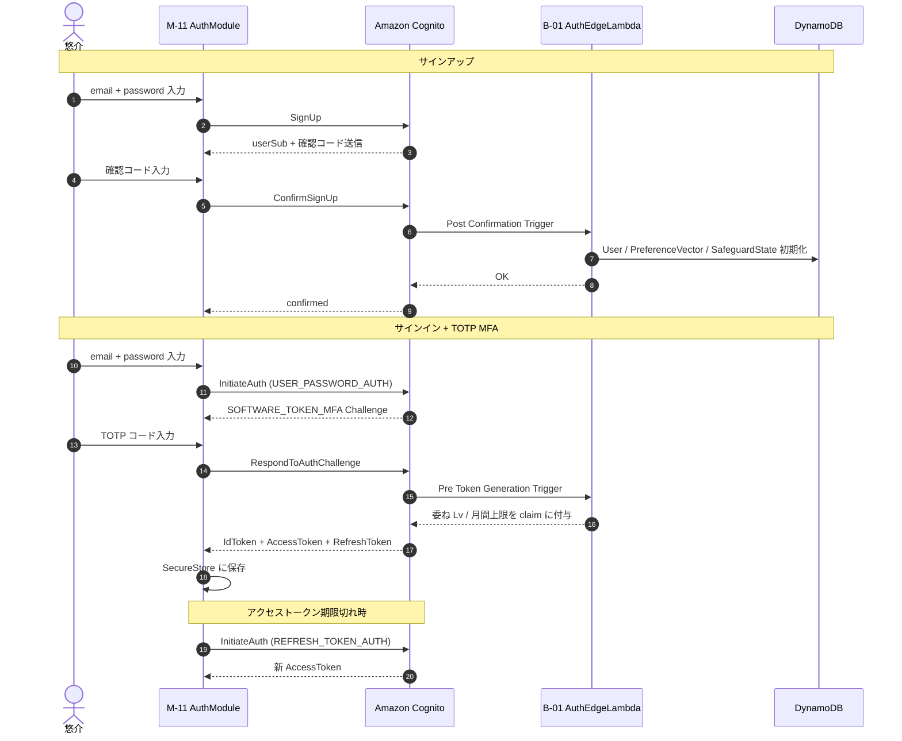

# Application Design — Component Dependencies

> コンポーネント間の依存関係、通信パターン、主要データフロー。Mermaid で可視化。  
> 参照: [Components](./components.md) / [Services](./services.md) / [Component Methods](./component-methods.md)

## 全体コンポーネント依存図



---

## 主要データフロー 1: UC-03 カート介入 + UC-01 論破（Share → 追撃 → 論破 → Amazon 遷移）

> 注: 本図では Share Extension から ApiClient への流れを簡略化。実際は Platform Channel 経由で RN 側の `registerAsCartWatchItem(asin)` メソッド（`M-08` と `M-12` の協調）を経由する。

```mermaid
sequenceDiagram
    autonumber
    actor User as 悠介
    participant AmApp as Amazon Shopping
    participant ShareExt as M-08 ShareExt
    participant ApiCli as M-12 ApiClient
    participant APIGW as API Gateway
    participant Intake as B-04 CartIntake
    participant Creators as B-11 CreatorsAPI
    participant Redis as ElastiCache
    participant CreatorsAPI as Amazon Creators API
    participant DDB as DynamoDB
    participant Sched as B-05 AttackSched
    participant EB as EventBridge Scheduler
    participant Notify as B-06 NotifDispatch
    participant EUM as End User Messaging
    participant Device as 端末 APNs/FCM
    participant Debate as B-02 DebateLLM
    participant Bedrock as Amazon Bedrock
    participant Safe as B-09 Safeguard
    participant Trans as B-13 AmazonTransition
    participant Link as B-10 AssociatesLink

    User->>AmApp: 商品をカートに入れる、迷う
    User->>ShareExt: 共有 → YUDANE
    ShareExt->>ApiCli: ASIN 付きで登録リクエスト
    ApiCli->>APIGW: POST /cart-items
    APIGW->>Intake: invoke
    Intake->>Creators: getItemByAsin(asin)
    Creators->>Redis: GET cache
    alt cache miss
        Creators->>CreatorsAPI: fetch product
        CreatorsAPI-->>Creators: ProductMeta
        Creators->>Redis: SET TTL 6h
    end
    Creators-->>Intake: ProductMeta
    Intake->>DDB: put CartWatchItem
    Intake->>Sched: schedule_attacks(userId, itemId)
    Sched->>EB: create 3 schedules (30m/6h/24h)
    Intake-->>APIGW: 2xx CartWatchItemDto
    APIGW-->>ApiCli: response
    ApiCli-->>User: トースト「監視リストに追加」

    Note over EB: 30 分経過
    EB->>Notify: invoke (step=30m)
    Notify->>EUM: send push (friend tone copy)
    EUM->>Device: APNs/FCM
    Device->>User: 「さっきのイヤホン 3 回目だよね。1 分話そう」

    User->>Device: 通知タップ
    Device->>ApiCli: deep link with itemId
    ApiCli->>APIGW: POST /debate-sessions (trigger=cart-attack)
    APIGW->>Safe: evaluate(userId, "debate-start")
    Safe-->>APIGW: allow
    APIGW->>Debate: invoke
    Debate->>Bedrock: stream prompt (fact+psychology)
    Bedrock-->>Debate: stream tokens
    Debate-->>APIGW: SSE
    APIGW-->>ApiCli: SSE
    ApiCli-->>User: 論破テキスト表示

    User->>ApiCli: 「🛍 Amazon で買う」
    ApiCli->>APIGW: POST /amazon-transitions
    APIGW->>Safe: evaluate(userId, "amazon-transition")
    Safe-->>APIGW: allow
    APIGW->>Trans: invoke
    Trans->>Link: generate_special_link(asin, userId)
    Link-->>Trans: SpecialLinkDto
    Trans->>DDB: write AmazonTransition + EXP
    Trans-->>APIGW: { url }
    APIGW-->>ApiCli: { url }
    ApiCli->>AmApp: Deep Link open
    AmApp->>User: 商品ページ（カート入り状態）
    Note over User,AmApp: 決済は Amazon 側で完結
```

---

## 主要データフロー 2: UC-02 リール + 論破 / Amazon 遷移



---

## 主要データフロー 3: UC-04 カレンダー連動



---

## 主要データフロー 4: 認証（サインアップ → MFA → サインイン → トークンリフレッシュ）



---

## 通信パターン

| パターン | 使用箇所 | 根拠 |
|---|---|---|
| **Sync REST (HTTPS)** | Mobile ↔ Backend 全般 | 認証のみ Amplify Auth を介し、データ通信は AWS SDK v3 で直接叩くシンプル構成 |
| **SSE (Server-Sent Events)** | Debate ストリーミング | LLM トークン逐次表示、WebSocket より軽量 |
| **非同期 EventBridge Scheduler** | Cart 追撃 (30m/6h/24h) | 時間遅延ジョブ。Step Functions より軽量 |
| **EventBridge（日次 cron）** | PreferenceVectorUpdater | バッチジョブ |
| **ネイティブ Platform Channel** | Share / Push / Calendar | RN の JS で扱えない OS 固有機能 |
| **Deep Link (custom scheme / Universal Link)** | YUDANE → Amazon App | Amazon 遷移 |
| **Cognito JWT** | 全 API 認証 | SECURITY-08/12 |

---

## データストア配置ポリシー

| ストア | 用途 | データ |
|---|---|---|
| **DynamoDB** | メインデータストア | `Users` / `PreferenceVectors` / `CartWatchItems` / `DebateSessions` / `DebateMessages` / `AmazonTransitions` / `Achievements` / `SafeguardStates` / `NotificationLogs` / `ReelImpressions` |
| **S3** | 大型オブジェクト | 商品画像キャッシュ / データエクスポート用 dump / ユーザーアバター |
| **ElastiCache Redis** | 低レイテンシ読み取り / レート制限 | Creators API 商品メタ（TTL 6h）/ セッションスロットル / 論破レート制限 |
| **OpenSearch Serverless** | ベクトル検索 | 商品埋め込み / 嗜好埋め込みマッチング |

PII を含むユーザー特定データはすべて DynamoDB（KMS CMEK 暗号化、SECURITY-01）。S3 は画像のみ。

---

## 依存方向の制約（循環禁止）

- Mobile → Backend への一方通行（Push 通知は非同期、Mobile は handler で受けるのみ）
- Backend 内でのクロスサービス呼出は **最小限**。SVC-01 論破は SVC-02/03/04 から直接呼ばれることはなく、各 SVC から論破トリガー API を叩くのみ
- `S-03 SafeguardPolicy` は Mobile と Backend 両方で import（同じ判定を走らせる）

---

## 障害時フォールバック

| 障害 | フォールバック |
|---|---|
| Bedrock 応答なし | 論破は「すみません、今回は見送りますか？」の定型文 / 事前生成テンプレート |
| Creators API レート制限 | Redis キャッシュで応答、TTL 延長、新規登録は一時拒否 |
| OpenSearch 応答遅延 | 静的推薦カタログへ切替（§6.7） |
| EventBridge Scheduler 失敗 | DynamoDB に TTL 予約も設定しておき、TTL トリガーで救済 |
| End User Messaging 配信失敗 | 次回アプリ起動時に「見逃した通知」として In-App で再表示 |
