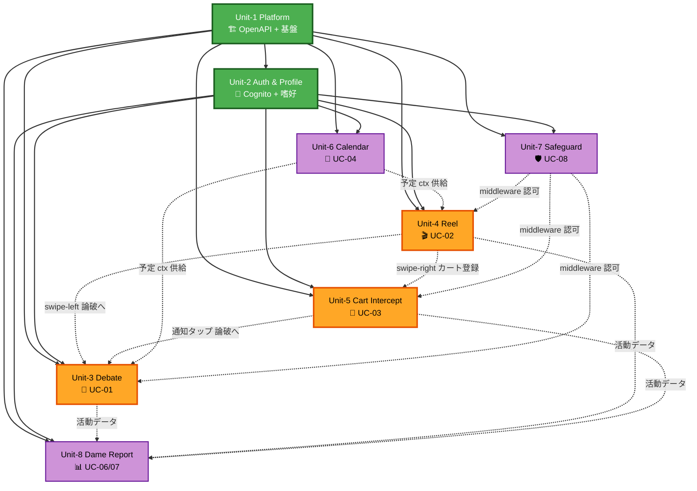
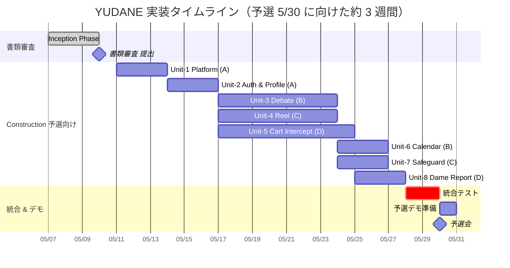

# Unit of Work — Dependency & Implementation Order

> 8 Units の依存関係、ブロッキング、実装順序、並行開発計画。  
> 参照: [Unit of Work](./unit-of-work.md) / [Story Map](./unit-of-work-story-map.md)

## 依存マトリクス

| Unit（下記←） | U1 Platform | U2 Auth | U3 Debate | U4 Reel | U5 Cart | U6 Cal | U7 Safe | U8 Report |
|---|:---:|:---:|:---:|:---:|:---:|:---:|:---:|:---:|
| **U1 Platform** | — | | | | | | | |
| **U2 Auth** | ✅ | — | | | | | | |
| **U3 Debate** | ✅ | ✅ | — | | | | | |
| **U4 Reel** | ✅ | ✅ | → swipe-left | — | → stash | → ctx | check | |
| **U5 Cart** | ✅ | ✅ | → trigger | | — | | check | |
| **U6 Calendar** | ✅ | ✅ | → ctx | → ctx | | — | | |
| **U7 Safeguard** | ✅ | ✅ | gate | gate | gate | | — | |
| **U8 Report** | ✅ | ✅ | read metric | read metric | read metric | read metric | read | — |

凡例:
- ✅ = **ブロッキング依存**（下の Unit が上の Unit 完成を待つ）
- `→` = **トリガー関係**（一方から他方を呼び出す）
- `gate` = **Authorizer 挿入**（Unit-7 の middleware が該当 Unit の API 前段に立つ）
- `check` = **ランタイムチェック**（UI 側で Unit-7 ポリシーを参照）
- `read xxx` = **データ読み取り**（Unit-8 が他 Unit の出力を消費、同期不要）

## Unit 間依存 DAG（Mermaid）

凡例:
- 🟢 **緑**: 基盤（Unit-1 / Unit-2）= 最初に完成させる
- 🟠 **オレンジ**: コア UC（Unit-3/4/5）= 並行開発
- 🟣 **紫**: サポート UC（Unit-6/7/8）= コアと並行可能
- 実線: ブロッキング依存（完了待ち）
- 点線: トリガー / 参照（契約凍結後は並行 OK）

## ブロッキング関係の詳細

### Unit-1 Platform がブロック解除する契約

Unit-1 の完成条件は以下の 4 点。これらが揃うと他 Unit が着手可能:

1. **OpenAPI 3.1 第 1 版凍結**（Q6=A）: `shared/schema/openapi.yaml` にすべてのエンドポイントを定義、TS / Python 型が生成される
2. **モノレポ構造の確定**: `mobile/` `backend/` `infra/` `shared/` のディレクトリと package 定義
3. **基盤 CDK スタック**: VPC / API Gateway / Cognito UserPool / DynamoDB 共通 / ElastiCache / OpenSearch / IAM
4. **CI/CD パイプライン**: GitHub Actions、SBOM、lint/test 通過

### Unit-2 Auth & Profile がブロック解除する契約

Unit-2 の完成条件:

1. **Cognito SignUp/SignIn/MFA が動く**（Mobile AuthModule + B-01 AuthEdgeLambda 統合）
2. **ホーム画面の雛形**が表示される（Auth ガート通過後）
3. **PreferenceVector の DynamoDB 構造**が確定（B-08 が書く型）

これが揃うと Unit-3/4/5 がユーザーコンテキスト付きで並行開発可能。

## 実装順序（Q3=A Platform First に基づく）

### 順序の根拠

- **Unit-1 (Day 1-3)**: OpenAPI 凍結と基盤がないと他 Unit は型すら書けない。**唯一のクリティカルパス**
- **Unit-2 (Day 4-6)**: Auth がないとコア UC の API は叩けない。ホーム画面はオンボ完成時点で最低限の雛形が必要
- **Unit-3/4/5 (Day 7-13/14 並行)**: 3 コア UC。各 5 ストーリー、Member B/C/D が専任
- **Unit-6/7/8 (Day 14-16 並行)**: 各コア担当が自分の Unit 完了後、担当サポート Unit を 3 日で実装。Platform の型生成 + OpenAPI 契約があるため高速に完走可能
- **統合テスト (Day 17-18)**: Unit-8 完了後 2 日、Member A が統合リード
- **デモ準備 (Day 19)**: Member A + 全員で予選デモ調整
- **予選 (Day 20, 5/30 土曜)**

## 並行化の制約

- **Unit-1** は **唯一のクリティカルパス**。ここが遅れると全スケジュールが押す
- **Unit-3/4/5** は API 契約が凍結済み（Q6=A 効果）なので **完全並行可能**
- **Unit-6/7/8** は各コア担当（B/C/D）がコア完了後に着手するシリアル構造。Platform が整っているため 3 日で完走可能
- **Member A** は Unit-1/2 実施後、**全期間で Platform 運用 + OpenAPI 守護 + CI + 統合リード** を担当し、特定 Unit に深入りしない

## ロールアウト戦略（Q5=A 独立デプロイ）

| フェーズ | デプロイする Stack |
|---|---|
| Day 3 書類審査 | （デプロイなし、ドキュメントのみ） |
| Day 6 Auth 完成 | `platform-stack` + `auth-stack` |
| Day 10 コア API 基本機能 | + `debate-stack` + `reel-stack` + `cart-stack` |
| Day 14 サポート完成 | + `calendar-stack` + `safeguard-stack` |
| Day 18 Report | + `report-stack` |
| Day 21 予選デモ | 全 Stack 統合動作 |

各 Stack は独立デプロイ可能なので、**部分障害時のロールバックが容易**。

## リスク & 緩和策

| リスク | 発生確率 | 影響 | 緩和策 |
|---|---|---|---|
| Unit-1 の OpenAPI 凍結が遅れる | 中 | 高（全体遅延） | Member A 専任、2 日目にチームレビューを置く |
| Amazon Approved Mobile Application 承認待ち | 高 | 中（本番遷移不可） | 予選までモックデータ、決勝前に申請完了 |
| Unit-5 ネイティブ実装で詰まる | 中 | 中（UC-03 遅延） | Member D のネイティブ経験を事前確認、代替として RN プラグイン利用検討 |
| Bedrock レート制限 | 低 | 中（論破遅延） | 事前に上限申請、論破モック応答のフォールバック |
| Creators API Approved 待機 | 中 | 中（商品データ不足） | ダミーカタログで全 UC を検証 |

## テスト戦略のユニット対応

- **Unit-1**: OpenAPI バリデーション / モノレポ構造テスト
- **Unit-2〜8**: 各 Unit が owner となる Lambda に対して Hypothesis / fast-check の PBT + example-based test
- **統合テスト**: 全 Stack デプロイ後、主要フロー 3 本（UC-01/02/03 のフル経路）を e2e で検証
