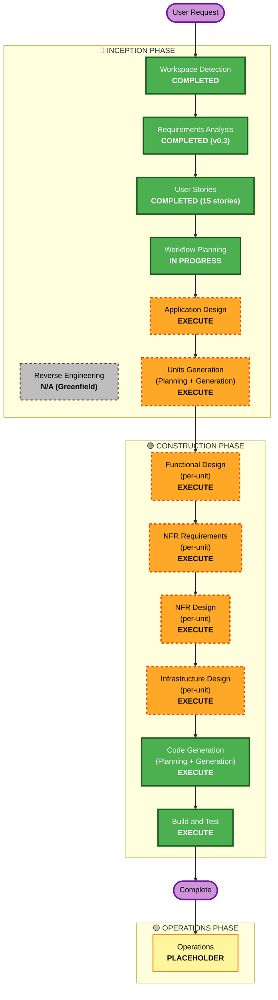

# Execution Plan (AI-DLC Workflow Planning)

> プロジェクト: YUDANE（買わない理由を論破する AI エージェント・コマース）  
> 参照: [要件書 v0.6](../requirements/requirements.md) / [ストーリー](../user-stories/stories.md) / [ペルソナ](../user-stories/personas.md)  
> 作成: 2026-05-07 / ステージ: 🔵 INCEPTION / Workflow Planning

## 詳細分析サマリー

### プロジェクトタイプ

- **Greenfield** — 既存コードなし、Reverse Engineering は N/A
- モバイル（**React Native + AWS SDK v3** 前提、Amplify は Auth のみ薄く採用）+ サーバーレス AWS（API Gateway + Lambda + 生 DynamoDB + Bedrock + **AWS End User Messaging Push** 等）+ Amazon Creators API / Associates 連携
- チーム 4 名（PM/UX / モバイル / バックエンド・AI / インフラ）
- Extension: Security Baseline + Property-Based Testing を全面適用

### 変更影響評価（Change Impact Assessment）

| 影響領域 | 影響有無 | 概要 |
|---|:---:|---|
| ユーザー向け変更 | ✅ | 全機能が新規ユーザー向け（UC-01〜08） |
| 構造的変更 | ✅ | 新規システム全体 |
| データモデル変更 | ✅ | 新規（ユーザー / 嗜好ベクトル / カート監視 / 論破履歴） |
| API 変更 | ✅ | 新規（API Gateway + 複数 Lambda） |
| NFR 影響 | ✅ | Perf / Security / Scalability / PBT / Accessibility すべてに設計要件あり |

### リスクアセスメント

| 項目 | 評価 |
|---|---|
| **総合リスク** | **Medium-High** |
| 巻き戻し複雑度 | Low（Greenfield のため過去資産なし） |
| テスト複雑度 | High（Security 15 + PBT 10 の全面検証要件） |
| スケジュールリスク | Medium（Amazon Approved Mobile App 申請期間不確定、4 名× 3 週間で予選 MVP） |
| 外部依存リスク | Medium（Amazon Creators API / AWS End User Messaging / Cognito への依存） |

### 主要不確実性

- **Amazon Approved Mobile Application 承認タイミング**: 書類審査・予選段階はモックデータで代替、決勝前までに承認完了を目指す（§8 A-10）
- **Amazon Creators API の完全仕様確定**: 2026-05-15 に PA-API 廃止予定、Creators API への移行タイミングとレート制限
- **チーム稼働率**: 4 名がどこまで専任でコミットできるか

## ワークフロー可視化

凡例:

- 🟢 **緑（COMPLETED / EXECUTE always）**: 完了済み、または必ず実行するステージ
- 🟠 **オレンジ点線（EXECUTE）**: EXECUTE と判定した条件付きステージ
- ⚫ **グレー点線（SKIP / N/A）**: スキップ or 非該当
- 🟡 **イエロー（PLACEHOLDER）**: 現時点ではプレースホルダ

## 実行するステージ

### 🔵 INCEPTION PHASE

- [x] **Workspace Detection** — 完了（Greenfield 判定）
- [ ] **Reverse Engineering** — N/A（Greenfield のため該当なし）
- [x] **Requirements Analysis** — 完了（requirements.md v0.3 / 30+ FR）
- [x] **User Stories** — 完了（15 ストーリー + ペルソナ + 1 年退化年表）
- [x] **Workflow Planning** — 本文書
- [ ] **Application Design** — **EXECUTE**
  - **根拠**: Greenfield の新規システムで、多数コンポーネント（Share Extension ハンドラ / 論破 LLM サービス / リール推薦エンジン / カート監視スケジューラ / Amazon Creators API クライアント / Associates リンクジェネレータ / セーフガード モジュール）が必要。評価軸「Unit 分解の適切さ」の下地作り
- [ ] **Units Generation** — **EXECUTE**
  - **根拠**: 新規データモデル / 複数 API / 複雑業務ロジック / IaC（CDK）・モバイル・バックエンド・AI 推薦の 4 系統パッケージ必要。**評価軸「Unit 分解の適切さ」の核心成果物**。4 名並行開発の前提として必須

### 🟢 CONSTRUCTION PHASE（Per-Unit Loop）

- [ ] **Functional Design** — **EXECUTE**（Unit ごと）
  - **根拠**: 論破プロンプト合成 / カート監視状態遷移 / 予定→カテゴリ分類 LLM / 嗜好ベクトル更新などの業務ロジックが Unit ごとに詳細化必要
- [ ] **NFR Requirements** — **EXECUTE**（Unit ごと）
  - **根拠**: 要件書 §6 の Perf（300ms / 60fps）/ Security-01〜15 / PBT-01〜10 / Scalability / Accessibility の具体化を Unit 単位で定義する必要あり
- [ ] **NFR Design** — **EXECUTE**（Unit ごと）
  - **根拠**: NFR Requirements が EXECUTE のため、AWS サービス選定と構成の設計が必須
- [ ] **Infrastructure Design** — **EXECUTE**（Unit ごと）
  - **根拠**: AWS デプロイが決勝（6/26）の必須要件、CDK スタック設計が必要
- [ ] **Code Generation** — **EXECUTE**（Always、Unit ごと）
- [ ] **Build and Test** — **EXECUTE**（Always、全 Unit 完了後）

### 🟡 OPERATIONS PHASE

- [ ] **Operations** — プレースホルダ（現段階では定義なし）

## パッケージ変更順序（Units Generation で確定予定）

Greenfield のため既存パッケージ依存はない。Units Generation で以下 4 系統の並行開発構造を確定する（暫定案）:

1. **mobile/**（React Native + TypeScript + AWS SDK v3 + TanStack Query + Zustand）— 悠介目線の主要 UX（ホーム / リール / 論破 / カート介入 / レポート / セーフガード画面）
2. **backend/**（Python Lambda）— 論破 LLM / 嗜好モデル / カート監視スケジューラ / Creators API クライアント
3. **infra/**（AWS CDK TypeScript）— IaC、Cognito / API Gateway / Lambda / DynamoDB / ElastiCache / Bedrock / **AWS End User Messaging Push** / EventBridge Scheduler / CloudWatch
4. **shared/**（スキーマ・プロトコル定義）— Python と Dart 間の DTO 定義、OpenAPI / JSON Schema

## 推定タイムライン（ハッカソン整合）

| マイルストーン | 日付 | 対応するステージ |
|---|---|---|
| **書類審査締切** | 2026-05-10（Sun） | ここまでに Inception phase すべて完了（AD + UG 実行） |
| 結果通知 | 〜2026-05-15 | — |
| **予選（MVP デモ）** | 2026-05-30（Sat） | Construction phase の Per-Unit Loop を回して MVP 到達 |
| **決勝（AWS デプロイ）** | 2026-06-26（Fri） | Build and Test + 本番デプロイ完了 |

### 直近 3 日（書類審査締切まで）の重点

1. **Application Design** — 2026-05-07〜08（1.5 日相当）
2. **Units Generation** — 2026-05-08〜09（1.5 日相当）
3. **最終レビュー + README 整備** — 2026-05-10（半日）

## 成功基準

### 書類審査（5/10）

- **Primary Goal**: 審査 4 基準すべてで減点を最小化
  1. ビジネス意図（Intent）の明確さ → requirements + personas + journey でカバー済み
  2. Unit 分解の適切さ → **AD + UG で本格整備**（本計画の主眼）
  3. 創造性とテーマ適合性 → ダメ化軌跡・Before/After・退化年表でカバー済み
  4. ドキュメントの品質 → README 整備 + リンク整合
- **Key Deliverables**: application-design/ 配下成果物、unit-of-work.md、unit-of-work-dependency.md、unit-of-work-story-map.md、README 整備
- **Quality Gates**: 診断エラーなし / 内部リンク整合 / Mermaid レンダリング確認

### 予選（5/30）

- 動作する MVP（UC-01〜03 のコアループが通る）
- AI-DLC プロセス実践の証跡（audit.md / plans/）
- プレゼン資料

### 決勝（6/26）

- AWS 上で動作する本番デモ
- Approved Mobile Application 承認済み（Amazon Associates）
- 全 UC 動作 + セーフガード実働

## 品質ゲート（各ステージ共通）

- [x] Extension コンプライアンス（Security-01〜15 / PBT-01〜10）の該当性評価
- [ ] 診断エラーなし（Markdown / コード）
- [ ] 内部リンク整合
- [ ] Mermaid / 図のレンダリング確認
- [ ] audit.md に意思決定ログ（ISO 8601 タイムスタンプ）
