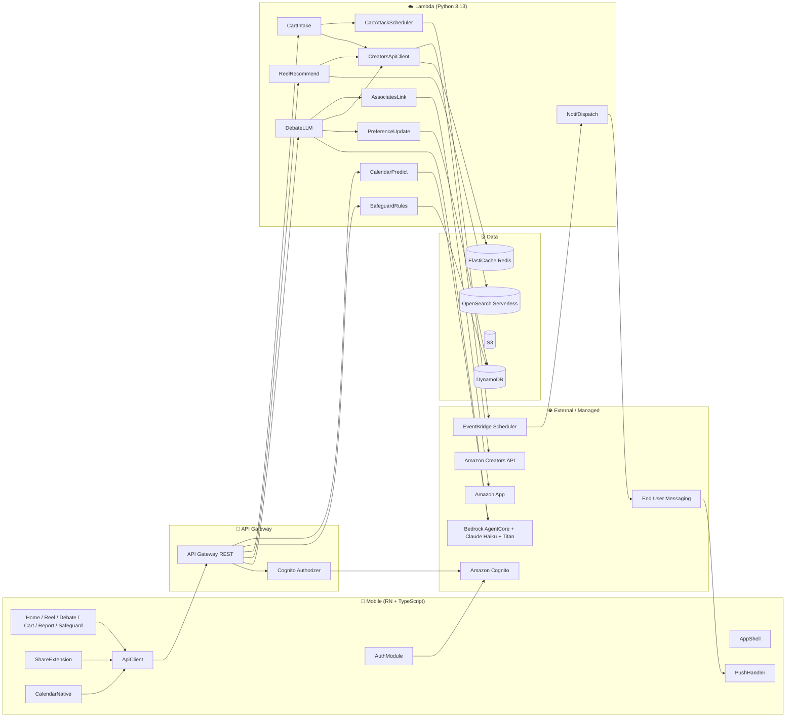

# YUDANE 技術スタック・システム構成

> YUDANE の技術選定とシステム構成のまとめ。フル AWS サーバーレス構成で、論破 AI は Bedrock がリアルタイム生成する。

## 1. 全体像（30秒）

- モバイルは **React Native（New Architecture）**、バックエンドは **API Gateway + Lambda(Python 3.13)**、AI は **Amazon Bedrock**。データは **DynamoDB / S3 / ElastiCache Redis / OpenSearch Serverless**。
- コア3UC（論破 / リール / カート介入）が Bedrock とストリーミングで動く。
- カート介入の 30分／6時間／24時間 の追撃は **EventBridge Scheduler 単独**で時間差制御（Step Functions は持ち込まない）。
- 決済は自前で持たず、**Amazon Associates の Special Link** で Amazon アプリへ送り出すだけ。
- IaC は **AWS CDK(TypeScript)**、Unit ごとに独立スタックを分割。

## 2. 技術スタック

| レイヤ | 採用技術 | 選定理由 |
|---|---|---|
| モバイル | React Native 0.76+（New Architecture）+ TypeScript 5.x + AWS SDK v3 | Fabric + TurboModules が既定。Share Extension / Share Target はネイティブモジュールで実装 |
| 状態管理 | TanStack Query（サーバー状態）+ Zustand（クライアント状態） | 認証・論破ストリーミング・嗜好キャッシュを分離管理 |
| 認証 | Amazon Cognito + Amplify JavaScript v6 の Auth モジュールのみ + TOTP MFA | `amazon-cognito-identity-js` 非推奨のため不採用。Data/Functions/CLI も不採用でスタックを純化 |
| API | API Gateway (REST) + Lambda (Python 3.13) | 論破 LLM・カート監視・Amazon 連携を Lambda で自由実装 |
| データ | DynamoDB + S3 + ElastiCache Redis + OpenSearch Serverless | 生 AWS サービスを CDK で直接定義 |
| AI | Amazon Bedrock（Claude Haiku 4.5 / Sonnet 4.6）+ Titan Embeddings V2 | 論破ストリーミング + 予定駆動プロンプト合成 + 嗜好ベクトル |
| 論破実行基盤 | Bedrock AgentCore（Runtime + Memory）+ Strands Agent | 会話状態の保持とストリーミング論破をマネージドに実行（Unit-3 Debate） |
| EC 連携 | Amazon Creators API（商品データ・OAuth2）+ Associates Program（Special Link） | PA-API 5.0 は 2026-04-30 deprecation / 2026-05-15 shutdown のため後継 API を採用 |
| プッシュ | AWS End User Messaging Push + EventBridge Scheduler | 30m/6h/24h の時間差追撃を Scheduler 単独で制御 |
| IaC | AWS CDK (TypeScript v2) + Node.js 22 LTS | Unit ごとに独立スタック分割 |
| CI/CD | GitHub Actions + SBOM（Snyk/Dependabot） | SECURITY 要件に整合 |
| テスト | fast-check（TS/RN）+ Hypothesis（Python）= Property-Based Testing 全面適用 | ビジネスロジック・シリアライズの不変条件を保証 |

## 3. システム構成図

## 4. コンポーネント・サービス・ユニット

- **コンポーネント 31 個**: Mobile 13（画面6 + ネイティブ3 + 認証/API/計測3 + シェル1）/ Backend 14（API Lambda 12 + ロガー1 + Cognito トリガー1）/ Shared 4。
- **オーケストレーションサービス 7 個**: Debate / Reel / Cart Intercept / Calendar / User Profile & Preference / Safeguard / Notification（横断）。
- **Unit of Work 8 個**（並行開発単位）:

| Unit | 責務 | 対応 UC |
|---|---|---|
| Unit-1 Platform | CDK 基盤・Cognito・共通モジュール・OpenAPI 守護 | 横断 |
| Unit-2 Auth & Profile | サインアップ / MFA / 予算感アンケート / 負債自己申告 | UC-05〜08 初期化 |
| Unit-3 Debate | 論破モーダル（Bedrock Haiku ストリーミング3ターン） | UC-01 |
| Unit-4 Reel | エージェント型縦型リール（嗜好×時間×疲労×予定） | UC-02 |
| Unit-5 Cart Intercept | Share Extension 受領 + 30m/6h/24h 追撃 | UC-03 |
| Unit-6 Calendar | 予定カテゴリを端末ローカル分類 + 論破弾薬化 | UC-04 |
| Unit-7 Safeguard | 月間上限・冷却モード・NG カテゴリ・年齢確認 | UC-08 |
| Unit-8 Dame Report | 週次集計 + 委ね Lv / 称号 / Before-After 指標 | UC-06/07 |

## 5. 主要データフロー

- **カート介入**: Amazon 共有 → ShareExtension → CartIntake が ASIN 抽出 + Creators API で商品メタ取得 → 監視リスト登録 → CartAttackScheduler が EventBridge Scheduler に 30m/6h/24h を予約 → NotifDispatch → End User Messaging → 端末プッシュ → 論破モーダル。
- **論破チャット（UC-01）**: DebateLLM が嗜好・予定・ストレス・時刻を文脈として Bedrock（AgentCore Runtime + Memory + Strands Agent + Claude Haiku 4.5）でコピーをストリーミング生成 → 「Amazon で買う」で Associates Special Link へ。
- **リール（UC-02）**: ReelRecommend が嗜好ベクトル（OpenSearch）× 時刻 × 疲労 × 予定で推薦 → Creators API で商品データ。
- **カレンダー連動（UC-04）**: 予定は端末ローカルで LLM 分類し、**カテゴリ文字列のみ**をバックエンドへ送信（予定本文は送らない）。

## 6. 論破 AI の実行基盤（Unit-3 Debate）

- **Bedrock AgentCore Runtime + Memory + Strands Agent + Claude Haiku 4.5** を採用。会話状態（Memory）を保持しつつ、3ターンの論破をストリーミングで返す。
- 認可は **AgentCore の Cognito Authorizer** + バックエンド側 `@require_owner`（sub 照合）で IDOR を防止。
- 論破は定型文を返さず、**心理学的メカニズム（損失回避・時給換算・自己知覚理論・ストレス×ご褒美軸ほか）** をプロンプトで指示し、ユーザー文脈を注入して毎回異なるコピーを動的生成する。

## 7. 設計原則

1. **EventBridge Scheduler 単独で時間差制御** — Step Functions は採用しない。
2. **Amplify は Auth モジュールのみ薄く採用** — スタックを純化し説明容易性を優先。
3. **LLM 呼び出しは Python Lambda / AgentCore に集約** — PBT と相性が良く、ストリーミング制御が容易。
4. **予定本文はバックエンドに送らない** — 端末ローカル分類、カテゴリのみ送信（プライバシー / NG-7）。
5. **Amazon 決済へ誘導するが保持しない** — Associates Special Link で送り出すだけ（収益モデル / NG-8）。
6. **Mobile と Backend で同じ SafeguardPolicy を共有** — UX 整合性。

## 8. 共通インフラ規約（platform-stack が全 Unit へ提供）

- **共有リソースは SSM Parameter 経由で参照**（VPC / Subnet / API Gateway / Cognito / Redis / KMS / SNS / Lambda SG / AuditLogger Layer）。CloudFormation の Export/Import は不使用。
- **暗号化（SECURITY-01）**: DynamoDB / S3 / Redis / Logs を platform の KMS キーで SSE。全 API は TLS 1.2+。
- **IAM（SECURITY-06）**: Lambda ごとに個別ロール、最小権限。`*` は理由コメント + cdk-nag suppression 必須。
- **ネットワーク（SECURITY-07）**: 業務 Lambda は VPC（private with egress）。DynamoDB / S3 は VPC Gateway Endpoint 経由。Redis / OpenSearch は platform の Lambda SG からのみ。
- **観測（SECURITY-02/03/14）**: 全 Lambda が AuditLogger Layer（構造化ログ + PII マスク + 相関 ID + EMF）を使用。X-Ray 有効、Logs 保持 90 日、重大アラートは SNS。
- **機密（SECURITY-09）**: API キー等は Secrets Manager、非機密設定は SSM Parameter Store。
- **API 契約**: 全エンドポイントは単一 API Gateway に `/v1/...` を追加。OpenAPI 骨格は Unit-1 が凍結し、各 Unit は非破壊で追記。

## 9. 命名規約（抜粋）

| 対象 | 規則 | 例 |
|---|---|---|
| Stack | `<unit>-<env>-stack` | `debate-prd-stack` |
| DynamoDB | `yudane-<unit>-<env>-<entity>` | `yudane-cart-dev-watch-items` |
| Lambda | `yudane-<unit>-<env>-<function>` | `yudane-debate-dev-streaming` |
| SSM Parameter | `/yudane/<env>/<unit>/<key>` | `/yudane/dev/debate/bedrock-model-id` |

## 10. 品質・セキュリティ拡張

- **Security Baseline（SECURITY-01〜15）** と **Property-Based Testing（PBT-01〜10）** を全面適用（AI-DLC の Extension をブロッキング制約として有効化）。
- TDD は Mobile=Outside-In / Backend=クラシック / CDK=Snapshot のハイブリッド。
- 代表的な PBT 対象: ASIN 抽出（round-trip）、CartAttackScheduler（stateful: 30m→6h→24h→購入/破棄）、SafeguardPolicy（invariant: 上限超過で block）、PreferenceVectorUpdater（idempotent）。
